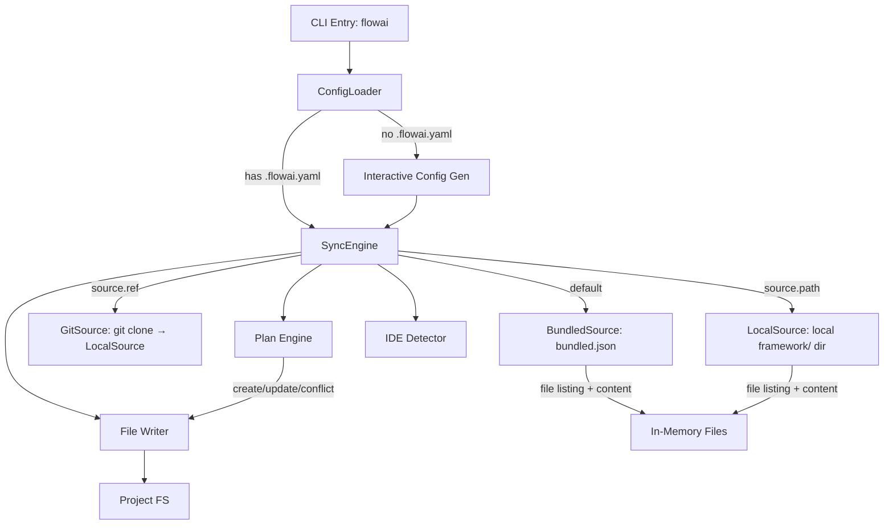

# Software Design Specification (SDS)

## 1. Introduction

- **Document purpose:** Detail the implementation and architecture of flowai.
- **Relation to SRS:** Implements requirements defined in
  `documents/requirements.md`.

## 2. System Architecture

- **Overview diagram:**
  ```mermaid
  graph TD
    Packs[framework/] -->|deno task sync-local| Claude[.claude/]
    Packs -->|flowai sync bundled.json| Users[End Users]
    Claude -->|skills, agents, hooks| IDE[Claude Code]
    IDE -->|Updates| Docs[documents/*.md]
    IDE -->|Executes| Actions[Code/Git/MCP]
    IDE -->|Updates| Claude
  ```
- **Main subsystems and their roles:**
  - **Product Framework (`framework/`):** Source of truth for end-user packs (skills, agents, hooks, scripts). Distributed via flowai.
  - **Dev Resources (`.claude/skills/`, `.claude/agents/`):** Generated by `deno task sync-local` from `framework/`. NOT tracked in git (gitignored). Auto-synced via SessionStart hook.
  - **Skills Subsystem:** Defines procedural workflows and capabilities.
  - **Agents Subsystem:** Defines specialized agent roles and prompts.
  - **Benchmark Runner:** Specialist in executing and analyzing agent benchmarks.
  - **Documentation Subsystem:** Stores project state and memory.

## 3. Components

### 3.1 Dev Resources (`.claude/skills/`, `.claude/agents/`)

- **Purpose:** Dev-only skills and agents for flowai development. Not distributed to users.
- **Structure:**
  - `.claude/skills/` — Framework skills (from `deno task sync-local`) + dev-only skills (bench-all, opencode-guide)
  - `.claude/agents/` — Framework agents (transformed) + dev-only agents
  - `.claude/scripts/` — Hook scripts (from `deno task sync-local`)
- **Git tracking:** `.claude/skills/`, `.claude/agents/`, `.claude/scripts/` are gitignored. Generated on-demand.
- **Auto-sync:** SessionStart hook bootstraps if missing.
- **Command:** `deno task sync-local` reads from `framework/` directly via `LocalSource` (no bundle step).

### 3.1.1 Product Packs (`framework/`)

- **Purpose:** Modular groups of skills, agents, hooks, and scripts for end users. Each pack is a self-contained directory.
- **Structure:**
  ```
  framework/<pack-name>/
    pack.yaml              # name, version (semver), description, scaffolds, assets (optional)
    skills/<name>/SKILL.md # skills (full installed name, e.g. flowai-commit/)
    agents/<name>.md       # agents (optional)
    hooks/<name>/          # hook.yaml + run.sh (optional)
    scripts/<name>         # utility scripts (optional)
    assets/                # shared templates (optional, e.g. AGENTS.md templates)
  ```
- **Packs:** `core` (base commands), `devtools` (skill/agent authoring), `engineering` (procedural knowledge), `deno` (Deno-specific), `typescript` (TS-specific).
- **Resource discovery:** Convention over configuration — resources found by scanning subdirectories, not listed in `pack.yaml`.
- **No inter-pack dependencies:** Each pack is self-contained. Enforced by `check-pack-refs.ts` (core→non-core and non-core-A→non-core-B references are errors; any→core and intra-pack are OK).
- **Naming:** Directory names inside packs are the full installed names (e.g., `flowai-commit/`, `flowai-skill-write-dep/`). flowai copies them as-is — no name transformation at install time.
- **Categories (by installed prefix):**
  - `flowai-*`: Command-like skills (e.g., `flowai-commit`, `flowai-plan`).
  - `flowai-skill-*`: Practical guides (e.g., `flowai-skill-fix-tests`).
  - `flowai-setup-*`: One-time setup skills (e.g., `flowai-setup-code-style-ts-deno`).
- **Composition**: Skills can delegate to other skills (e.g., `flowai-init` delegates development command configuration to `flowai-skill-configure-*-commands`).
- **Script independence:** Scripts in pack `scripts/` are installed into user projects without a shared `deno.json`. They MUST be runnable standalone:
  - Use `jsr:` specifiers for Deno std imports (e.g., `jsr:@std/path`), NOT bare specifiers (`@std/path`).
  - Avoid dependencies requiring import maps or `deno.json` resolution.
  - Each script header MUST include a `Run:` section with the exact `deno run` command.

#### 3.1.2 Script Language Policy

All project scripts (`framework/<pack>/skills/*/scripts/`, `framework/<pack>/commands/*/scripts/`, and root `scripts/`) use Deno/TypeScript exclusively. Python appears only in benchmark fixtures (test project stubs).

#### 3.1.3 Skill Tool Hints (`allowed-tools`)

Skills MAY use the `allowed-tools` frontmatter field (experimental, per agentskills.io spec) to pre-approve tools needed for script execution. Example:

```yaml
---
name: my-skill
description: Does something
allowed-tools: Bash(deno:*)
---
```

Adoption is optional. IDEs that support `allowed-tools` will auto-approve matching tool calls; IDEs that don't will ignore the field.

### 3.2 Product Agents (in packs)

- **Purpose:** Define specialized AI subagent personas and roles for end users.
- **Structure:** `.md` files inside `framework/<pack>/agents/`. One canonical file per agent.
  Frontmatter contains universal superset of all IDE fields; body is the shared system prompt.
- **Canonical Format:** Universal frontmatter — superset of all IDE-specific fields:
  `name`, `description` (required), `tools` (string, Claude), `disallowedTools` (string, Claude),
  `readonly` (bool, Cursor), `mode` (string, OpenCode), `opencode_tools` (map, OpenCode),
  `model` (tier: `max`/`smart`/`fast`/`cheap`/`inherit`), `effort` (string, Claude),
  `maxTurns` (int, Claude; renamed `steps` for OpenCode), `background` (bool, Claude), `isolation` (string, Claude),
  `color` (string, Claude/OpenCode).
  `flowai` extracts IDE-relevant fields and resolves model tiers at install time via `transformAgent()`.
- **Model Tiers:** Abstract quality/cost intent. Resolved to IDE-native values at install time:
  - Default maps: `claude: {max: opus, smart: sonnet, fast: haiku, cheap: haiku}`,
    `cursor: {max: slow, smart: slow, fast: fast, cheap: fast}`, `opencode: {}` (user configures).
  - User overrides via `.flowai.yaml` `models:` section.
  - `inherit` or absent → field omitted (IDE uses parent model).
- **Key Agents (5 canonical files):**
  - `core/agents/flowai-console-expert.md`: Specialist in executing complex console tasks without modifying code.
  - `core/agents/flowai-diff-specialist.md`: Specialist in analyzing git diffs and planning atomic commits.
  - `core/agents/flowai-skill-adapter.md`: Adapts skills to project specifics after upstream updates.
  - `core/agents/flowai-agent-adapter.md`: Adapts agent definitions to project specifics after upstream updates. Mirrors `flowai-skill-adapter` but for agent `.md` files — preserves YAML frontmatter, adapts body (system prompt).
  - `engineering/agents/flowai-deep-research-worker.md`: Research worker for a single direction within a deep research task; spawned by `flowai-skill-deep-research` orchestrator.
- **Distribution:** `flowai` transforms canonical agents into IDE-specific format at install time.
- **IDE frontmatter formats** (transformation rules owned by flowai, see also 3.5 Agent transformation rules):
  - **Universal (canonical):** `model` uses abstract tiers (`max`/`smart`/`fast`/`cheap`/`inherit`). Resolved by flowai at install time.
  - **Claude Code:** `name`, `description` (req), `tools`, `disallowedTools`, `model` (resolved: opus/sonnet/haiku), `effort` (low/medium/high/max), `maxTurns` (int), `background` (bool), `isolation` (worktree/remote), `color`.
  - **Cursor:** `name`, `description` (req), `model` (resolved: slow/fast), `readonly` (bool).
  - **OpenCode:** `description` (req), `mode: subagent`, `model` (resolved from .flowai.yaml or omitted), `tools` (map: write/edit/bash→bool), `color`. Filename = agent name.
  - **OpenAI Codex:** Not a markdown-frontmatter format. Each agent becomes two artifacts: (a) a sidecar `<cwd>/.codex/agents/<name>.toml` with top-level `name`, `description`, `developer_instructions` (the agent body as a TOML multi-line triple-quoted string); (b) a registration block `[agents.<name>] description="..." config_file="./agents/<name>.toml"` merged into `.codex/config.toml`. Agent body markdown is transferred verbatim into `developer_instructions`. Model tier is NOT written — Codex subagents inherit the session model. See 3.5 for the `toml_merge.ts` component.

### 3.3 Project Documentation (`documents/`)

- **Purpose:** Persistent project memory across AI sessions. Single source of truth for requirements, architecture, and current plans.
- **Hierarchy:**
  1. `AGENTS.md` — project vision, constraints, mandatory rules (root-level, read-only reference).
  2. `documents/requirements.md` (SRS) — functional and non-functional requirements. Source of truth for "what" and "why".
  3. `documents/design.md` (SDS) — architecture and implementation details. Depends on SRS.
  4. `documents/tasks/<YYYY-MM-DD>-<slug>.md` — temporary plans and notes in GODS format. One file per task/session. Directory is gitignored.
  5. `documents/ides-difference.md` — cross-IDE capability comparison (primitives, hooks, agents, MCP). Reference for FR-HOOK-DOCS–FR-IDE-SCOPE.
  6. `documents/benchmarking.md` — benchmark results and analysis.
- **Rules:**
  - Traceability: code references FR-* IDs via comments (`// FR-<ID>` or `# FR-<ID>`). SRS has `[x]`/`[ ]` status without `Evidence:` paths. Validated by `scripts/check-traceability.ts` (part of `deno task check`).
  - English only (except tasks). Compressed style (no fluff, high-info words).
  - Agent reads docs at session start; outdated docs = wrong assumptions.
- **Deps:** None (plain Markdown files).

### 3.4 Benchmark System (`benchmarks/`, `scripts/benchmarks/`)

- **Purpose:** Evidence-based evaluation of AI agent skill execution quality.
- **Architecture:**
  - `deno task bench`: Evaluates agents via evidence-based scenarios. Supports direct model selection via `-m, --model` flag, and skill override via `-s, --skill-override` for A/B testing (runs existing scenarios against a different skill name).
  - **Parallel Execution Protection**: Uses `benchmarks/benchmarks.lock` file containing the PID to prevent concurrent runs. Implements signal listeners (`SIGINT`, `SIGTERM`) and `unload` events for reliable cleanup.
  - **Isolation**: Benchmarks run in isolated sandboxes using `SpawnedAgent` (direct `Deno.Command` based). Sandbox contains only pack-scoped primitives: core pack benchmark → core only; non-core pack benchmark → core + that pack.
  - **Docker**: Optional Docker isolation (`Dockerfile` based on `denoland/deno:alpine`) with `git`, `bash`, `curl`, and `cursor-agent` installed.
  - **Co-located Scenarios**: Scenarios are co-located with primitives — `framework/<pack>/skills/<skill>/benchmarks/<scenario>/mod.ts` for skills and `framework/<pack>/commands/<command>/benchmarks/<scenario>/mod.ts` for commands. Pack-level scenarios (e.g., AGENTS.md rules) live at `framework/<pack>/benchmarks/<scenario>/mod.ts` with shared fixtures.
  - **JSON Configuration**: `benchmarks/config.json` stores unified model presets.
  - **Direct Model Support**: If a preset is not found, the system uses the provided name as the model identifier with default settings (temperature: 0).
  - **Side-Effect Validation**: System checks sandbox state (files, git) using LLM-Judge via Claude CLI (`cliChatCompletion` in `llm.ts`). Uses `--output-format json` + `--json-schema` for structured verdicts. No external API key required. Judge retries once on failure before marking items failed.
  - **Evidence Pipeline**: Raw NDJSON agent logs are converted to readable conversation format (`format_logs.ts`). Evidence (user query, agent logs, git diff/status/log, task files, generated files) is written to `<runDir>/judge-evidence.md` and passed to Claude CLI via `--append-system-prompt-file`. This avoids E2BIG/stdin size limits for large traces (~250KB). The user message to judge contains only the checklist and evaluation instruction. Evidence files persist in run directory for debugging.
  - **Execution Stability**: `SpawnedAgent` per-step timeout + global scenario timeout (default 15 min, `totalTimeoutMs`). Kills agent and proceeds to judge with partial evidence on expiry.
  - **Skill Integration**: Both `framework/<pack>/skills/` and `framework/<pack>/commands/` are copied into the sandbox IDE config dir (pack-scoped) by `copyFrameworkToIdeDir` in `scripts/benchmarks/lib/utils.ts`. Commands land in the same `.{ide}/skills/` target as skills; each command's `SKILL.md` gets `disable-model-invocation: true` injected via `injectDisableModelInvocation` from `cli/src/sync.ts` (single source of truth, mirrors production sync). The flag marks the primitive as user-only — it remains discoverable but is not auto-triggered by the model.
  - **Project Instructions**: Scenarios MUST declare `agentsTemplateVars` (required field; PROJECT_NAME, TOOLING_STACK, etc.) — runner renders the single AGENTS.md from the pack-level template (`framework/<pack>/assets/AGENTS.template.md`) at runtime (single source of truth). All sections (documentation rules, development commands, planning rules, TDD flow) live in this one template. For Claude adapter, a root CLAUDE.md symlink is created automatically. Legacy `agentsMarkdown` and fixture `AGENTS.md` are not supported.
  - **IDE Session Naming**: Claude adapter passes `--name <skill>/<scenario>` for session identification.
  - **Rich Tracing**: Generates single-file `trace.html` with dashboard, per-scenario detail views, and sidebar navigation. Modular architecture: `trace.ts` (facade) → `trace-collector.ts` (data) + `trace-renderer.ts` (HTML structure) + `trace-styles.ts` (CSS/JS) + `trace-types.ts` (shared types).
  - **Unified Data UI**: All technical data (logs, scripts, prompts) use a consistent `.data-block` component with line numbers, word wrap, and smart expand/collapse.
  - **Interactive Flows**: `UserEmulator` simulates user responses via LLM for multi-turn scenarios (persona-driven).
  - **Multi-Turn Benchmarking**: `SpawnedAgent` + `runner.ts` support automatic session resumption (`--resume`) when `UserEmulator` provides input.

### 3.4a Experiments Subsystem (RELOCATED) — FR-EXP

Relocated to [`flowai-experiments`](https://github.com/korchasa/flowai-experiments) on 2026-04-11 (provenance SHA `f311142`). That repo owns: the experiment runner/judge/noise/report/tokens libs, the `claude-md-length` variants and committed results, the `deno task experiment` CLI, and the `writeMemoryFile`/`getCleanroomEnv` adapter extensions that were experiment-only. The `AgentAdapter` contract in `flow` returns to regression-benchmark responsibilities (no memory-file injection, no cleanroom env plumbing). `task-bench.ts` discovery was always scoped to `framework/<pack>/.../benchmarks/`, so no isolation logic changed.

### 3.5 Global Framework Distribution — FR-DIST (`cli/`)

- **Purpose:** Install/update flowai framework skills/agents into project-local IDE config dirs.
- **Location:** `cli/` monorepo directory. Published to JSR as `@korchasa/flowai`.
- **Pattern:** Single-command CLI. Adapter pattern for FS isolation. Bundled source (default), git clone, or local path.
- **Diagram:**

- **Components:**
  - `cli/src/cli.ts` — CLI entry, `sync` subcommand, `--global`/`-g` flag, IDE context guard (`isInsideIDE`; skipped when `--global` is set), @cliffy/command
  - `cli/src/config.ts` — `.flowai.yaml` parser/writer, validation (include/exclude mutual exclusivity). Config path resolution honours scope (`<cwd>/.flowai.yaml` vs `~/.flowai.yaml`).
  - `cli/src/scope.ts` — `SyncScope = "project" | "global"`. `resolveScope(flags)` reads the `--global` flag. `resolveConfigPath(scope, cwd, home)` returns `<cwd>/.flowai.yaml` or `~/.flowai.yaml`. `resolveIdeBaseDir(ide, scope, cwd, home, purpose?)` returns the target base dir per IDE per scope (purpose `"skills" | "agents"` used only to split Codex global paths: `~/.codex/` for agents, `~/.agents/skills/` for skills). Project mode maps 1:1 to `<cwd>/.{ide.configDir}`. Global mode maps to user-level native dirs: Claude `~/.claude/`, Cursor `~/.cursor/`, OpenCode `~/.config/opencode/`, Codex-agents `~/.codex/`, Codex-skills `~/.agents/skills/`.
  - `cli/src/config_generator.ts` — config creation: interactive (prompts via @cliffy/prompt) and non-interactive (auto-detect IDEs, all packs)
  - `cli/src/source.ts` — `FrameworkSource` interface, `BundledSource` (reads `bundled.json`), `GitSource` (clones repo to tmpdir, delegates to `LocalSource`), `LocalSource` (reads `framework/` dir, follows symlinks, excludes benchmarks/_test), `InMemoryFrameworkSource` (tests)
  - `cli/src/sync.ts` — orchestrates: `resolveSource()` (git/local/bundled) → filter skills/agents → compute plan → write files → symlinks
  - `cli/src/plan.ts` — compares upstream vs local (create/ok/conflict classification)
  - `cli/src/writer.ts` — writes plan items to IDE config dirs
  - `cli/src/transform.ts` — transforms universal agent frontmatter into IDE-specific format
  - `cli/src/toml_merge.ts` — merges flowai-managed `[agents.<name>]` blocks into an existing Codex `config.toml` without touching unrelated user sections. Pure (no FS). Uses `jsr:@std/toml`. Tracks managed agent names in `.codex/flowai-agents.json` manifest (parallels `flowai-hooks.json`). Throws on malformed input TOML (never silently overwrites). See FR-DIST.CODEX-AGENTS.
  - `cli/src/ide.ts` — IDE detection by config dir presence + `isInsideIDE()` env var check (`CURSOR_AGENT`, `CLAUDECODE`, `OPENCODE`, `CODEX_THREAD_ID`, `CODEX_SANDBOX`)
  - `cli/src/symlinks.ts` — root `CLAUDE.md -> AGENTS.md` symlink (FR-DIST.SYMLINKS)
  - `cli/src/version.ts` — self-update check against JSR registry (fail-open)
  - `cli/src/update.ts` — two entry points: `notifyUpdateAvailable(options?)` used by `flowai` / `flowai sync` pre-flight, prints an `Update available: … Run \`flowai update\` to install.` hint and never spawns an install (silent when up to date, network-failing, or skipped — FR-DIST.UPDATE); `runSelfUpdate(options?)` used exclusively by the `flowai update` subcommand, checks JSR via `checkForUpdate()` and installs via `runUpdate()` (FR-DIST.UPDATE-CMD). Both fail-open on network errors.
  - `cli/src/adapters/fs.ts` — `FsAdapter` abstraction + `DenoFsAdapter` + `InMemoryFsAdapter`
  - `cli/scripts/bundle-framework.ts` — generates `src/bundled.json` from `../framework/`
- **Data entities:**
  - `FlowConfig`: `{ version, ides, packs, skills: {include, exclude}, agents: {include, exclude}, source? }` (`source`: git branch/local path override)
  - `SourceConfig`: `{ git?, ref?, path? }` — `ref` = branch/tag (default URL: `DEFAULT_GIT_URL`); `git` = custom repo URL (requires `ref`); `path` = local dir (mutually exclusive with `ref`)
  - `PackDefinition`: `{ name, version, description, scaffolds?: Record<skill, paths[]>, assets?: Record<template, artifactPath> }` (parsed from `pack.yaml`)
  - `HookDefinition`: `{ event, matcher?, description, timeout? }` (parsed from `hook.yaml`; timeout default: 30 PostToolUse, 600 PreToolUse)
  - `PlanItem`: `{ type: skill|agent|hook|script|asset, name, action: create|update|ok|conflict, sourcePath, targetPath, content }`
- **Agent transformation rules** (per IDE): See 3.2 IDE frontmatter formats.
- **Pack resolution flow:** Load config → expand `packs:` to resource lists (skills, agents, hooks, scripts from `framework/*/`) → apply `skills.include/exclude` filter → compute plan → write. `resolvePackResources()` returns `hookNames` and `scriptNames` alongside skills/agents.
- **Rich sync output:** `flowai sync` produces instruction-oriented output. Layout (top→bottom): truthful header (`flowai sync complete.` on success / `flowai sync FAILED: N error(s).` on errors, red via `cli/src/color.ts` when stdout is TTY and `NO_COLOR` unset) → `>>> ACTIONS REQUIRED` (config migration, updated/created/deleted skills with inline scaffolds, agents, hooks, assets with artifact mappings; counter shown as `N/M` when partial writes failed and failed items are hidden from the success list) → `>>> NO ACTIONS REQUIRED` summary → `>>> ERRORS (N):` block (red) listing failed writes — last so it stays visible in scrollback. Failed status is propagated by `markFailedActions()` (`cli/src/resource_index.ts`) cross-referencing `result.errors` with each section's `ResourceAction[]`. `SyncResult` includes `configMigrated`, `skillActions[]`, `agentActions[]`, `hookActions[]`, `assetActions[]`, `errors[]` (with `name`/`type` for failure attribution), and `dryRun?: boolean`. Post-sync frontmatter validation via `flowai-update/scripts/validate_frontmatter.ts` (scans IDE config dirs for skills + agents).
- **Sync plan preview:** `formatSyncPlan(config, {scope, home})` (`cli/src/cli.ts`, pure string builder for testability) prints Source/IDEs/Skills/Agents block before the confirmation prompt. In global mode it appends a `Target dirs:` list of resolved user-level base dirs per IDE — including the Codex split (`~/.codex` for agents + `~/.agents` for skills) — surfacing the blast radius before any writes.
- **Dry-run (`--dry-run` / `-n`):** Compute and render the full plan without writing. Implemented via `wrapDryRun(fs)` in `cli/src/sync.ts` — a read-through `FsAdapter` that turns `writeFile`/`mkdir`/`symlink`/`remove` into no-ops, leaving every downstream write site unaware. `processPlan` short-circuits before `writeFiles` so `totalWritten` stays 0 and the renderer reports the run truthfully. Dry-run skips the spinner, the `notifyUpdateAvailable` pre-flight step, the new-config generator, and conflict prompts; exits 0 always.
- **Exit code:** `runSync` returns `number`; root command and `sync` subcommand call `Deno.exit(code)` when non-zero. `1` if `result.errors.length > 0` after a real run; `0` for any dry-run.
- **Hook installation:** Reads `hook.yaml`, generates IDE-specific config via `cli/src/hooks.ts`: Claude Code → 3-level nested `settings.json` hooks, Cursor → flat `.cursor/hooks.json`, OpenCode → generated `flowai-hooks.ts` plugin, OpenAI Codex → Claude-compatible nested `.codex/hooks.json` (events: `PreToolUse`, `PostToolUse`, `SessionStart`, `UserPromptSubmit` — same wire names as Claude; feature-gated behind the `codex_hooks` feature flag and behind the `experimental.codexHooks: true` key in `.flowai.yaml`). Event/tool name mapping per IDE (`EVENT_MAP`, `TOOL_MAP`). Manifest `.{ide}/flowai-hooks.json` tracks installed hooks for deinstallation. Merge preserves user hooks not in manifest. 1 framework hook: `flowai-skill-structure-validate` (PostToolUse, SKILL.md validation).
- **Codex subagent sync:** For `ide === "codex"`, agent-writing bypasses the standard markdown path. `writeCodexAgents(plan, fs, cwd)` in `cli/src/writer.ts`: (1) reads existing `.codex/config.toml` (or starts empty); (2) writes each universal agent body as a sidecar `.codex/agents/<name>.toml` with top-level `name`, `description`, `developer_instructions = """..."""`; (3) calls `mergeCodexConfig` to upsert `[agents.<name>] description="..." config_file="./agents/<name>.toml"` blocks, preserving all non-managed TOML sections; (4) writes `.codex/flowai-agents.json` manifest with managed names. Removing an agent from `.flowai.yaml` removes both the sidecar and the `[agents.<name>]` block on next sync. Malformed existing `config.toml` throws with file path + underlying parse error.
- **Script installation:** Copies to `.{ide}/scripts/` (simple file copy).
- **Naming:** Pack directory names are the final installed names (e.g., `flowai-commit`, `flowai-skill-write-dep`). No name transformation at install time.
- **Dev-only file exclusion:** Bundle and sync exclude dev-only files from distribution: benchmark scenarios (`/benchmarks/`) and test files (`_test.*`). Filtering at two levels: `bundle-framework.ts` (build time) and `readSkillFiles`/`readPackSkillFiles` in `sync.ts` (runtime).
- **Distribution:** JSR via `deno publish`. `bundled.json` generated at publish time from `framework/*/`. No build step for TS.
- **Scope + global mode (FR-DIST.GLOBAL):** `SyncScope = "project" | "global"` threaded via `cli/src/scope.ts`. Project = default: config `<cwd>/.flowai.yaml`, targets `<cwd>/.{ide}/`, scaffolds + artifact sync enabled, hooks merged into `<cwd>/.claude/settings.json`. Global (`--global`): config `~/.flowai.yaml`, targets per IDE native user dir (see Components bullet for `scope.ts`), scaffolds + artifact sync SKIPPED (templates still install), hooks merged into `~/.claude/settings.json` (same manifest-based logic). Both configs may coexist; project wins when `--global` is absent and both exist. `resolvePackResources()` filters by the `scope:` frontmatter field: `project-only` primitives skipped in global mode, `global-only` primitives skipped in project mode, absent = both (FR-PACKS.SCOPE).

### 3.5.1 AGENTS.md Re-Adaptation Skill — `flowai-adapt-instructions`

- **Purpose:** Standalone skill (installable in both scopes) that re-adapts the project's AGENTS.md when the upstream template changes significantly. Reads the installed template (`{ide}/assets/AGENTS.template.md`, path resolved per scope), diffs against `<cwd>/AGENTS.md`, proposes a merge preserving project-specific sections, writes on user approval.
- **Location:** `framework/core/commands/flowai-adapt-instructions/SKILL.md` + `benchmarks/basic/mod.ts` (user-invoked, so placed under `commands/` per FR-PACKS.STRUCT naming).
- **No template duplication:** The skill does NOT carry its own copy of the AGENTS.md template. It relies on the pack-level asset installed by `flowai sync` into `{ide}/assets/`.
- **Relation to `flowai-update`:** `flowai-update` (scope: `project-only`) delegates the AGENTS.md migration step to `/flowai-adapt-instructions` rather than re-implementing template diffing.
- **Behavioral requirements:** See benchmark `flowai-adapt-instructions-basic`.

### 3.6 Migrate Command — FR-DIST.MIGRATE (`cli/src/migrate.ts`)

- **Purpose:** One-way migration of all IDE primitives (skills, agents, commands) from one IDE config dir to another. Unlike `user_sync` (bidirectional, mtime-based, user resources only), `migrate` is explicit, one-directional, includes all resources (`flowai-*` + user-created), and requires no `.flowai.yaml`.
- **CLI:** `flowai migrate <from> <to>`. Flags: `--yes` (overwrite without prompt), `--dry-run` (print plan, no writes). Known IDEs: `claude`, `cursor`, `opencode`.
- **Components (`cli/src/migrate.ts`):**
  - `ScannedResource` — `{ name, type: skill|agent|command, files: [{relPath, content}] }`
  - `MigrateOptions` — `{ yes, dryRun, promptConflicts? }`
  - `scanAllResources(cwd, fromIde, fs)` — scans `skills/`, `agents/`, `commands/` subdirs; no filter; uses `safeReadDir` (skips missing dirs).
  - `buildMigratePlan(resources, fromIde, toIde, cwd, fs, modelMap, log)` — async; reads target files; classifies each item as `create/ok/conflict`; transforms agents via `crossTransformAgent()`.
  - `runMigrate(cwd, from, to, fs, options, log)` — validates IDEs, scans, builds plan, applies via `processPlan` (or prints in dry-run mode).
- **Reused from existing modules:** `crossTransformAgent` (`transform.ts`), `processPlan` (`sync.ts`), `DEFAULT_MODEL_MAPS` (`transform.ts`).
- **Excluded from migration:** rules (`.cursor/rules/`, `.claude/rules/`) and hooks — fundamentally different formats across IDEs, no automated transform.

### 3.7 Conventional Commits `agent:` Type — FR-AGENT-COMMIT

- **Purpose:** Dedicated commit type for AI agent/skill config changes.
- **Behavioral requirements:** See benchmarks `flowai-commit-agent-type`.

### 3.8 flowai-init Multi-File Architecture + Diff-Based Updates — FR-INIT.IDEMPOTENT

- **Purpose:** Preserve user edits during re-initialization. Single root AGENTS.md file generated from the pack-level asset template. Legacy three-file layouts (`documents/AGENTS.md`, `scripts/AGENTS.md`) are detected and collapsed into root. Template updates tracked independently via `pack.yaml` `assets:` field (not flowai-init scaffolds).
- **Script:** `generate_agents.ts` (Deno/TS) — analyze-only. Command: `analyze`.
- **Behavioral requirements:** See benchmarks `flowai-init-*` (6 scenarios).

### 3.9 AI Devcontainer Setup — FR-DEVCONTAINER

- **Purpose:** Generate `.devcontainer/` config for AI IDE development.
- **Behavioral requirements:** See benchmarks `flowai-skill-setup-ai-ide-devcontainer-*` (6 scenarios).
- **Deps:** None (pure SKILL.md, agent-driven generation).

### 3.10 Framework Update Skill — `flowai-update`

- **Purpose:** Single entry point for updating framework + migrating asset-mapped and scaffolded artifacts.
- **Asset artifacts:** AGENTS.md template mapped via `pack.yaml` `assets:` field (single template → single project artifact). Tracked independently from skills — changes detected even when no skills are updated.
- **Scaffolded artifacts:** Remaining artifacts mapped via `pack.yaml` `scaffolds:` field (skill → artifact paths).
- **CLI integration:** `flowai` bare command is no-op inside IDE. `flowai sync` required explicitly.
- **Behavioral requirements:** See benchmarks `flowai-update-*` (4 scenarios).

### 3.11 Loop Command — Non-Interactive Runner — FR-LOOP (`cli/src/loop.ts`)

- **Purpose:** Launch Claude Code non-interactively with a prompt. Base automation primitive.
- **CLI:** `flowai loop [OPTIONS] <prompt>`. Flags: `--agent`, `--model`, `--cwd`, `--yolo`, `--timeout`, `--interval`, `--max-iterations`. Skills invoked via prompt (e.g. `"/flowai-commit msg"`).
- **Components:**
  - `cli/src/loop.ts` — pure functions + runner:
    - `parseInterval(str)` — `"30s"`, `"5m"`, `"1h"` → ms
    - `buildClaudeArgs(options)` — constructs claude CLI args. Always adds `-p --output-format stream-json --verbose`
    - `StreamFormatter` — stateful ANSI formatter with agent nesting depth tracking. Labels: `[init]`, `[call]`, `[text]`, `[result]`, `[ok]`/`[error]`, `[agent:start]`, `[agent:call]`, `[agent:done]`
    - `processNDJSONStream(reader, onEvent)` — buffered NDJSON parser → `StreamResult`
    - `runOnce(options)` — spawn claude, stream-json processing, hang workaround, exit code
    - `runLoop(options)` — cycle: runOnce + sleep(interval) + iteration check
  - `cli/src/loop_test.ts` — 28 unit tests for pure functions, formatter nesting, processNDJSONStream
  - `cli/src/cli.ts` — registers `loop` subcommand
- **Process spawn:** `Deno.Command("claude", { stdin: "null", stdout: "piped", stderr: "inherit", env: { CLAUDECODE: "" } })`. `stdin: "null"` prevents terminal read; `CLAUDECODE: ""` allows nested launch.
- **Output:** Always stream-json. NDJSON real-time parsing + ANSI formatting. Subagent events (`task_started`/`task_progress`/`task_notification`) indented by nesting depth. 30s hang workaround after result event.
- **Exit code:** resultEvent.is_error → process exit code → 1 (fallback).
- **Defaults:** interval=0 (no pause), max-iterations=infinite, timeout=none.

### 3.12 Standalone Primitive Adaptation — `flowai-adapt`

- **Purpose:** On-demand adaptation of all installed framework primitives (skills, agents, AGENTS.md artifact, hooks) to project specifics — independent of `flowai-update`.
- **Command:** `framework/core/commands/flowai-adapt/SKILL.md`. User-only primitive under `commands/` directory; `disable-model-invocation: true` is injected by the CLI writer at sync time.
- **Subagents:**
  - `flowai-skill-adapter` — adapts skill SKILL.md (reused from flowai-update).
  - `flowai-agent-adapter` — adapts agent `.md` body, preserves YAML frontmatter.
- **Workflow:**
  1. Detect IDE config dirs (`.claude/`, `.cursor/`, `.opencode/`).
  2. Parse args: type filter (`--skills`/`--agents`/`--assets`/`--hooks`) + optional name.
  3. Adapt skills: scan `{ide}/skills/`, parallel subagents, diff + confirm.
  4. Adapt agents: scan `{ide}/agents/`, parallel subagents, diff + confirm.
  5. Verify AGENTS.md artifacts: template-vs-artifact comparison.
  6. Adapt hooks: check for stack-specific commands, skip agnostic.
  7. Summary.
- **Git tracking:** Adaptation state tracked through git history. Working tree = current version; `git show HEAD:<path>` = previous adapted version. No extra metadata fields.
- **Relation to flowai-update:** `flowai-update` ties adaptation to the sync cycle. `flowai-adapt` runs standalone — after first install, stack change, or selectively.
- **Behavioral requirements:** See benchmarks `flowai-adapt-skills-basic`, `flowai-adapt-agents-basic`.

## 4. Data and Storage

- File-based storage only. No database. Entities: Skill (Name, Content, Path), Agent (Name, Prompt, Capabilities).
- Manual updates via git.

## 5. Future Extensions

- Hook format transformation — tracked as FR-HOOK-DOCS (cross-IDE hook/plugin format transformation) and FR-HOOK-RESOURCES (hook resources in packs).
