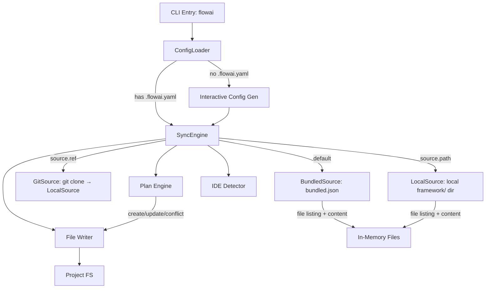

# Software Design Specification (SDS)

## 1. Introduction

- **Document purpose:** Detail the implementation and architecture of flowai.
- **Relation to SRS:** Implements requirements defined in
  `documents/requirements.md`.

## 2. System Architecture

- **Overview diagram:**
  ```mermaid
  graph TD
    Packs[framework/] -->|deno task sync-local| Claude[.claude/]
    Packs -->|flowai sync bundled.json| Users[End Users]
    Claude -->|skills, agents, hooks| IDE[Claude Code]
    IDE -->|Updates| Docs[documents/*.md]
    IDE -->|Executes| Actions[Code/Git/MCP]
    IDE -->|Updates| Claude
  ```
- **Main subsystems and their roles:**
  - **Product Framework (`framework/`):** Source of truth for end-user packs (skills, agents, hooks, scripts). Distributed via flowai.
  - **Dev Resources (`.claude/skills/`, `.claude/agents/`):** Generated by `deno task sync-local` from `framework/`. NOT tracked in git (gitignored). Auto-synced via SessionStart hook.
  - **Skills Subsystem:** Defines procedural workflows and capabilities.
  - **Agents Subsystem:** Defines specialized agent roles and prompts.
  - **Benchmark Runner:** Specialist in executing and analyzing agent acceptance tests.
  - **Documentation Subsystem:** Stores project state and memory.

## 3. Components

### 3.0 Primitive Inventory [ANC:sds:3-0]

Single-page catalog of every primitive shipped by `framework/`. The generator
pipeline `framework/atoms/*.md` + `framework/composites/*.md` +
`framework/composites.yaml` → `scripts/generate-skill-composites.ts` produces
the **generated** SKILL.md targets listed below (all gitignored — edit the
source, not the target). All other primitives are **standalone** (hand-written,
tracked in git). Detailed per-component descriptions live in §3.1 onwards.

#### Generation pipeline

- atom `commit`: `framework/atoms/commit.md` → `framework/core/commands/commit/SKILL.md` (used by 3 composites)
- atom `implement`: `framework/atoms/implement.md` → `framework/core/skills/implement/SKILL.md` (used by 2 composites)
- atom `plan`: `framework/atoms/plan.md` → `framework/core/skills/plan/SKILL.md` (used by 1 composite)
- atom `push`: `framework/atoms/push.md` → `framework/core/commands/push/SKILL.md` (used by 2 composites)
- atom `review`: `framework/atoms/review.md` → `framework/core/skills/review/SKILL.md` (used by 3 composites)
- composite `review-and-commit`: `framework/composites/review-and-commit.md` → `framework/core/commands/review-and-commit/SKILL.md` (atoms: review + commit)
- composite `ship`: `framework/composites/ship.md` → `framework/core/commands/ship/SKILL.md` (atoms: plan, implement, review, commit, push)
- composite `ship-task`: `framework/composites/ship-task.md` → `framework/core/commands/ship-task/SKILL.md` (atoms: implement, review, commit, push)

#### Commands by pack (8) — all in `core`

- `adapt` — standalone — `framework/core/commands/adapt/SKILL.md`
- `commit` — generated from atom `commit`
- `init` — standalone — `framework/core/commands/init/SKILL.md`
- `push` — generated from atom `push`
- `review-and-commit` — generated from composite `review-and-commit`
- `ship` — generated from composite `ship`
- `ship-task` — generated from composite `ship-task`
- `update` — standalone — `framework/core/commands/update/SKILL.md`

#### Skills by pack (43)

**core (10):**

- `configure-deno-commands` — standalone
- `epic` — standalone
- `implement` — generated from atom `implement`
- `investigate` — standalone
- `maintenance` — standalone
- `plan` — generated from atom `plan`
- `reflect` — standalone
- `reflect-by-history` — standalone
- `review` — generated from atom `review`
- `setup-ai-ide-devcontainer` — standalone

**deno (2):** `cli`, `deploy` — standalone

**devtools (6):** `engineer-command`, `engineer-hook`, `engineer-rule`,
`engineer-skill`, `engineer-subagent`, `write-agent-benchmarks` — all standalone

**engineering (18):** `analyze-context`, `browser-automation`, `deep-research`,
`diagnose-benchmark-failure`, `draw-mermaid-diagrams`,
`engineer-ai-ide-plugin`, `engineer-plugin-hooks`,
`engineer-plugin-marketplace`, `engineer-plugin-mcp`,
`engineer-prompts-for-instant`, `engineer-prompts-for-reasoning`, `fix-tests`,
`interactive-teaching-materials`,
`manage-github-tickets`, `write-dep`, `write-gods-tasks`,
`write-in-informational-style`, `write-prd` — all standalone

**ide-bridge (2):** `ai-ide-runner`, `delegate-to-ide` — standalone

**memex (3):** `ask`, `audit`, `save` — standalone

**typescript (2):** `setup-agent-code-style-deno`,
`setup-agent-code-style-strict` — standalone

#### Agents by pack (6) — all standalone

- `framework/core/agents/agent-adapter.md`
- `framework/core/agents/console-expert.md`
- `framework/core/agents/diff-specialist.md`
- `framework/core/agents/skill-adapter.md`
- `framework/engineering/agents/deep-research-worker.md`
- `framework/ide-bridge/agents/worker.md`

#### Summary

- Commands: 9 (3 atom-generated, 3 composite-generated, 3 standalone) — all in `core`.
- Skills: 43 (2 atom-generated in `core`, 41 standalone across 7 packs).
- Agents: 6 (all standalone — 4 in `core`, 1 in `engineering`, 1 in `ide-bridge`).
- Gitignored generated paths: 7 (5 atom targets + 2 composite targets).

### 3.1 Dev Resources (`.claude/skills/`, `.claude/agents/`) [ANC:sds:3-1]

- **Purpose:** Dev-only skills and agents for flowai development. Not distributed to users.
- **Structure:**
  - `.claude/skills/` — Framework skills (from `deno task sync-local`) + dev-only skills (bench-all, opencode-guide)
  - `.claude/agents/` — Framework agents (transformed) + dev-only agents
  - `.claude/scripts/` — Hook scripts (from `deno task sync-local`)
- **Git tracking:** `.claude/skills/`, `.claude/agents/`, `.claude/scripts/` are gitignored. Generated on-demand.
- **Auto-sync:** SessionStart hook bootstraps if missing.
- **Command:** `deno task sync-local` reads from `framework/` directly via `LocalSource` (no bundle step).

### 3.1.1 Product Packs (`framework/`) [ANC:sds:3-1-1]

- **Purpose:** Modular groups of skills, agents, hooks, and scripts for end users. Each pack is a self-contained directory.
- **Structure:**
  ```
  framework/<pack-name>/
    pack.yaml              # name, version (semver), description, scaffolds, assets (optional)
    skills/<name>/SKILL.md # skills (full installed name, e.g. commit/)
    agents/<name>.md       # agents (optional)
    hooks/<name>/          # hook.yaml + run.sh (optional)
    scripts/<name>         # utility scripts (optional)
    assets/                # shared templates (optional, e.g. AGENTS.md templates)
  ```
- **Packs:** `core` (base commands), `devtools` (skill/agent authoring), `engineering` (procedural knowledge), `deno` (Deno-specific), `typescript` (TS-specific), `memex` (long-term knowledge bank for AI agents, see §3.15), `ide-bridge` (cross-IDE delegation: relay + isolated-context subagent, see §3.17).
- **Resource discovery:** Convention over configuration — resources found by scanning subdirectories, not listed in `pack.yaml`.
- **No inter-pack dependencies:** Each pack is self-contained. Enforced by `check-pack-refs.ts` (core→non-core and non-core-A→non-core-B references are errors; any→core and intra-pack are OK).
- **Naming:** Directory names inside packs are the full installed names (e.g., `commit/`, `write-dep/`). flowai copies them as-is — no name transformation at install time.
- **Categories (by installed prefix):**
  - `commands/<name>`: User-only commands (e.g., `commit`, `review-and-commit`, `update`).
  - `skills/<name>`: Agent-auto-invocable skills (e.g., `plan`, `fix-tests`, `setup-agent-code-style-deno`).
- **Composition**: Skills can delegate to other skills (e.g., `init` delegates development command configuration to `configure-*-commands`). Composite SKILL.md files (`review-and-commit`, `ship`, `ship-task`) are **gitignored build artefacts** — materialized from `framework/atoms/*.md` sources + `framework/composites/*.md` wrappers + `framework/composites.yaml` manifest by `scripts/generate-skill-composites.ts` per FR-SKILL-COMPOSE (see §3.1.1.1). Every consumer regenerates first via `--write`, so drift between source and rendered output is structurally impossible. Composite canon (no delegation, no source-skill names in description, explicit verdict-gate success/failure branches, single `<step_by_step>` per atom slot, 700-line cap) is machine-enforced inside the generator. Never hand-edit a generated SKILL.md.
- **Streamlined commit flow:** `commit` and `review-and-commit` use targeted doc sync, inline grouping, auto-invoked `reflect`, and a *Post-Reflect Cleanup Commit*: when reflect leaves working-tree edits, the workflow stages and commits them as a separate `agent: apply reflect-suggested improvements` commit before exit. `review-and-commit` additionally preserves task-status derivation and persistent new-shape task cleanup semantics required by FR-DOC-TASK-LIFECYCLE.
- **Terminal full-cycle composite (FR-SHIP):** `ship` (user-only command at `framework/core/commands/ship/`) drives plan → implement → review → commit → push in one invocation. Generated from five atoms: `plan` + `implement` + `review` + `commit` + `push`. Four explicit gates: variant-selection (Plan→Implement), green project check (Implement→Review), verdict gate (Review→Commit), clean-tree + branch-protection check (Commit→Push). Post-push verification: `git rev-parse @{u}` matches local `HEAD`. The Push atom forbids `--force`, gates `--force-with-lease` on per-push user authorization, and refuses divergent pushes to protected branches.
- **SDLC continuation composite (FR-SHIP-TASK):** `ship-task` (user-only command at `framework/core/commands/ship-task/`) is the post-planning counterpart of `ship`. Takes a path (or unambiguous identifier) to an already-written task file with a filled `## Solution` section and drives implement → review → commit → push. Generated from four atoms: `implement` + `review` + `commit` + `push` (no `plan` atom). Three explicit gates: green project check (Implement→Review), verdict gate (Review→Commit), clean-tree + branch-protection check (Commit→Push). The composite STOPs at the start if the task file is missing or its `## Solution` is empty — it never plans. All Push-atom safety guarantees from FR-SHIP carry over verbatim.
- **`-beta` lifecycle policy:** Any primitive (skill or command) whose source path ends in `-beta` MUST be either promoted (rename to its stable form, replacing the prior stable variant) or removed within **60 days** of its last functional commit. A `-beta` exists to A/B-test a delta against its stable counterpart via `deno task bench -s, --skill-override`; beyond 60 idle days the A/B comparison is no longer informative and the parallel SKILL.md becomes orphaned doc weight. `maintenance` flags any `-beta` that crosses the 60-day threshold (Documentation Health category). Coverage parity rule: each behavioral delta listed in the `-beta`'s SKILL.md (or its intro commit) MUST have ≥1 dedicated benchmark scenario — without this the A/B signal is unsubstantiated. Promotion: rename source dirs from `<name>-beta` to `<name>`, delete the prior stable, port any `-beta`-specific scenarios into the new stable benchmark dir, update SDS/SRS references. Retirement: delete the `<name>-beta` source dir, its `benchmarks/`, cache entries under `acceptance-tests/cache/<pack>/<name>-beta-*`, and any SDS/SRS mention.
- **Script independence:** Scripts in pack `scripts/` are installed into user projects without a shared `deno.json`. They MUST be runnable standalone:
  - Use `jsr:` specifiers for Deno std imports (e.g., `jsr:@std/path`), NOT bare specifiers (`@std/path`).
  - Avoid dependencies requiring import maps or `deno.json` resolution.
  - Each script header MUST include a `Run:` section with the exact `deno run` command.

#### 3.1.1.1 Generated Composite & Atomic SKILL.md — FR-SKILL-COMPOSE (`scripts/generate-skill-composites.ts`, `framework/composites.yaml`) [ANC:sds:3-1-1-1]

**Model:** SKILL.md files for atoms and composites are **gitignored build artefacts** materialized from three sources of truth in `framework/`:

- `framework/atoms/<name>.md` — single-skill body with frontmatter, wrapper sections, and exactly one `<step_by_step>` block. Supports `{{PARAM}}` placeholders and `<param-branch name="X" value="Y">…</param-branch>` blocks (stripped at render, indexed by name+value).
- `framework/composites/<name>.md` — composite wrapper with frontmatter + body containing a `{{PHASES}}` marker, optional `<inline-phase index="N">…</inline-phase>` (phase body lives in the wrapper, no atom consumed), and `<gate after="N">…</gate>` blocks for inter-phase text.
- `framework/composites.yaml` — manifest (`schema_version: 1`). `atoms:` map each atom id to its `source`, `target`, and `default_params`. `composites:` map each composite to its `target`, `wrapper`, and ordered `phases:` (each phase specifies `title` + either `atom: <id>` with optional `params:` or `inline: true`).

**Build-artefact contract:** the 8 generated SKILL.md paths are explicitly listed in `.gitignore`; `git ls-files framework/**/SKILL.md` returns nothing for generated targets. Every downstream consumer regenerates first via `deno run -A scripts/generate-skill-composites.ts --write` (idempotent):

- `scripts/task-check.ts` runs `--write` as a prerequisite before fmt/lint/tests/check-skills/check-pack-refs `--leakage`.
- `scripts/task-acceptance-tests.ts` runs `--write` before sandbox setup so `copyFrameworkToIdeDir` sees the rendered files.
- `scripts/build-plugins.ts` runs `--write` in its CLI wrapper (`if (import.meta.main)` block, not inside `buildPlugins()`) so unit tests with a fake `frameworkDir` aren't affected.
- `.github/workflows/ci.yml` Build framework tarball step runs `--write` before `tar`, so the tarball always carries the latest rendered output regardless of CI cache state.

Drift between source and rendered output is **structurally impossible** — there is no tracked rendered copy that can fall behind.

**Generator modes:**

- `--write` — render all manifest targets to disk. Also runs `checkGitignoreParity` (fails build with `missing`/`extra` diagnostics if `.gitignore` ≠ `--list-targets`).
- `--check` — syntax + parity self-test (renders into memory + checks `.gitignore` parity; does NOT compare against on-disk because fresh-clone disk is empty). Drift detection is moot under the build-artefact model.
- `--list-targets` — emit the manifest's target paths (one per line). Consumed by the parity check and any other tool wanting the authoritative list.

**Canon validator (inside the generator):** Composite SKILL.md output MUST (a) include the exact phrase "Self-contained — execute the inlined steps directly" in `description`, (b) contain a `**No delegation**` rule in `<rules>`, (c) NOT name any atom from the manifest in the description (grep-checked against `framework/composites.yaml` `atoms:` keys), (d) have verdict gates with BOTH a success branch (Approve) AND a reject branch (Request Changes / Needs Discussion / Reject), and (e) stay under 500 lines. Each atom source MUST contain exactly one `<step_by_step>` block. Failures point at the manifest entry and offending line.

**Bundle-leakage gate:** `framework.tar.gz` excludes generator inputs via `tar --exclude='*/atoms' --exclude='*/composites' --exclude='composites.yaml'` plus legacy `_atom.md` / `_composite.md` guards. `scripts/check-pack-refs.ts --leakage` rebuilds the tarball locally with the same flags, unpacks it, and fails with offending paths if anything leaks. End-user IDE configs see only the rendered SKILL.md.

**Token-cap exemption:** `FR-UNIVERSAL.DISCLOSURE` caps SKILL.md frontmatter at 5000 tokens; the cap is relaxed for composites. The exemption list is derived live from `framework/composites.yaml` via `scripts/lib/composite-list.ts`, so adding a composite to the manifest automatically exempts it without a separate hand-maintained list.

**Predecessor (deleted):** This system replaces the legacy `scripts/check-skill-sync.ts` (substring drift check) + `scripts/composite-skills.ts` (hard-coded composite list with `COMPOSITE_SKILLS` array). Both files removed; `scripts/lib/composite-list.ts` is the manifest-driven replacement.

#### 3.1.2 Script Language Policy [ANC:sds:3-1-2]

All project scripts (`framework/<pack>/skills/*/scripts/`, `framework/<pack>/commands/*/scripts/`, and root `scripts/`) use Deno/TypeScript exclusively. Python appears only in acceptance test fixtures (test project stubs).

#### 3.1.3 Skill Tool Hints (`allowed-tools`) [ANC:sds:3-1-3]

Skills MAY use the `allowed-tools` frontmatter field (experimental, per agentskills.io spec) to pre-approve tools needed for script execution. Example:

```yaml
---
name: my-skill
description: Does something
allowed-tools: Bash(deno:*)
---
```

Adoption is optional. IDEs that support `allowed-tools` will auto-approve matching tool calls; IDEs that don't will ignore the field.

### 3.2 Product Agents (in packs) [ANC:sds:3-2]

- **Purpose:** Define specialized AI subagent personas and roles for end users.
- **Structure:** `.md` files inside `framework/<pack>/agents/`. One canonical file per agent.
  Frontmatter contains universal superset of all IDE fields; body is the shared system prompt.
- **Canonical Format:** Universal frontmatter — superset of all IDE-specific fields:
  `name`, `description` (required), `tools` (string, Claude), `disallowedTools` (string, Claude),
  `readonly` (bool, Cursor), `mode` (string, OpenCode), `opencode_tools` (map, OpenCode),
  `model` (tier: `max`/`smart`/`fast`/`cheap`/`inherit`), `effort` (string, Claude),
  `maxTurns` (int, Claude; renamed `steps` for OpenCode), `background` (bool, Claude), `isolation` (string, Claude),
  `color` (string, Claude/OpenCode).
  `flowai` extracts IDE-relevant fields and resolves model tiers at install time via `transformAgent()`.
- **Model Tiers:** Abstract quality/cost intent. Resolved to IDE-native values at install time:
  - Default maps: `claude: {max: opus, smart: sonnet, fast: haiku, cheap: haiku}`,
    `cursor: {max: slow, smart: slow, fast: fast, cheap: fast}`, `opencode: {}` (user configures).
  - User overrides via `.flowai.yaml` `models:` section.
  - `inherit` or absent → field omitted (IDE uses parent model).
- **Key Agents (7 canonical files):**
  - `core/agents/console-expert.md`: Specialist in executing complex console tasks without modifying code.
  - `core/agents/diff-specialist.md`: Specialist in analyzing git diffs and planning atomic commits.
  - `core/agents/skill-adapter.md`: Adapts skills to project specifics after upstream updates.
  - `core/agents/agent-adapter.md`: Adapts agent definitions to project specifics after upstream updates. Mirrors `skill-adapter` but for agent `.md` files — preserves YAML frontmatter, adapts body (system prompt).
  - `engineering/agents/deep-research-worker.md`: Research worker for a single direction within a deep research task; spawned by `deep-research` orchestrator.
- **Distribution:** `flowai` transforms canonical agents into IDE-specific format at install time.
- **IDE frontmatter formats** (transformation rules owned by flowai, see also 3.5 Agent transformation rules):
  - **Universal (canonical):** `model` uses abstract tiers (`max`/`smart`/`fast`/`cheap`/`inherit`). Resolved by flowai at install time.
  - **Claude Code:** `name`, `description` (req), `tools`, `disallowedTools`, `model` (resolved: opus/sonnet/haiku), `effort` (low/medium/high/max), `maxTurns` (int), `background` (bool), `isolation` (worktree/remote), `color`.
  - **Cursor:** `name`, `description` (req), `model` (resolved: slow/fast), `readonly` (bool).
  - **OpenCode:** `description` (req), `mode: subagent`, `model` (resolved from .flowai.yaml or omitted), `tools` (map: write/edit/bash→bool), `color`. Filename = agent name.
  - **OpenAI Codex:** Not a markdown-frontmatter format. Each agent becomes two artifacts: (a) a sidecar `<cwd>/.codex/agents/<name>.toml` with top-level `name`, `description`, `developer_instructions` (the agent body as a TOML multi-line triple-quoted string); (b) a registration block `[agents.<name>] description="..." config_file="./agents/<name>.toml"` merged into `.codex/config.toml`. Agent body markdown is transferred verbatim into `developer_instructions`. Model tier is NOT written — Codex subagents inherit the session model. See 3.5 for the `toml_merge.ts` component.

### 3.3 Project Documentation (`documents/`) [ANC:sds:3-3]

- **Purpose:** Persistent project memory across AI sessions. Single source of truth for requirements, architecture, and current plans.
- **Hierarchy:**
  1. `AGENTS.md` — project vision, constraints, mandatory rules (root-level, read-only reference).
  2. `documents/requirements.md` (SRS) — functional and non-functional requirements. Source of truth for "what" and "why".
  3. `documents/design.md` (SDS) — architecture and implementation details. Depends on SRS.
  4. `documents/tasks/<YYYY>/<MM>/<slug>.md` — persistent committed plans and notes in GODS format. One file per task/session.
  5. `documents/ides-difference.md` — cross-IDE capability comparison (primitives, hooks, agents, MCP). Reference for FR-HOOK-DOCS–FR-IDE-SCOPE.
  6. `documents/acceptance-testing.md` — benchmark results and analysis.
- **Rules:**
  - Traceability: code references FR-* IDs via comments (`// FR-<ID>` or `# FR-<ID>`). SRS has `[x]`/`[ ]` status without `Evidence:` paths. Validated by `scripts/check-traceability.ts` (part of `deno task check`).
  - English only (except tasks). Compressed style (no fluff, high-info words).
  - Agent reads docs at session start; outdated docs = wrong assumptions.
- **Deps:** None (plain Markdown files).

### 3.4 Acceptance Test System (`benchmarks/`, `scripts/acceptance-tests/`) [ANC:sds:3-4]

- **Purpose:** Evidence-based evaluation of AI agent skill execution quality.
- **Architecture:**
  - `deno task acceptance-tests`: Evaluates agents via evidence-based scenarios. Supports direct model selection via `-m, --model` flag, and skill override via `-s, --skill-override` for A/B testing (runs existing scenarios against a different skill name).
  - **Parallel Execution Protection**: Uses `acceptance-tests/acceptance-tests.lock` file containing the PID to prevent concurrent runs. Implements signal listeners (`SIGINT`, `SIGTERM`) and `unload` events for reliable cleanup.
  - **Isolation**: Acceptance tests run in isolated sandboxes using `SpawnedAgent` (direct `Deno.Command` based). Sandbox contains only pack-scoped primitives: core pack acceptance test → core only; non-core pack acceptance test → core + that pack.
  - **Skill isolation from user-level installation — FR-ACCEPT-ISOLATION**: Claude Code's Skill tool resolves user-level (`~/.claude/skills/<name>/SKILL.md`) over project-level on name collision, so a developer's installed snapshot of `flowai-*` skills would silently shadow framework-source edits during a bench run. `ClaudeAdapter.prepareWorkspace(<sandbox>)` (called by `runner.ts` after framework copy and before agent spawn) constructs an isolated `$HOME = <workDir>/bench-home/` (sibling of `<workDir>/sandbox/`, deliberately outside the sandbox cwd so `git status` does not see it as untracked) with an empty `.claude/skills/` and two targeted symlinks: `Library/Keychains -> ~/Library/Keychains` (default keychain search-path) and `.local/share/claude -> ~/.local/share/claude` (versioned launcher + PID lock). `.credentials.json` is deliberately omitted — letting Keychain win avoids stale-refresh-token 400s from `platform.claude.com/v1/oauth/token`. The adapter never reads or writes `~/.claude/skills/`. Cursor and Codex have no equivalent resolution-path bug, so their adapters do not implement `prepareWorkspace` and the runner passes them through unchanged. Cache invalidation is automatic: the adapter source lives under `scripts/acceptance-tests/lib/adapters/`, which the cache-key `runner:` prefix already walks recursively.
  - **Container isolation — abandoned, not viable for subscription auth.** A previous Docker scheme (`ce1d4c1` Jan 27 2026, removed `9e30ab7` Jan 31 2026) wrapped `bench` in `docker run -v $(pwd):/app …`. Stripped because (a) `@sigma/pty-ffi` does not work cleanly in the alpine image, AND (b) the deeper, currently-blocking reason: Claude Pro/Max subscription auth lives in macOS Keychain and is bound to the `claude` binary's code-signing identity via an "Always Allow" ACL entry. Inside a Linux container the macOS Security framework is gone, the Linux `claude` binary expects `~/.claude/.credentials.json` (which does not exist on macOS hosts), and extracting the token from Keychain into a file requires a one-time interactive system dialog ("Allow security to access Claude Code"). There is no fully unattended path. The orphan `Dockerfile` at repo root is kept for cursor-agent ad-hoc runs but is not used by the bench. Resource isolation is therefore pushed into userspace guards (see §3.4.3).
  - **Co-located Scenarios**: Scenarios are co-located with primitives — `framework/<pack>/skills/<skill>/acceptance-tests/<scenario>/mod.ts` for skills and `framework/<pack>/commands/<command>/acceptance-tests/<scenario>/mod.ts` for commands. Pack-level scenarios (e.g., AGENTS.md rules) live at `framework/<pack>/acceptance-tests/<scenario>/mod.ts` with shared fixtures.
  - **JSON Configuration**: `acceptance-tests/config.json` stores unified model presets.
  - **Direct Model Support**: If a preset is not found, the system uses the provided name as the model identifier with default settings (temperature: 0).
  - **Side-Effect Validation**: System checks sandbox state (files, git) using LLM-Judge via Claude CLI (`cliChatCompletion` in `llm.ts`). Uses `--output-format json` + `--json-schema` for structured verdicts. No external API key required. Judge retries once on failure before marking items failed.
  - **Evidence Pipeline**: Raw NDJSON agent logs are converted to readable conversation format (`format_logs.ts`). Evidence (user query, agent logs, git diff/status/log, task files, generated files) is written to `<runDir>/judge-evidence.md` and passed to Claude CLI via `--append-system-prompt-file`. This avoids E2BIG/stdin size limits for large traces (~250KB). The user message to judge contains only the checklist and evaluation instruction. Evidence files persist in run directory for debugging.
  - **Execution Stability**: `SpawnedAgent` per-step timeout + global scenario timeout (default 15 min, `totalTimeoutMs`). Kills agent and proceeds to judge with partial evidence on expiry.
  - **Skill Integration**: Both `framework/<pack>/skills/` and `framework/<pack>/commands/` are copied into the sandbox IDE config dir (pack-scoped) by `copyFrameworkToIdeDir` in `scripts/acceptance-tests/lib/utils.ts`. Commands land in the same `.{ide}/skills/` target as skills; each command's `SKILL.md` gets `disable-model-invocation: true` injected via `injectDisableModelInvocation` from `cli/src/sync.ts` (single source of truth, mirrors production sync). The flag marks the primitive as user-only — it remains discoverable but is not auto-triggered by the model.
  - **Project Instructions**: Scenarios MUST declare `agentsTemplateVars` (required field; PROJECT_NAME, TOOLING_STACK, etc.) — runner renders the single AGENTS.md from the pack-level template (`framework/<pack>/assets/AGENTS.template.md`) at runtime (single source of truth). All sections (documentation rules, development commands, planning rules, TDD flow) live in this one template. For Claude adapter, a root CLAUDE.md symlink is created automatically. Legacy `agentsMarkdown` and fixture `AGENTS.md` are not supported.
  - **IDE Session Naming**: Claude adapter passes `--name <skill>/<scenario>` for session identification.
  - **Rich Tracing**: Generates single-file `trace.html` with dashboard, per-scenario detail views, and sidebar navigation. Modular architecture: `trace.ts` (facade) → `trace-collector.ts` (data) + `trace-renderer.ts` (HTML structure) + `trace-styles.ts` (CSS/JS) + `trace-types.ts` (shared types).
  - **Unified Data UI**: All technical data (logs, scripts, prompts) use a consistent `.data-block` component with line numbers, word wrap, and smart expand/collapse.
  - **Interactive Flows**: `UserEmulator` simulates user responses via LLM for multi-turn scenarios (persona-driven).
  - **Multi-Turn Benchmarking**: `SpawnedAgent` + `runner.ts` support automatic session resumption (`--resume`) when `UserEmulator` provides input.

### 3.4.1 Acceptance Test Result Cache — FR-ACCEPT-CACHE (`scripts/acceptance-tests/lib/cache.ts`) [ANC:sds:3-4-1]

- **Purpose:** Content-addressed cache of per-scenario verdicts, committed under `acceptance-tests/cache/<pack>/<scenario-id>/<ide>.json`. Short-circuits the agent + judge CLIs when inputs have not changed, turning `deno task acceptance-tests` into an incremental operation.
- **Interfaces:**
  - `computeCacheKey(inputs)` — pure async; sha-256 over a canonical-JSON payload. No side effects.
  - `readCache(scenario, ide)` — returns `CacheEntry | null`; treats any failure (missing file, corrupt JSON, schema mismatch) as a miss.
  - `writeCache(scenario, ide, entry)` — creates parent dirs; pretty-printed JSON.
  - `trimResultForCache(r)` — projects `BenchmarkResult` onto the committed shape; drops `logs`/`evidence`; truncates judge `reason` at `MAX_REASON_LEN = 200` with `…`.
  - `resultFromCache(scenario, entry)` — reconstructs a minimal `BenchmarkResult` for summary printing on hit.
- **Deps:** `@std/path`, `@std/fs/walk`, Web Crypto `crypto.subtle.digest("SHA-256", ...)`. No new third-party deps.
- **Data flow:**
  ```
  discoverScenarios → [per scenario]
     computeCacheKey → readCache
        hit  → resultFromCache → results[]         (skip runScenario)
        miss → runScenario → writeCache if all runs success
  ```
- **Cache-key algorithm (v1):** sha-256 of canonical JSON `{ version, scenarioId, ide, ideCliVersion, agentModel, runs, inputs }` where `inputs` is a sorted map of `<prefix>:<relpath> → fileHash(path)`. Prefixes: `scenario:` (scenario dir), `primitive:` (primitive dir, `benchmarks/` skipped), `pack.yaml:`, `agents.template:`, `runner:` (`scripts/acceptance-tests/lib/**` + `scripts/task-bench.ts`), `cli:` (whitelisted cross-package imports — `cli/src/transform.ts`, `cli/src/sync.ts`, `scripts/utils.ts`), `config:full`. Missing files contribute nothing.
- **CLI integration (`scripts/task-bench.ts`):** four flags — `--no-cache` (bypass read+write), `--refresh-cache` (skip read, force write on success), `--cache-check` (read-only, exit 1 on any miss), `--cache-with-runs` (opt-in to caching when `-n > 1`). First three are mutually exclusive. Cache is always bypassed when `scenario.skip` is set or when `-n > 1` without `--cache-with-runs`.
- **Adapter hook:** `AgentAdapter.cliVersion()` → `probeCliVersion(command, 2s timeout)` → trimmed `--version` stdout or `""` on any failure. Stable empty string keeps the key reproducible across probe failures on the same host.
- **Write policy:** write only when all N runs for a scenario return `success === true`. Failed runs never land in cache — protects against freezing broken scenarios at green.
- **Drift guard:** `cache_test.ts` parses every `*.ts` under `scripts/acceptance-tests/lib/` for imports, resolves relative paths, and asserts any import that escapes `scripts/acceptance-tests/` appears in `whitelistedCrossPackageFiles`. Catches silent staleness introduced by new cross-package dependencies.
- **Storage footprint:** One JSON file per (scenario, ide). Typical size ~1–3 KB. `logs` and `evidence` are dropped; full traces remain in the gitignored `acceptance-tests/runs/` directory.

### 3.4.2 Resource Guards For Spawned Agents — FR-ACCEPT-GUARDS (`scripts/acceptance-tests/lib/process_watchdog.ts`, `system_health.ts`) [ANC:sds:3-4-2]

- **Purpose:** Prevent two host-hang failure modes observed on 2026-05-09: a fork-loop incident at 02:43 (~720 `deno test` descendants in 90 s, 4 forced reboots) and a bloat-OOM incident at 07:50 (`compressor_size = 7.18 GiB`, `compression_ratio = 14`, kernel reported "no eligible processes" to jetsam, host hung until reboot at 08:53). Container-based isolation is unavailable for subscription-auth reasons (see §3.4 "Container isolation — abandoned"); these guards are the userspace replacement.
- **Why not `setrlimit`:** the natural-looking fix — `RLIMIT_AS`/`RLIMIT_DATA` per spawn — does not work against V8-based agents on macOS. Live data: `claude` runs at RSS=95 MB but VSZ=485 GB. V8 over-reserves virtual address space for heap spaces, code cache, and isolates; any `-v` cap small enough to constrain RSS will clip the V8 reservation and crash the binary at startup. `RLIMIT_RSS` is declared in `<sys/resource.h>` but the kernel does not enforce it on macOS or Linux. `RLIMIT_NPROC` is per-user, not per-tree, and is shared with all other user processes — not safe to lower from the bench. The only kernel-enforced macOS path is `launchd` jobs with `MemoryHighWatermark`, which would require a plist per spawn and a launchctl bootstrap/bootout cycle — significantly more complex than userspace polling and was out of scope for the immediate incident response.
- **Components:**
  - **`setpgrp_exec.py`** — Python wrapper invoked between Deno and the agent CLI. Calls `os.setsid()` then `os.execvp(target, args)`. After exec the agent owns a brand-new session and process group whose PGID equals the agent's PID. Every grandchild inherits the PGID, even after re-parenting to PID 1 when an intermediate parent dies. Required because `Deno.Command` cannot itself enter a new process group; macOS does not ship the GNU `setsid` binary; and FFI to `libc setsid()` is more code than a 6-line Python wrapper. Skipped only when the test caller passes `disableWatchdog: true` to `SpawnedAgent` (programmatic; no env-var bypass).
  - **`process_watchdog.ts`** — per-spawned-agent poll loop. `startWatchdog(rootPid, opts)` returns `WatchdogHandle { stop, trip, isStopped }`. Every `intervalMs` (default 500):
    - Resolve PGID lazily on first tick (`getPgid(rootPid)`), falling back to `rootPid` itself when the leader has already exited (orphan-only group). The setsid contract guarantees PGID == leader PID, so the fallback is safe.
    - List process group via `pgrep -g <pgid>` — finds reparented orphans that PPID-walk misses.
    - **Fork-loop check**: `members.length - 1 > maxDescendants` (default 5) for `confirmSamples` (default 2) consecutive samples → trip.
    - **RSS-bloat check**: `readTotalRssBytes(members)` via `ps -o pid=,rss=` → sum bytes. `> maxRssBytes` (default 6 GiB) for `confirmSamples` consecutive samples → trip.
    - On trip: `tripNow()` publishes the `WatchdogTrip { cause, reason, descendants, totalRssBytes, killedPids, trippedAt }` object SYNCHRONOUSLY before awaiting the kill sequence — otherwise consumers reading `watchdog.trip()` after `child.status` resolves on SIGTERM see `null` because the kill grace period outlives the agent's exit-status resolver.
    - Kill sequence: `/bin/kill -TERM -- -<pgid>`, wait `graceMs` (cancellable via `AbortController` so `wd.stop()` lets in-flight grace exit cleanly during tests), `/bin/kill -KILL -- -<pgid>`. The negative-PID syntax targets the entire process group atomically — orphans included.
    - Programmatic-only test escape: `WatchdogOptions.disabled = true` returns a no-op handle; `AgentOptions.disableWatchdog = true` ALSO skips the python wrapper. There is NO environment-variable path to bypass the watchdog — production callers cannot disable it accidentally or under agent control.
  - **History — why not PPID-walk.** The first cut of this watchdog walked descendants via `pgrep -P <root>` recursively. On 2026-05-09 12:12 a real bench scenario (`configure-deno-commands-trigger-pos-3`, since consolidated into `trigger-pos-1` on 2026-05-10) tripped the count threshold at 35 descendants; the watchdog SIGTERM'd them, but their grandchildren had already re-parented to PID 1 and were no longer descendants of root. The tree-walk reported "tree killed", the bench moved on, and the orphans kept forking in the background until the host hung and required a forced reboot. The fix is the process-group approach above — the kernel's `kill(2)` with negative PID hits all members, regardless of whether their immediate parent is still alive.
  - **`system_health.ts`** — `assertHealthy(thresholds, context)` reads `vm_stat` + `sysctl hw.memsize` + `sysctl vm.swapusage` + `sysctl vm.loadavg` + `sysctl hw.ncpu`, computes `availableBytes = free + inactive + speculative + purgeable` and `effectiveHeadroomBytes = availableBytes + freeSwap × swapDiscountFactor` (default discount 0.3 — swap is several times slower than RAM, so 1 GB of free swap counts as ~300 MB of effective headroom). Throws `SystemUnhealthyError` when headroom drops below `BENCH_MIN_HEADROOM_MB` OR load-per-CPU exceeds `BENCH_MAX_LOAD_PER_CPU`. The single-axis combined headroom replaces the earlier two-axis scheme (`BENCH_MIN_FREE_PCT` + `BENCH_MAX_SWAP_PCT`), which produced false aborts when one axis was tight but the other had ample slack. Linux returns `NEUTRAL_HEALTH` (`platform: "other"`) and never trips. There is NO escape hatch — thresholds may be tuned via env, but the gate cannot be skipped.
  - **`spawned_agent.ts` integration** (`SpawnedAgent.start`): `await assertHealthy(undefined, "agent <name>")` BEFORE `cmd.spawn()`. On `SystemUnhealthyError` → log to scenario evidence, `cleanup(75)` (`EX_TEMPFAIL`), no spawn. On healthy → log snapshot to `fullLog` (lands in `judge-evidence.md`), spawn, attach `startWatchdog(this.process.pid, {...})`. `onTrip` callback labels the message by `trip.cause` (`[fork-loop guard]` vs `[rss-bloat guard]`) and prepends to log + stderr. `cleanup()` reads `watchdog.trip()`; if non-null, returns final exit code 137 instead of the raw `child.status.code`.
- **Tunables (env, all optional, threshold-only — gates cannot be disabled via env):**
  - Health: `BENCH_MIN_HEADROOM_MB` (2048), `BENCH_SWAP_DISCOUNT` (0.3), `BENCH_MAX_LOAD_PER_CPU` (4).
  - Watchdog: `BENCH_MAX_DESCENDANTS` (5), `BENCH_MAX_RSS_GB` (6), `BENCH_WATCHDOG_INTERVAL_MS` (2000), `BENCH_WATCHDOG_CONFIRM` (2).
  - Programmatic-only test bypass: `AgentOptions.disableWatchdog` / `WatchdogOptions.disabled`. No env-var bypass for either guard.
- **Reaction window math:** `intervalMs × confirmSamples = 1 s` between first overshoot and kill (500 ms × 2). A pathological fork bomb on M-series silicon can produce ~200 children/s, so the worst case before kill is ~200 transient processes — well below the ~720 that triggered compressor-shortage in the original incident. Earlier default `intervalMs=2000` was tightened after a 2026-05-09 12:12 test on `configure-deno-commands-trigger-pos-3` (since consolidated into `trigger-pos-1` on 2026-05-10) where the watchdog tripped at 35 descendants but swap had already grown from 2 GiB to 6 GiB — kill in time, but spike too large.
- **Aggregate gap (open):** guards are per-`SpawnedAgent`. If `task-bench.ts` ever runs N scenarios in parallel, each gets its own 6 GiB cap; total can exceed the host. Sequential execution is the current default, so no aggregate accumulator exists. When concurrency is added, a runner-level `Map<rootPid, currentRssBytes>` should be threaded through and a global cap applied.
- **Deps:** `Deno.Command` (for `pgrep`, `ps`, `vm_stat`, `sysctl`). No third-party deps.

### 3.4.3 Skill Trigger Benchmarks — FR-ACCEPT.TRIGGER [ANC:sds:3-4-3]

- **Purpose:** Verify the LLM picks the correct skill (or none) for a given user query, independent of whether the skill *executes* correctly when chosen. Detects description-matching regressions: a description rewrite that makes the skill invisible (false negative) or over-broad (false positive). Pairs with execution scenarios, which assume the skill is already loaded.
- **Layout:** Co-located with each skill, parallel to existing execution scenarios:
  ```
  framework/<pack>/skills/<skill-id>/acceptance-tests/
    trigger-pos-1/mod.ts    trigger-adj-1/mod.ts    trigger-false-1/mod.ts
    <execution-scenario>/mod.ts ...
  ```
- **Naming convention:** Scenario `id` is `<skill-id>-trigger-<type>-1` where `<type>` is `pos`, `adj`, or `false`. The trailing `-1` is preserved for backward compatibility with existing trace tooling; only `n=1` is permitted (the previous 3+3+3 layout was reduced to 1+1+1 on 2026-05-10).
- **Type semantics:**
  - `trigger-pos-*` (positive): user query that naturally matches the skill's description. Skill MUST activate.
  - `trigger-adj-*` (adjacent-negative): user query for which a *different, neighboring* skill is the right match (e.g., for `fix-tests` an adjacent query targets `review` to scrutinize uncommitted changes). The skill under test MUST stand down.
  - `trigger-false-*` (false-use-negative): user query inside the skill's general domain but with the wrong intent — typically asking *about* the skill, asking how it works, requesting documentation on its idiom, or asking for something semantically close but explicitly excluded by the description. The skill under test MUST stand down.
- **Scenario shape:** Plain `AcceptanceTestScenario` instance with `id`, `name`, `skill`, `agentsTemplateVars`, `userQuery`, and `checklist` (1 critical item). No `setup`, no `fixturePath` (default empty sandbox is sufficient — trigger decisions happen before any project state matters).
- **Checklist phrasing (stable, judge-friendly):**
  - Positive (`expectTriggered: true`):
    - `id`: `skill_invoked`
    - `description`: "Did the agent load and act on `<skill-id>` in response to this query? Look in the trace for a `Skill` tool call or a read of the skill's `SKILL.md` for `<skill-id>`."
    - `critical`: true
  - Negative (`expectTriggered: false`):
    - `id`: `skill_not_invoked`
    - `description`: "Did the agent AVOID loading `<skill-id>`? For this query the skill is not appropriate; the agent should either invoke a different skill or respond directly without reading `<skill-id>/SKILL.md` or calling the `Skill` tool with `<skill-id>`."
    - `critical`: true
- **Coverage enforcement:** `scripts/check-trigger-coverage.ts` walks every `framework/*/skills/*` source skill and asserts each contains exactly the 3 expected `acceptance-tests/trigger-{pos,adj,false}-1/mod.ts` files. Wired into `scripts/task-check.ts`. Failure messages list the missing/misnamed paths. Stray `trigger-{pos,adj,false}-{2,3,...}` directories are reported as misnamed.
- **Selection guidance for authors** (also in the authoring skill):
  - `pos` query should sound like a real user — short, natural, no `/skill-name` invocation, no over-specified jargon. With N=1, the single phrasing carries the full description-match weight: pick the phrasing most likely to expose a description regression (typically the most natural / least-jargonized form a user would use).
  - `adj` query picks the *most likely confusion* skill — usually a sibling in the same pack, or a skill with overlapping vocabulary. Examples: `fix-tests` ↔ `review`; `plan` ↔ `epic`.
  - `false` query probes the skill's hardest no-go case. Recommended patterns: surface-vocabulary match where the actual ask is something else (e.g., a planning skill receiving "plan" in a non-software-task sense; a fix-tests skill receiving a "speed up the test runner" perf request); reverse-intent traps (e.g., write *new* tests vs fix *failing* ones). **Do NOT use meta-questions about the skill itself** ("what does X cover?", "how does X work?", "when should I use X?") as false-use. Under Claude Code, installed skills are exposed as a `.claude/skills/` directory listing; a meta-query is legitimately answered by reading the skill's `SKILL.md`, so the agent will rightly load it and the judge will record activation. Treat meta-questions as positives or omit them.
- **Cost / cache:** Each scenario runs the agent once and the judge once. Trigger benchmarks compose with `FR-ACCEPT-CACHE` (no special handling). Skill-description edits invalidate exactly the affected skill's 3 scenarios.
- **Retry:** Judge-level retry-on-error (`scripts/acceptance-tests/lib/judge.ts:103`) absorbs transient judge failures. Agent-level retry-on-result is intentionally NOT applied — re-running a "skill not invoked" until it passes would mask real description regressions. Suspected agent variance is investigated by manual re-run (`deno task bench -f <scenario-id>`).
- **History:** Original 3+3+3 layout (9 scenarios per skill) was reduced to 1+1+1 (3 per skill) on 2026-05-10; see `documents/tasks/2026/05/trigger-n1-retry.md` for rationale (no empirical justification for N=3 in the originating task; 70% of all framework acceptance tests were trigger scenarios; 24/39 skills had zero cached trigger verdicts at the time of audit, indicating the triple-redundancy was theoretical).

### 3.4a Experiments Subsystem (RELOCATED) — FR-EXP [ANC:sds:3-4a]

Relocated to [`flowai-experiments`](https://github.com/korchasa/flowai-experiments) on 2026-04-11 (provenance SHA `f311142`). That repo owns: the experiment runner/judge/noise/report/tokens libs, the `claude-md-length` variants and committed results, the `deno task experiment` CLI, and the `writeMemoryFile`/`getCleanroomEnv` adapter extensions that were experiment-only. The `AgentAdapter` contract in `flow` returns to regression acceptance-test responsibilities (no memory-file injection, no cleanroom env plumbing). `task-bench.ts` discovery was always scoped to `framework/<pack>/.../acceptance-tests/`, so no isolation logic changed.

### 3.5 Global Framework Distribution — FR-DIST (`cli/`) [ANC:sds:3-5]

- **Purpose:** Install/update flowai framework skills/agents into project-local IDE config dirs.
- **Location:** `cli/` monorepo directory. Published to JSR as `@korchasa/flowai`.
- **Pattern:** Single-command CLI. Adapter pattern for FS isolation. Bundled source (default), git clone, or local path.
- **Diagram:**

- **Components:** Implementation lives in the external [korchasa/flowai-cli](https://github.com/korchasa/flowai-cli) repo. Key modules (in that repo, under `src/`): `cli.ts` (entry + subcommands), `config.ts` (`.flowai.yaml` parser), `scope.ts` (project/global resolution), `config_generator.ts` (interactive + auto-detect), `source.ts` (`FrameworkSource` interface, `BundledSource`/`GitSource`/`LocalSource`/`InMemoryFrameworkSource`), `sync.ts` (orchestration), `plan.ts` (create/ok/conflict classification), `writer.ts` (filesystem writes), `transform.ts` (agent frontmatter → IDE-specific format), `toml_merge.ts` (Codex `config.toml` upsert with prefix-based ownership), `ide.ts` (IDE detection + `isInsideIDE()`), `symlinks.ts`, `version.ts`, `update.ts` (`notifyUpdateAvailable` + `runSelfUpdate`), `adapters/fs.ts` (`FsAdapter`/`DenoFsAdapter`/`InMemoryFsAdapter`); plus `scripts/bundle-framework.ts` consuming the pinned `framework-v*` tarball release.
- **Data entities:**
  - `FlowConfig`: `{ version, ides, packs, skills: {include, exclude}, agents: {include, exclude}, source? }` (`source`: git branch/local path override)
  - `SourceConfig`: `{ git?, ref?, path? }` — `ref` = branch/tag (default URL: `DEFAULT_GIT_URL`); `git` = custom repo URL (requires `ref`); `path` = local dir (mutually exclusive with `ref`)
  - `PackDefinition`: `{ name, version, description, scaffolds?: Record<skill, paths[]>, assets?: Record<template, artifactPath> }` (parsed from `pack.yaml`)
  - `HookDefinition`: `{ event, matcher?, description, timeout? }` (parsed from `hook.yaml`; timeout default: 30 PostToolUse, 600 PreToolUse)
  - `PlanItem`: `{ type: skill|agent|hook|script|asset, name, action: create|update|ok|conflict, sourcePath, targetPath, content }`
- **Agent transformation rules** (per IDE): See 3.2 IDE frontmatter formats.
- **Pack resolution flow:** Load config → expand `packs:` to resource lists (skills, agents, hooks, scripts from `framework/*/`) → apply `skills.include/exclude` filter → compute plan → write. `resolvePackResources()` returns `hookNames` and `scriptNames` alongside skills/agents.
- **Rich sync output:** `flowai sync` produces instruction-oriented output. Layout (top→bottom): truthful header (`flowai sync complete.` on success / `flowai sync FAILED: N error(s).` on errors, red via `cli/src/color.ts` when stdout is TTY and `NO_COLOR` unset) → `>>> ACTIONS REQUIRED` (config migration, updated/created/deleted skills with inline scaffolds, agents, hooks, assets with artifact mappings; counter shown as `N/M` when partial writes failed and failed items are hidden from the success list) → `>>> NO ACTIONS REQUIRED` summary → `>>> ERRORS (N):` block (red) listing failed writes — last so it stays visible in scrollback. Failed status is propagated by `markFailedActions()` (`cli/src/resource_index.ts`) cross-referencing `result.errors` with each section's `ResourceAction[]`. `SyncResult` includes `configMigrated`, `skillActions[]`, `agentActions[]`, `hookActions[]`, `assetActions[]`, `errors[]` (with `name`/`type` for failure attribution), and `dryRun?: boolean`.
- **Sync plan preview:** `formatSyncPlan(config, {scope, home})` (`cli/src/cli.ts`, pure string builder for testability) prints Source/IDEs/Skills/Agents block before the confirmation prompt. In global mode it appends a `Target dirs:` list of resolved user-level base dirs per IDE — including the Codex split (`~/.codex` for agents + `~/.agents` for skills) — surfacing the blast radius before any writes.
- **Dry-run (`--dry-run` / `-n`):** Compute and render the full plan without writing. Implemented via `wrapDryRun(fs)` in `cli/src/sync.ts` — a read-through `FsAdapter` that turns `writeFile`/`mkdir`/`symlink`/`remove` into no-ops, leaving every downstream write site unaware. `processPlan` short-circuits before `writeFiles` so `totalWritten` stays 0 and the renderer reports the run truthfully. Dry-run skips the spinner, the `notifyUpdateAvailable` pre-flight step, the new-config generator, and conflict prompts; exits 0 always.
- **Exit code:** `runSync` returns `number`; root command and `sync` subcommand call `Deno.exit(code)` when non-zero. `1` if `result.errors.length > 0` after a real run; `0` for any dry-run.
- **Hook installation:** Reads `hook.yaml`, generates IDE-specific config via `cli/src/hooks.ts`: Claude Code → 3-level nested `settings.json` hooks, Cursor → flat `.cursor/hooks.json`, OpenCode → generated `flowai-hooks.ts` plugin, OpenAI Codex → Claude-compatible nested `.codex/hooks.json` (events: `PreToolUse`, `PostToolUse`, `SessionStart`, `UserPromptSubmit` — same wire names as Claude; feature-gated behind the `codex_hooks` feature flag and behind the `experimental.codexHooks: true` key in `.flowai.yaml`). Event/tool name mapping per IDE (`EVENT_MAP`, `TOOL_MAP`). Manifest `.{ide}/flowai-hooks.json` tracks installed hooks for deinstallation. Merge preserves user hooks not in manifest. 1 framework hook: `skill-structure-validate` (PostToolUse, SKILL.md validation).
- **Codex subagent sync:** For `ide === "codex"`, agent-writing bypasses the standard markdown path. `syncCodexAgents(...)` in `cli/src/codex_sync.ts`: (1) reads existing `.codex/config.toml` (or starts empty); (2) writes each universal agent body as a sidecar `.codex/agents/<name>.toml` with top-level `name`, `description`, `developer_instructions = """..."""`; (3) removes legacy `flowai-*.toml` sidecars whose short-name equivalent is in the current change-set; (4) calls `mergeCodexConfig(tomlText, changes)` to upsert `[agents.<name>] description="..." config_file="./agents/<name>.toml"` blocks and strip legacy `[agents.flowai-*]` tables, preserving non-bundled TOML sections; (5) removes legacy `.codex/flowai-agents.json` manifest if present (one-shot migration from the old mechanism). Removing or renaming an agent removes both the sidecar and the `[agents.<name>]` block on next sync via bundled-name ownership plus legacy-prefix cleanup. Malformed existing `config.toml` throws with file path + underlying parse error.
- **Legacy-prefix orphan cleanup (FR-DIST.CLEAN-PREFIX):** Framework sync owns current bundled names and uses legacy `flowai-*` deletion only as a migration bridge. Invariants: (a) after writing short names, delete legacy entries whose short-name equivalent is in `keepNames` or whose old prefixed name disappeared from the bundle; (b) never delete symlinks (`entry.isSymlink`); (c) strip `ext` (`.md` for agents, `.toml` for Codex sidecars, `""` for skill dirs) before comparing against `keepNames`. For the `{ide}/skills/` dir (skills + commands share it) `keepNames = skillNames ∪ commandNames` — a single pass runs after both resources are written. User primitives and third-party skills (e.g. `paperclip`, `para-memory-files`) are untouched by construction. `runUserSync` does NOT invoke framework cleanup.
- **Script installation:** Copies to `.{ide}/scripts/` (simple file copy).
- **Naming:** Pack directory names are the final installed names (e.g., `commit`, `write-dep`). No name transformation at install time.
- **Dev-only file exclusion:** Bundle and sync exclude dev-only files from distribution: acceptance test scenarios (`/acceptance-tests/`) and test files (`_test.*`). Filtering at two levels: `bundle-framework.ts` (build time) and `readSkillFiles`/`readPackSkillFiles` in `sync.ts` (runtime).
- **Distribution:** JSR via `deno publish`. `bundled.json` generated at publish time from `framework/*/`. No build step for TS.
- **Scope + global mode (FR-DIST.GLOBAL):** `SyncScope = "project" | "global"` threaded via `cli/src/scope.ts`. CLI exposes three mutually exclusive flags on `flowai` / `flowai sync`: `--global` / `-g` (force global), `--local` / `-l` (force project), `--auto` (default). **Resolution in `--auto`** (via `resolveAutoScope(cwd, home, fs)` in `scope.ts`): (1) `<cwd>/.flowai.yaml` exists → `"project"`; (2) else `~/.flowai.yaml` exists → `"global"` (CLI logs `Using global config at ~/.flowai.yaml`); (3) both missing → `null` (caller prompts interactively, or defaults to global in `-y` mode). **Explicit flags** skip the ladder: `--global` loads/creates `~/.flowai.yaml`, `--local` loads/creates `<cwd>/.flowai.yaml`; conflicting flags (`--global` + `--local`) exit non-zero. **`migrate` subcommand** requires explicit `--global`/`--local`; no auto-resolution. **IDE guard** (`isInsideIDE()`) fires only when resolved scope is `"project"`; global scope bypasses the guard. Project mode: targets `<cwd>/.{ide}/`, scaffolds + artifact sync enabled, hooks merged into `<cwd>/.claude/settings.json`. Global mode: targets per IDE native user dir (see Components bullet for `scope.ts`), scaffolds + artifact sync SKIPPED (templates still install), hooks merged into `~/.claude/settings.json` (same manifest-based logic). `resolvePackResources()` filters by the `scope:` frontmatter field: `project-only` primitives skipped in global mode, `global-only` primitives skipped in project mode, absent = both (FR-PACKS.SCOPE).

### 3.5.1 Claude Code + Codex Plugin Marketplace — FR-DIST.MARKETPLACE (`scripts/build-plugins.ts`) [ANC:sds:3-5-1]

- **Purpose:** Additional, additive distribution channel that publishes flowai packs as native Claude Code + Codex plugins through one generated marketplace at `korchasa/flowai-plugins`. flowai CLI (3.5) remains primary for Cursor / OpenCode and stays supported for Claude Code / Codex; marketplace install is offered alongside, not as a replacement.
- **Location:** `scripts/build-plugins.ts` (build), `scripts/validate-plugins.ts` (validator), `scripts/build-plugins_test.ts` + `scripts/validate-plugins_test.ts` (tests), `.github/workflows/ci.yml` step `Build and validate plugin marketplace` + downstream sync (publish). Compatibility wrappers `scripts/build-claude-plugins.ts` and `scripts/validate-claude-plugins.ts` call the new scripts for one transition release. Output tree at `dist/claude-plugins/` is gitignored.
- **Interfaces:**
  - CLI: `deno task build-plugins [--pack core] [--framework ./framework] [--out ./dist/claude-plugins] [--marketplace-name flowai-plugins]`. Defaults: packs from `DEFAULT_PACKS`, out=`dist/claude-plugins`, marketplace-name from `DEFAULT_MARKETPLACE_NAME` constant in the build script.
  - Codex marketplace display: `.agents/plugins/marketplace.json` sets `interface.displayName` equal to the technical `marketplaceName` (`flowai-plugins` or `flowai-plugins-local`) so the Codex UI exposes the exact source namespace.
  - Check integration: `scripts/task-check.ts` runs `scripts/build-plugins.ts` and `scripts/validate-plugins.ts` as sequential prerequisites. By default the build emits the upstream marketplace name `flowai-plugins` and the check does not install or refresh plugins in the user's Claude Code / Codex; `deno task sync-plugins-local` is the explicit dogfood entry point. When `AUTO_INSTALL_PLUGINS=true` is set in env or `.env` (read via `shouldAutoInstall()`), `task-check.ts` reroutes the build to `scripts/build-plugins.ts --marketplace-name flowai-plugins-local` and appends `scripts/sync-plugins-local.ts --no-build` after the build/validate prerequisites so every healthy check auto-installs the dogfood marketplace. `sync-plugins-local --no-build` cross-checks the dist's `marketplace.json` `.name` field via the pure helper `validateCatalogMarketplaceName()` and fail-fasts if it does not equal `flowai-plugins-local` (prevents silent registration under the wrong namespace).
  - Local sync (framework developer): `scripts/sync-plugins-local.ts` rebuilds `./dist/claude-plugins` in-process via `buildPlugins({ marketplaceName: "flowai-plugins-local", … })` (composite generator runs as a pre-build step so a standalone invocation still sees fresh SKILL.md atoms), wipes the on-disk Codex payload cache at `<CODEX_HOME>/plugins/cache/flowai-plugins-local/` (resolved via the pure helper `codexCachePathFor()`) between Codex `marketplace remove` and `marketplace add` so the same-version cache cannot pin Codex to stale skill content, and removes the legacy `flowai-plugins` cache only when `shouldWipeLegacyCodexCache()` proves the old marketplace is absent or still points at this repo's local dist. A genuine upstream `flowai-plugins` Git/source registration is preserved. It re-points the `flowai-plugins-local` marketplace in each available CLI at the absolute path of that dist (`claude plugin marketplace remove flowai-plugins-local` best-effort → `claude plugin marketplace add <abs>`; same for `codex plugin marketplace …`), then for each plugin emitted by `dist/claude-plugins/.claude-plugin/marketplace.json` `planClaudeActions()` routes IDs into two buckets under the dogfood namespace — `install` (idempotent re-install for every plugin not previously disabled at user scope) and `skipped` (installed under the dogfood namespace but disabled, preserving the user's mute choice). `installedBefore` is captured BEFORE `marketplace remove` so the planner doesn't lose enabled state. Codex: `planCodexPluginAdds()` returns every emitted `<name>@flowai-plugins-local` selector because `codex plugin marketplace add` only registers the source while `codex plugin add` materializes the payload cache and marks the plugin installed. `syncCodex()` captures prior dogfood `enabled` values before invoking `codex plugin add` for every emitted pack, then `reconcileCodexFlowaiPluginEntries()` strips/re-emits the dogfood tables so newcomers default to `enabled = true` and previously disabled packs return to `enabled = false`. Upstream `[plugins."<x>@flowai-plugins"]` blocks and the upstream marketplace registration are left byte-identical, enabling parallel coexistence. Refuses to mutate when the emitted set is empty (would silently wipe user state). CLI probes: `<cmd> --version` for presence, `codex plugin marketplace --help` for subcommand support on Codex; either failure → warn + skip without abort. Pure functions `planClaudeActions`, `planCodexPluginAdds`, `parseAndStripFlowaiTables`, `reconcileCodexFlowaiPluginEntries`, `readMarketplacePluginNames`, `parseArgs`, `autoInstallEnabled`, `validateCatalogMarketplaceName`, `codexCachePathFor`, `shouldWipeLegacyCodexCache` are unit-tested.
  - CI: steps inside the existing `release` job, gated on the same `should_release == 'true'` condition that produces `framework-v*` tags. Order: build framework tarball → publish framework release → build plugin tree → checkout downstream → sync + commit + push.
  - Downstream: repository `korchasa/flowai-plugins`. `main` is updated by CI on each framework release; tags `framework-vX.Y.Z` mirror the upstream framework version. CI auth via deploy key secret `FLOWAI_PLUGINS_DEPLOY_KEY` (write-enabled).
- **Generated layout:**
  - `<out>/.claude-plugin/marketplace.json` — Claude Code catalog.
  - `<out>/.agents/plugins/marketplace.json` — Codex catalog with `plugins[].source = {source:"local", path:"./plugins/<plugin>"}`.
  - `<out>/plugins/<plugin>/.claude-plugin/plugin.json` — Claude Code manifest. Core emits `flowai`; optional packs emit `flowai-<pack>`.
  - `<out>/plugins/<plugin>/.codex-plugin/plugin.json` — Codex manifest (`skills: "./skills/"`, optional `hooks: "./hooks/hooks.json"`).
  - `<out>/plugins/<plugin>/skills/<stripped>/SKILL.md` (+ supporting subdirs) — commands and skills merged into one dir; commands carry injected `disable-model-invocation: true`.
  - `<out>/plugins/<plugin>/agents/<name>.md` — agents with Claude-native frontmatter. Codex manifest does not declare an `agents` component because current Codex plugin docs do not define one.
  - `<out>/plugins/<plugin>/hooks/hooks.json` — generated only when the pack has hooks (no hooks in `core`).
- **Internal model:** `DEFAULT_PACKS` currently publishes `core`, `deno`, `devtools`, `engineering`, `memex`, and `typescript`. `PluginPackArtifact` records plugin name, pack name, description, version, tags, hook presence, and license. Build flow: emit shared payload once per pack → emit Claude manifest → emit Codex manifest → emit Claude marketplace → emit Codex marketplace. Surface-specific emitters never re-read framework source.
- **Short names:** source directories under `commands/` and `skills/`, and source agent stems under `agents/`, use unprefixed kebab-case names. Plugin names are `flowai` for core and `flowai-<pack>` for optional packs, so source `core/commands/commit` emits `/flowai:commit`. Legacy `flowai-<short>` source names are rejected by `scripts/check-naming-prefix.ts`; plugin build still strips the legacy prefix defensively for compatibility fixtures.
- **Frontmatter transforms:**
  - SKILL.md: command source → inject `disable-model-invocation: true`; skill source → no injection. Resolve `model` tier (`max|smart|fast|cheap|inherit`) → `opus|sonnet|haiku|haiku|(drop)`.
  - Agent .md: keep `{name, description, tools, disallowedTools, model, effort, maxTurns, background, isolation, color}`; drop `{readonly, mode, opencode_tools}` and any unknown key (per FR-DIST.MAPPING universal → Claude column).
- **Invariant guards (fail-fast):**
  - FR-PACKS.CMD-INVARIANT: a source SKILL.md under `framework/<pack>/commands/` that already carries `disable-model-invocation` aborts the build with the offending path. The flag belongs to the writer, not the source.
  - FR-PACKS.SKILL-INVARIANT: same flag in `framework/<pack>/skills/` aborts the build (primitive should be under `commands/` if user-only).
- **Determinism:** sorted directory walk, sorted plugin entry list (alphabetical pack name), stable YAML / JSON serialization with fixed key ordering (commands first frontmatter keys: `name`, `description`, `disable-model-invocation`, ...; agent frontmatter: `name`, `description`, `tools`, `disallowedTools`, `model`, `effort`, `maxTurns`, `background`, `isolation`, `color`). Building twice produces byte-identical output (verified by `byte-deterministic-rerun` test).
- **Version policy:** Claude + Codex `plugin.json` and Claude marketplace entries carry upstream `deno.json` `.version` (validated as semver by `validate-plugins.ts`). Auto-update is tied to the downstream commit SHA; the semver field is supplementary metadata so plugin UIs show a human-readable version.
- **Codex validation:** `CodexMarketplaceSchema` validates `.agents/plugins/marketplace.json`; `CodexPluginManifestSchema` validates `.codex-plugin/plugin.json`. Path rules: marketplace `source.path` and manifest component paths start with `./`, stay inside the marketplace/plugin root after resolution, and point to existing files/dirs. Malformed Codex output aborts `deno task validate-plugins` before downstream sync.
- **Build transforms (execution order, FR-DIST.MARKETPLACE round 2):**
  1. **Scope filter** — primitives with `scope: project-only` are skipped before any per-skill copy. `update` has no scope field because it is plugin/user-level installable and writes only current-project artifacts.
  2. **Skill / command emit** — copy support files, transform SKILL.md frontmatter, inject `disable-model-invocation: true` on commands.
  3. **Asset copy + path rewrite** — `framework/<pack>/assets/<file>` files referenced by SKILL.md (with or without `../` prefixes) are copied to `plugins/<plugin>/skills/<skill>/assets/<file>` and body paths rewritten to the local form. Bare directory refs like `../../assets/` also get normalized to `assets/`.
  4. **CLI-only fence strip** — `<!-- begin: cli-only-skill-update --> ... <!-- end: cli-only-skill-update -->` blocks are removed from emitted SKILL.md (left intact in source, where the CLI install reads them).
  5. **Cross-skill slash rewrite** — `/flowai-<name>` references in SKILL.md bodies become `/<plugin>:<name>`. Idempotent — already-rewritten refs are skipped via a negative lookahead on `:`.
  6. **Version inject** — upstream `deno.json` `.version` written into both plugin.json and marketplace entry.
  7. **Tag union** — `tags:` from each SKILL.md frontmatter is collected, deduped, sorted, capped at 8, and emitted on the marketplace entry only. The tag key is stripped from per-skill frontmatter (Claude's plugin validator rejects `tags` in plugin.json, mirroring `category`).
  8. **Hook transform** — `framework/<pack>/hooks/<name>/{hook.yaml,run.ts}` → `plugins/<plugin>/hooks/hooks.json` keyed by `event`, with `command: "deno run -A ${CLAUDE_PLUGIN_ROOT}/hooks/<name>/run.ts"`; the `run.ts` is co-emitted. Core has zero hooks today; the transformer covers `devtools` / `memex` rollout. `${CLAUDE_PLUGIN_ROOT}` is retained because Claude Code requires it and Codex exposes it as a compatibility variable; Codex users must enable `[features].plugin_hooks = true` before relying on hooks.
- **Pre-conditions:**
  - Local Claude Code one-session smoke uses `claude --plugin-dir ./dist/claude-plugins/plugins/flowai` after `deno task build-plugins`; commands load as `/flowai:<short>`.
  - Local Claude Code persistent install uses `claude plugin validate ./dist/claude-plugins` → `claude plugin marketplace add ./dist/claude-plugins` → `claude plugin install flowai@flowai-plugins --scope user`.
  - Local Codex smoke uses `codex plugin marketplace add ./dist/claude-plugins` followed by `codex plugin add flowai@flowai-plugins`. `marketplace add` registers the source; `plugin add` copies the payload into `~/.codex/plugins/cache/` and writes `[plugins."flowai@flowai-plugins"] enabled = true`. Starting a new Codex thread loads installed packs. Refresh path: `codex plugin marketplace upgrade <marketplace>` plus `codex plugin add <plugin>@<marketplace>`.
  - Official public Codex Plugin Directory submission is out of scope until self-serve publishing exists.
  - Downstream repo bootstrap is manual once: create `korchasa/flowai-plugins`, commit `README.md` + `LICENSE`, register write-enabled deploy key, expose private key as upstream `FLOWAI_PLUGINS_DEPLOY_KEY` secret.
- **Failure modes:**
  - Build failure on invariant violation → CI step fails before downstream checkout; downstream untouched.
  - Downstream auth failure or push rejection → CI step fails; framework release tag is preserved (already published) and the workflow can be re-run after credentials are restored. Idempotent re-publish: `git diff --cached --quiet` short-circuits empty commits, `git tag -f` + `git push --force-with-lease` tolerates a re-shot tag.
- **Drift surface (acknowledged):** agent transform logic is vendored in `build-plugins.ts` rather than shared with `flowai-cli`'s `crossTransformAgent`. Drift risk bounded by FR-DIST.MAPPING coverage in tests; follow-up tracked as extraction of `@korchasa/flowai-transforms` to JSR once a second consumer surfaces.

### 3.6 Migrate Command — FR-DIST.MIGRATE (`cli/src/migrate.ts`) [ANC:sds:3-6]

- **Purpose:** One-way migration of all IDE primitives (skills, agents, commands) from one IDE config dir to another. Unlike `user_sync` (bidirectional, mtime-based, user resources only), `migrate` is explicit, one-directional, includes all resources (`flowai-*` + user-created), and requires no `.flowai.yaml`.
- **CLI:** `flowai migrate <from> <to>`. Flags: `--yes` (overwrite without prompt), `--dry-run` (print plan, no writes). Known IDEs: `claude`, `cursor`, `opencode`.
- **Components (`cli/src/migrate.ts`):**
  - `ScannedResource` — `{ name, type: skill|agent|command, files: [{relPath, content}] }`
  - `MigrateOptions` — `{ yes, dryRun, promptConflicts? }`
  - `scanAllResources(cwd, fromIde, fs)` — scans `skills/`, `agents/`, `commands/` subdirs; no filter; uses `safeReadDir` (skips missing dirs).
  - `buildMigratePlan(resources, fromIde, toIde, cwd, fs, modelMap, log)` — async; reads target files; classifies each item as `create/ok/conflict`; transforms agents via `crossTransformAgent()`.
  - `runMigrate(cwd, from, to, fs, options, log)` — validates IDEs, scans, builds plan, applies via `processPlan` (or prints in dry-run mode).
- **Reused from existing modules:** `crossTransformAgent` (`transform.ts`), `processPlan` (`sync.ts`), `DEFAULT_MODEL_MAPS` (`transform.ts`).
- **Excluded from migration:** rules (`.cursor/rules/`, `.claude/rules/`) and hooks — fundamentally different formats across IDEs, no automated transform.

### 3.7 Conventional Commits `agent:` Type — FR-AGENT-COMMIT [ANC:sds:3-7]

- **Purpose:** Dedicated commit type for AI agent/skill config changes.
- **Behavioral requirements:** See acceptance tests `commit-agent-type`.

### 3.8 init Multi-File Architecture + Diff-Based Updates — FR-INIT.IDEMPOTENT [ANC:sds:3-8]

- **Purpose:** Preserve user edits during re-initialization. Single root AGENTS.md file generated from the pack-level asset template. Legacy three-file layouts (`documents/AGENTS.md`, `scripts/AGENTS.md`) are detected and collapsed into root. Template updates tracked independently via `pack.yaml` `assets:` field (not init scaffolds).
- **Script:** `generate_agents.ts` (Deno/TS) — analyze-only. Command: `analyze`.
- **Behavioral requirements:** See acceptance tests `init-*` (6 scenarios).

### 3.9 AI Devcontainer Setup — FR-DEVCONTAINER [ANC:sds:3-9]

- **Purpose:** Generate `.devcontainer/` config for AI IDE development.
- **Behavioral requirements:** See acceptance tests `setup-ai-ide-devcontainer-*` (6 scenarios).
- **Deps:** None (pure SKILL.md, agent-driven generation).

### 3.10 Project Integration Update Skill — `update` [ANC:sds:3-10]

- **Purpose:** Reconcile current-project artifacts with installed flowai framework templates without managing CLI lifecycle or installed primitives.
- **Install channel:** Works from project-local, plugin, or user-level installs. Framework template sources are read-only.
- **Asset artifacts:** AGENTS.md template mapped to project `AGENTS.md`; comparison is template content vs project artifact, not sync output.
- **Scaffolded artifacts:** Existing project docs/configs are checked only when a visible template/source is available. Missing sources are skipped with a clear note.
- **Boundary:** Never runs `flowai update`, `flowai sync`, or rewrites plugin cache/user-level dirs/project-local primitives. Primitive adaptation is a `adapt` responsibility.
- **Behavioral requirements:** See acceptance tests `update-*` (4 scenarios).

### 3.11 Loop Command — Non-Interactive Runner — FR-LOOP (`cli/src/loop.ts`) [ANC:sds:3-11]

- **Purpose:** Launch Claude Code non-interactively with a prompt. Base automation primitive.
- **CLI:** `flowai loop [OPTIONS] <prompt>`. Flags: `--agent`, `--model`, `--cwd`, `--yolo`, `--timeout`, `--interval`, `--max-iterations`. Skills invoked via prompt (e.g. `"/commit msg"`).
- **Components:**
  - `cli/src/loop.ts` — pure functions + runner:
    - `parseInterval(str)` — `"30s"`, `"5m"`, `"1h"` → ms
    - `buildClaudeArgs(options)` — constructs claude CLI args. Always adds `-p --output-format stream-json --verbose`
    - `StreamFormatter` — stateful ANSI formatter with agent nesting depth tracking. Labels: `[init]`, `[call]`, `[text]`, `[result]`, `[ok]`/`[error]`, `[agent:start]`, `[agent:call]`, `[agent:done]`
    - `processNDJSONStream(reader, onEvent)` — buffered NDJSON parser → `StreamResult`
    - `runOnce(options)` — spawn claude, stream-json processing, hang workaround, exit code
    - `runLoop(options)` — cycle: runOnce + sleep(interval) + iteration check
  - `cli/src/loop_test.ts` — 28 unit tests for pure functions, formatter nesting, processNDJSONStream
  - `cli/src/cli.ts` — registers `loop` subcommand
- **Process spawn:** `Deno.Command("claude", { stdin: "null", stdout: "piped", stderr: "inherit", env: { CLAUDECODE: "" } })`. `stdin: "null"` prevents terminal read; `CLAUDECODE: ""` allows nested launch.
- **Output:** Always stream-json. NDJSON real-time parsing + ANSI formatting. Subagent events (`task_started`/`task_progress`/`task_notification`) indented by nesting depth. 30s hang workaround after result event.
- **Exit code:** resultEvent.is_error → process exit code → 1 (fallback).
- **Defaults:** interval=0 (no pause), max-iterations=infinite, timeout=none.

### 3.12 Standalone Primitive Adaptation — `adapt` [ANC:sds:3-12]

- **Purpose:** On-demand adaptation of project-local framework primitives (skills, agents, AGENTS.md artifact, hooks) to project specifics — independent of `update`.
- **Command:** `framework/core/commands/adapt/SKILL.md`. User-only primitive under `commands/` directory; `disable-model-invocation: true` is injected by the CLI writer at sync time.
- **Subagents:**
  - `skill-adapter` — adapts skill SKILL.md (reused from update).
  - `agent-adapter` — adapts agent `.md` body, preserves YAML frontmatter.
- **Workflow:**
  1. Detect project-local IDE config dirs (`.claude/`, `.cursor/`, `.opencode/`).
  2. Parse args: type filter (`--skills`/`--agents`/`--assets`/`--hooks`) + optional name.
  3. Adapt skills: scan `{ide}/skills/`, parallel subagents, diff + confirm.
  4. Adapt agents: scan `{ide}/agents/`, parallel subagents, diff + confirm.
  5. Verify AGENTS.md artifacts: template-vs-artifact comparison.
  6. Adapt hooks: check for stack-specific commands, skip agnostic.
  7. Summary.
- **Git tracking:** Adaptation state tracked through git history. Working tree = current version; `git show HEAD:<path>` = previous adapted version. No extra metadata fields.
- **Relation to update:** `update` handles project-owned artifact reconciliation. `adapt` handles project-local primitive adaptation — after first local install, stack change, or selectively. Plugin/user-level primitives stay read-only.
- **Behavioral requirements:** See acceptance tests `adapt-skills-basic`, `adapt-agents-basic`.

### 3.13 JiT Subset of Review Atom — FR-JIT-REVIEW [ANC:sds:3-13]

- **Purpose:** Diff-centric regression probe interleaved into the `review` atom. Generates ephemeral "Catching JiTTests" — tests that pass on parent and fail on diff — to catch behavioural regressions the author missed, without polluting the static test suite. Implements FR-JIT-REVIEW. No longer a standalone skill; activates automatically inside every `review` invocation and every composite that uses it.
- **Location:** Interleaved into `framework/atoms/review.md` as steps 2b (parent baseline), 3d-e (intent hints + inference), 6-8 side-channel risk hypotheses, 8a (mutant + ephemeral test synthesis), 8b (dual-run + filter), extended step 10 (report sections), and step 11 (ephemeral dispose).
- **Dependencies:**
  - `git` (worktree, diff, log, show) for diff collection and parent reconstruction.
  - `test` / `check` command declared in the project's AGENTS.md "Development Commands" section — the only stack integration point.
  - `gh pr view` (optional) for PR-body intent hints; falls back to commit message if unavailable.
- **Interface:** Activated as part of `/review` (or any composite that uses the review phase). No separate user-facing entry point. Returns a unified review report whose `### Intents`, `### Catching Tests`, `### Uncovered Risks`, and `### Degradation Notes` sections expose the JiT findings alongside QA / Code Review / Automated Checks. Surviving catching tests are `[critical]` findings that push verdict to `Request Changes` via the shared review verdict gate.
- **Pipeline (Intent-Aware, adapted from Meta JiTTests, interleaved into review):**
  1. **Parent baseline** (review step 2b) — run the AGENTS.md `test`/`check` command in a session-id'd `git worktree`; on red parent, JiT disables itself (graceful degradation) and review continues.
  2. **Intent hints + inference** (review steps 3d-e) — collect commit-message + optional PR-body hints; derive ≤5 intents from task DoD + commit messages + diff.
  3. **Risk hypotheses** (review steps 6-8 side-channel) — ≤3 diff-specific hypotheses per intent; collected while reading hunks for design / implementation / readability review.
  4. **Mutant synthesis** (step 8a) — one mutant per risk (≤15 total) modelling a specific failure (swapped comparator, removed guard, inverted return, skipped branch, off-by-one, swapped args). Skipped on pure-deletion diffs or JiT-disabled flag.
  5. **Test synthesis** (step 8a) — one test per mutant, written to a session-id'd ephemeral directory (`.flowai/review-jit/<sid>/` or `$(mktemp -d)/review-jit-<sid>/`).
  6. **Dual-run verification** (step 8b) — (a) parent: must pass; (b) diff: failures = catching tests; (c) mutants: kill-rate probe. Sub-stage (c) is **skipped under time-budget degradation** (single `test`-run > 30 s) while preserving the catching invariant.
  7. **Filter ensemble** (step 8b) — drop flaky (3-rerun flip), assertion-duplicates, and zero-kill tests (if 7c ran).
  8. **Report** (extended review step 10) — top-5 catching tests by severity × uniqueness; uncovered risks; explicit degradation notes. Diff > ~10 files or > ~500 LOC → warn and suggest splitting; if user does not narrow, JiT silently disables.
  9. **Ephemeral dispose** (step 11) — interactive prompt: `save` moves a test into the main test tree (agent proposes a path); `discard` deletes the scratch directory.
- **Test-catalogue criterion:** A test `T` is *catching* for diff `D` iff `T` passes on `parent(D)` and fails on `D`. This is the only objective signal; other metrics (mutant kill-rate, LOC coverage) are auxiliary.
- **Ephemeral-directory rules:** (a) outside main test tree; (b) not in git (under `.gitignore` or system temp); (c) session-id'd path so parallel review runs do not clobber each other and the skill can relocate tests on `save`; (d) deleted on `discard`. Atom Rule 11 enforces `.gitignore` precondition for the repo-local form.
- **Budget:** ≤5 intents × ≤3 risks × 1 mutant = ≤15 mutants. After dedup / filter, typically 5–10 tests; user sees the top 5.
- **Graceful degradation:** If AGENTS.md declares no `test`/`check` command, OR parent baseline is red, OR diff is pure-deletion, OR diff exceeds the >10-file / >500-LOC guardrail, the JiT subset disables itself silently and the review continues. The lost signal is recorded in the report's `### Degradation Notes` section so it is visible (not absent).
- **Verdict gate is shared with review:** catching tests that fail-on-diff are `[critical]` findings; no second JiT gate.
- **Behavioral requirements:** See acceptance tests `review-catches-regression-via-jittests`, `review-no-change-no-alarm`.

### 3.14 AI IDE Runner Skill — `ai-ide-runner` [ANC:sds:3-14]

- **Purpose:** Spawn another AI IDE CLI runtime (`claude`, `opencode`, `cursor-agent`, `codex`) in one-shot non-interactive mode, capture stdout, and relay it verbatim. Enables second-opinion lookups, per-IDE fan-out, and cross-model comparisons from within the current agent session. Implements FR-AI-IDE-RUNNER. Companion to the delegation-style flow in §3.17.
- **Location:** `framework/ide-bridge/skills/ai-ide-runner/SKILL.md` with catalogue references under `references/models.md` and `references/runtimes.md`. Model-invocable. (Relocated from `framework/engineering/` when the `ide-bridge` pack was introduced — see §3.17.)
- **Dependencies:**
  - Child CLIs on `PATH` (`claude`, `opencode`, `cursor-agent`, `codex`) — skill assumes they are installed and authenticated; missing binaries surface the runtime's own error verbatim.
  - Shell for concurrent execution (`&` + `wait`) and stdout capture.
- **Interface:** Triggered by queries matching the skill's description ("run in <ide>", "compare <ide> vs <ide>", "try on <model>"). Returns the child runtime's quoted output plus thin framing (IDE + resolved model labels, side-by-side layout for comparisons).
- **Workflow:**
  1. **Parse intent** — extract target IDEs, models, comparison axis; default unnamed-IDE runs to the vendor's native CLI (Anthropic→`claude`, OpenAI→`codex`).
  2. **Pick model per IDE** — consult `references/models.md` catalogue; run discovery (`--list-models`, `models`) when the request names an unknown ID; do not invent IDs.
  3. **Build & run** — construct each invocation per `references/runtimes.md` (binary, non-interactive flag, model flag, permission / sandbox mode); launch concurrently for comparisons; apply `CLAUDECODE=""` when calling `claude` from Claude Code.
  4. **Present** — quote captured stdout byte-for-byte in labelled blocks; add only minimal framing (per-IDE headers, comparison paragraph). No translation, paraphrase, or grammar fixes.
- **Output contract (verbatim relay):** The final message's quoted block MUST come from the child runtime's stdout/stderr (or, under sandbox hook blocks, the hook's `reason` payload returned as the Bash tool result). If the tool produced nothing or errored, the skill quotes the empty/error state — it does NOT synthesise a plausible answer from the outer model's weights.
- **Provider routing (OpenCode):** Vendor labels map to native providers first (`anthropic/`, `openai/`); routed providers (`openrouter/`, `opencode/`) require explicit user opt-in. Native failure → report and stop; never silently reroute.
- **Scope boundaries:** Skill does NOT install CLIs, persist session transcripts, or grade outputs. If the user wants a verdict, the skill runs an LLM-as-judge as an additional explicit invocation rather than embedding the opinion.
- **Behavioral requirements:** See acceptance tests `ai-ide-runner-fanout-parallel-claude-opencode`, `ai-ide-runner-opencode-provider-format`, `ai-ide-runner-single-cursor-read-only`, `ai-ide-runner-default-native-ide-for-model`.

### 3.15 Memex Pack — FR-MEMEX (`framework/memex/`) [ANC:sds:3-15]

- **Purpose:** Long-term knowledge bank for AI agents. The pack provides three agent-invocable skills plus a shared schema asset, a deterministic audit script, and a `SessionStart` hook. The memex itself lives wherever the user keeps it (typical: `<project>/` with `pages/` subdir, or a dedicated `~/memex/` root); this pack ships the operations, not the data.
- **Inspiration:** Vannevar Bush's *Memex* (As We May Think, 1945) reframed for AI agents — a personal knowledge bank that an agent can read from, write into, and audit. Andrej Karpathy's `llmwiki` post (Memex-style persistent wiki maintained by an LLM) is the direct precursor. Two predecessor reference implementations were studied — `ekadetov/llm-wiki` (single-Obsidian-vault skill, ~600 lines) and `nvk/llm-wiki` (15-command multi-IDE plugin, ~4500 lines). This pack stays close to Karpathy's three-operation core while borrowing only the demonstrably useful primitives from each.
- **Location:** `framework/memex/` containing:
  - `pack.yaml` — manifest.
  - `skills/{save,ask,audit}/SKILL.md` — three agent-invocable skills with descriptions written for model auto-invocation.
  - `scripts/audit.ts` — standalone deterministic audit (uses `jsr:` imports, no import map). Reports `DEAD_LINK | ORPHAN | MISSING_SECTION | INDEX_MISSING | INDEX_DEAD | MALFORMED_REF` one-per-line. Parses SALP REFs (`[REF:mx-<type>:<slug>]`); the older wikilink grammar is no longer recognised.
  - `scripts/audit_test.ts` — 8 unit tests covering each issue kind plus the SALP-only parser smoke test and missing-dir error.
  - `hooks/status/{hook.yaml,run.ts,run_test.ts}` — `SessionStart` hook that walks up from `cwd` for `AGENTS.md + pages/`, prints `additionalContext` JSON with page / source counts, last-log entry, last-audit date, and a save-nudge once ≥5 raw sources lack any incoming SALP REF (`[REF:mx-source:<slug>]`).
  - `assets/AGENTS.md` — schema asset dropped into the memex root by the `save` skill on first call (defines directory layout, four entity templates with frontmatter, naming conventions, log format, cross-reference rules).
- **Vocabulary:** Skills are named after their action — **save** (capture a source), **ask** (answer from the memex), **audit** (health check). The data model uses `pages/` for the cross-linked graph (with `pages/answers/` for filed `ask` outputs). Internal cross-references use SALP (`[REF:mx-<type>:<slug>]`) — the legacy wikilink syntax is no longer parsed by the audit script or the skills.
- **Memex resolution protocol** (identical across all three skills):
  1. `--memex <path>` flag → use that path.
  2. Walk up from `cwd`. First ancestor with both `AGENTS.md` and a `pages/` subdirectory wins.
  3. Fallback: cwd root. For `save`, scaffold if missing; for `ask` / `audit`, stop with a "no memex found" error.
- **Skill (vs command) classification:** The three primitives are agent-invocable skills (`save`, `ask`, `audit` under `framework/memex/skills/`), not user-only commands. Agents auto-discover them by description match — fitting the "knowledge bank for AI agents" framing where the agent decides when to save, ask, or audit.
- **Atomicity choice:** Unlike both reference implementations (which split source-save from page-creation across `ingest` + `compile`), this pack keeps Karpathy's atomic `save` — one skill stores to `raw/`, extracts entities, creates / updates pages, runs the backlink audit, updates `pages/index.md`, and appends `log.md`. Reduces ceremony at the cost of longer single invocations; aligns with "one source typically touches 5–15 pages."
- **Schema-as-AGENTS.md:** Schema lives in the memex root as `AGENTS.md` (cross-IDE convention) rather than `CLAUDE.md` (Claude-specific). Both Claude Code and Codex auto-load it when working inside the memex dir.
- **SALP-only cross-references:** Skills write `[REF:mx-<type>:<slug>]` (bare) or `[REF:mx-<type>:<slug> | <display>]` (with display) exclusively. Each page declares its own `[ANC:mx-<type>:<slug>]` directly below its H1 title. The previous Obsidian dual-link form (`[[slug|Display]] ([Display](slug.md))`) is removed; Obsidian renders unrecognised SALP brackets as plain text, which is acceptable, because the agent navigates the graph by SALP only.
- **Honest gaps:** `ask` is forbidden from falling back on training-data knowledge. If the memex does not cover the question, the answer says so explicitly, suggests sources to save, and files a `status: gap` answer record. No silent `WebFetch` / `WebSearch` while answering.
- **Scope boundaries (intentionally minimal vs nvk/llm-wiki):** No multi-memex hub, no `research` / `thesis` / `librarian` / `projects` / `output` / `assess` / `plan` skills, no volatility / freshness scoring, no `qmd` dependency, no derived-index protocol (the on-disk frontmatter is the only source of truth; index drift surfaces as an audit issue rather than auto-rebuilding silently).
- **Behavioral requirements:** See acceptance tests `save-new`, `save-update`, `ask-citations`, `ask-honest-gap`, `audit-clean`, `audit-defects`.

### 3.16 Documentation System — FR-DOC-* (`framework/core/`) [ANC:sds:3-16]

- **Purpose:** A coherent doc system across SRS, SDS, tasks, index, code references — one cross-reference mechanism, agent-maintainable, drift-detectable.
- **Schema source (FR-UNIVERSAL.DOC-SCHEMA):** The root project-instructions artifact (`AGENTS.md`) defines concrete documentation paths and schemas. `CLAUDE.md` is the same artifact exposed for compatibility: symlink or byte-equivalent mirror; divergent regular content is stale compatibility content, not a second schema source. The framework template may use default paths; shipped operational primitives treat those paths as examples, not universal contract.
- **Semantic roles:** Primitives resolve docs by role before use: `SRS` = requirements document; `SDS` = design document; `tasks` = persistent task-plan record location/layout; `index` = documentation navigation aggregate. If a role is absent, the primitive stops and asks to bind it in project instructions. No implicit fallback to default flowai paths.
- **Runtime model:** Role discovery is agent behaviour: read/parse project instructions already present in context or on disk. No new runtime parser/library is introduced by this task.
- **Validation:** [scripts/check-skills.ts](../scripts/check-skills.ts) scans distributed plugin resources for concrete default documentation paths and embedded SRS/SDS/task schema blocks. Allowed surfaces: `framework/*/assets/AGENTS*.md`, `framework/*/assets/CLAUDE*.md`, acceptance-test fixtures/assertions, and code-comment GFM traceability links to SRS/SDS headings. `pack.yaml` `scaffolds:` remains a bounded metadata exception because the external `flowai-cli` contract reads it as skill -> project-relative artifact paths for sync output; operational primitive text still resolves roles from `AGENTS.md`.
- **Core principle (FR-DOC-ANCHORS):** Interconnectedness Principle in [AGENTS.template.md](../framework/core/assets/AGENTS.template.md) — every cross-reference (doc-to-doc AND code-to-doc) uses the SALP grammar `[ANC:<ns>:<id>]` / `[REF:<ns>:<id> | <display>]`. Namespace `<ns>` matches `[a-z][a-z0-9-]*` and is an open set; example namespaces currently in use (`fr`, `sds`, `task`, `nfr`, `code`, `mx-concept`, `mx-person`, `mx-source`, `mx-answer`) are catalogued in `scripts/lib/salp.ts` `EXAMPLE_NAMESPACES` as a hint only — new consumers may add namespaces freely. FR-DOC-LINKS (GFM-link mandate) is superseded; GFM-form FR links, wikilinks, salp-short, and bare-ID code comments are explicitly rejected by `scripts/check-salp.ts`.
- **Code-to-doc evidence (FR-DOC-ANCHORS supersedes FR-DOC-IDS):** Code-comment cross-references use `// [REF:fr:<id>]` (or `# [REF:fr:<id>]` for shell/YAML). `scripts/lib/salp.ts` parser + `scripts/check-salp.ts` validator enforce grammar, REF-resolves-to-ANC, and no-surviving-legacy-grammar. `scripts/migrate-to-salp.ts --write` was used once to convert the historical 104 GFM-form FR-link comments and is shipped to downstream projects for the same one-shot conversion.
- **First-class committed tasks (FR-DOC-TASKS):** Tasks live at `documents/tasks/<YYYY>/<MM>/<slug>.md`, are committed (NOT gitignored), use GODS body shape, and carry frontmatter `date` / `status: to do | in progress | done | superseded` / optional `implements: [FR-...]` / optional `tags` / optional `related_tasks` / optional `migrated_from` / optional `superseded_by` (required when `status: superseded`). Validated by [scripts/check-task-format.ts](../scripts/check-task-format.ts) — wired into `deno task check` (path regex, status enum, status↔DoD consistency except superseded tasks, whose stale original DoD is ignored). Architectural decisions are recorded as regular tasks with weighed alternatives surfaced in the body — there is no separate ADR primitive. `plan` writes this layout.
- **Task lifecycle (FR-DOC-TASK-LIFECYCLE):** `commit` and `review-and-commit` derive `status` from `## Definition of Done` checkbox count on every commit that stages a non-superseded new-shape task (frontmatter contains `date:`). Algorithm: count top-level `- [ ]`/`- [x]` items K of N; map `K=0 → "to do"`, `0<K<N → "in progress"`, `K=N → "done"`; rewrite frontmatter and `git add` if it differs. Idempotent. Never downgrades `done`. `status: superseded` is manually set, requires `superseded_by`, and is excluded from DoD derivation because its original DoD no longer maps to current reality. Warn-only on parse errors. Composite review-and-commit inlines the same step (no Skill-tool delegation per composite rules).
- **Related-task context (FR-DOC-TASK-CONTEXT):** `plan` Step 2 globs `documents/tasks/**/*.md`, parses each frontmatter `implements:`, and reads up to 10 most-recent tasks whose set intersects the new task's `implements:`. Loaded content informs variant analysis and DoD synthesis so prior decisions are not contradicted.
- **SRS back-pointer (FR-DOC-TASK-LINK):** `plan` and `epic` insert/extend a single `- **Tasks:** [<slug>](tasks/<YYYY>/<MM>/<slug>.md)[, ...]` line directly after the `**Description:**` line of each FR section listed in `implements:`. Surgical edit; idempotent. Replaces the now-removed `## ADR` section in `documents/index.md` as the FR → task navigation surface.
- **Index maintenance (FR-DOC-INDEX):** `plan` writes/updates `documents/index.md` rows under `## FR` (`- [<FR-ID>](requirements.md#anchor) — <summary> — <status>`). Anchor falls back to `<fr-id>-tbd` when the SRS section does not yet exist; develop/commit fixes the anchor on FR introduction. The legacy `## ADR` section is removed; FR-inline `**Tasks:**` carries the navigation load.
- **Decision rescue (FR-DOC-RESCUE):** `reflect` Step 2b "Surface Decisions for Task Capture" scans the source for decision passages (≥2 weighed alternatives + explicit reasoning) and recommends `/plan` on its `**Recommended action:**` line. Reflect remains read-only — never writes a task file, never edits SRS/SDS, never creates an ADR. The legacy `documents/adr/` directory is phased out.
- **Health audit (FR-DOC-LINT):** `maintenance` adds Category 9 "Documentation Health" — broken GFM cross-links, stale `[x]` FRs (acceptance reference missing), orphan FRs (`[x]` in SRS, no source-code link), SRS↔SDS contradictions, `documents/index.md` drift. DISTINCT from Category 5 Consistency (doc-vs-code drift) and Category 6 Documentation Coverage (jsdoc per symbol) — this group covers doc-vs-doc integrity.
- **Ownership flow:** `plan` writes committed new-shape tasks, `documents/index.md` rows, and SRS-inline `**Tasks:**` back-pointers; commit/review-and-commit derive task `status` from DoD; reflect detects decisions (read-only); maintenance audits drift.
- **Acceptance evidence:** Benchmarks `plan-writes-task-new-frontmatter`, `plan-loads-related-tasks`, `plan-updates-srs-task-back-pointer`, `commit-flips-task-status`, `commit-derives-in-progress-status`, `review-and-commit-flips-task-status`, `plan-updates-index-on-new-fr`, `reflect-rescues-decision-as-task`, `maintenance-detects-doc-health-issues`, plus 104 GFM-link comments resolved by check-traceability.

### 3.17 IDE Bridge Pack — `ide-bridge` (`framework/ide-bridge/`) [ANC:sds:3-17]

- **Purpose:** Cross-IDE delegation. Lets an agent running in one AI IDE (e.g. Claude Code) hand a task to another IDE's CLI (e.g. Codex) — either as a one-shot relay/comparison (§3.14) or as a context-isolated delegation through a subagent.
- **Pack contents:**
  - `pack.yaml` — manifest (`name: ide-bridge`, `version`, `description`). No `scaffolds:` block.
  - `skills/ai-ide-runner/` — relocated from `framework/engineering/` (see §3.14). Behavioural contract unchanged: one-shot relay, fan-out comparison, multi-model comparison; verbatim courier rule. Implements FR-AI-IDE-RUNNER.
  - `skills/delegate-to-ide/` — agent-invocable skill that routes delegation requests ("delegate to <ide>", "have <ide> do <task>", "execute <task> in <ide>") to the worker subagent below. MUST NOT shell out inline from the parent context. Implements FR-IDE-BRIDGE-DELEGATE.
  - `agents/worker.md` — subagent that owns a single cross-IDE CLI invocation in an isolated context window. Inherits the FR-AI-IDE-RUNNER verbatim-relay contract; single-shot only. Implements FR-IDE-BRIDGE-WORKER.
- **Relay vs delegation split:** `ai-ide-runner` is the right fit when the child's full output IS the deliverable (one-shot relay, side-by-side comparison) — context isolation buys nothing. `delegate-to-ide` + `worker` is the right fit when only the child's *final result* needs to surface in the parent; the child's intermediate work stays in the subagent's window. Description-level disambiguation is verified by mirrored adjacent-negative trigger benchmarks on both skills.
- **Host-IDE compatibility:** Claude Code (native `Agent`/`Task` dispatch) and OpenCode (`@<agent>` mentions) support the worker; Cursor and Codex lack native subagent dispatch and the skill MUST surface that limitation and route the user to `ai-ide-runner`. No silent inline fallback.
- **No inter-pack dependencies:** `ide-bridge` is self-contained. Enforced by `scripts/check-pack-refs.ts`.
- **Behavioural requirements:** See acceptance tests `ai-ide-runner-fanout-parallel-claude-opencode`, `ai-ide-runner-opencode-provider-format`, `ai-ide-runner-single-cursor-read-only`, `ai-ide-runner-default-native-ide-for-model` (relocated with the skill); `delegate-to-ide-via-subagent` (end-to-end: covers both FR-IDE-BRIDGE-DELEGATE and FR-IDE-BRIDGE-WORKER, since `AcceptanceTestAgentScenario` does not actually execute a subagent's body in isolation — the wrapping scenario is the only honest test path); `delegate-to-ide-trigger-pos-1`, `delegate-to-ide-trigger-adj-1`, `delegate-to-ide-trigger-false-1`.

### 3.18 SALP Anchor Infrastructure — FR-DOC-ANCHORS (`scripts/lib/salp.ts`, `scripts/check-salp.ts`, `scripts/migrate-to-salp.ts`) [ANC:sds:3-18]

- **Purpose:** Tooling that backs the SALP (Semantic Anchor / Link Protocol) adoption — parser + validator + migration script. Implements [REF:fr:doc-anchors | FR-DOC-ANCHORS].
- **Components:**
  - `scripts/lib/salp.ts` — pure parser/serializer. Pins the grammar regex (`[ANC:<ns>:<id>]` and `[REF:<ns>:<id>(?: \| <display>)?]`), exposes `parseAnchors` / `parseRefs` / `serializeAnchor` / `serializeRef` / `EXAMPLE_NAMESPACES` (documentation hint, NOT enforced) / `detectLegacyGrammars`. Throws `SalpSyntaxError` with `{line, col}` on any grammar violation including salp-short (`[ANC:id]` without namespace).
  - `scripts/lib/salp-anchor-map.ts` — frozen-at-start anchor map. Walks SRS `### FR-X:` headings → `{ns: "fr", id: lowercase(X)}` keyed by GFM auto-slug; SDS `### N.M[.K] <Title>` → `{ns: "sds", id: "N-M-K"}`. Used by the migration script to translate legacy `[FR-X](path.md#…)` into `[REF:fr:x | FR-X]`.
  - `scripts/check-salp.ts` — validator. Walks documents/, framework/, scripts/, README.md, AGENTS.md (skipping `flowai-experiments/`, `acceptance-tests/runs|cache/`, `**/fixture/`, `*_test.ts`). For `.md` files strips fenced-code-block and inline-backtick spans; for `.ts`/`.js` keeps only comment lines and strips backticks. Reports three finding kinds: `dead-ref`, `duplicate-anchor`, `legacy-grammar` (last gated by `--enforce-no-legacy`). Namespaces are NOT checked against a closed list — any grammar-conformant value is accepted.
  - `scripts/migrate-to-salp.ts` — converter. Pure `migrateText(input, opts)` returns the rewritten string; CLI wrapper applies it to files with `--write`. Handles GFM-FR links, generic GFM links with SDS-anchor targets, bare and display wikilinks, dual-link collapsing, bare `// FR-X` comments, and GFM links in comments. Idempotent. Fail-fast: unresolvable target or wikilink without page-type throws `SalpMigrationError`. Skip-list: paths in `framework/composites.yaml` targets (generator artefacts) excluded.
- **Integration:** `scripts/task-check.ts` parallel block invokes `check-salp.ts` between `check-traceability` and `check-skills`. Phase 1 ships permissive mode (no `--enforce-no-legacy`); subsequent phases tighten as surfaces migrate.
- **Acceptance verified by tests:** `scripts/lib/salp_test.ts` (22 tests), `scripts/check-salp_test.ts` (7 tests), `scripts/migrate-to-salp_test.ts` (13 tests), `scripts/check-fr-coverage_test.ts` (1 test asserting FR-DOC-ANCHORS has Acceptance).

### 3.19 Push Atom CI-Await Contract — FR-ATOM-PUSH.CI-AWAIT (`framework/atoms/push.md`) [ANC:sds:3-19]

- **Purpose:** Define the contract between the `push` atom and the project's CI/CD provider so that, after a successful push, the workflow waits for the build to finish and on failure delegates root-cause analysis to the `investigate` skill. Implements [REF:fr:atom-push.ci-await | FR-ATOM-PUSH.CI-AWAIT].
- **AGENTS.md schema** (`## CI/CD` section — user-populated, NOT scaffolded by `init`; projects without CI simply omit the section and the atom skips silently):
  - `Provider:` — free-form provider name (e.g. `github-actions`, `gitlab`, `circleci`). Informational; not used for command lookup.
  - `Status command:` — REQUIRED. Single-shot status query. Exit 0 = green (terminal success), exit 1 = red (terminal failure), exit 2 = in-progress (atom re-invokes after 60 s), other = malformed (atom STOPs). MUST NOT block indefinitely; the iteration cap is what bounds wall-clock.
  - `Logs command:` — OPTIONAL. Prints failed-job logs to stdout. Used to seed the `investigate` skill prompt. Output truncated to 12 KB by the atom.
  - `Run URL command:` — OPTIONAL. Prints the URL of the run triggered by `$SHA`. Used in the final user-facing report and in the `investigate` handoff prompt.
  - All three commands receive the pushed SHA via the `SHA` environment variable, exported by the atom (`SHA=$(git rev-parse HEAD)`) before invocation.
- **Atom step (new step 6, between Post-Push Verification and TERMINATION):**
  1. Read AGENTS.md `## CI/CD`. Absent → emit one-line skip note, continue to TERMINATION. Malformed (missing `Provider` or `Status command`) → STOP fail-fast.
  2. Export `SHA`. Detect-trigger window: poll Status command at 5 s intervals for up to 60 s waiting for any non-"other" exit code (60 s ≈ 2× slowest realistic provider lag, observed at ~30 s for GitLab pipeline registration).
  3. Poll loop, max 30 iterations of (invoke Status command, sleep 60 s). Iteration counter bounds wall-clock deterministically across IDE-harness latencies — wall-clock is NOT the gate. Exit 0 → green → TERMINATION. Exit 1 → red → Investigate Handoff. Exit 2 → continue polling. Other → STOP malformed.
  4. Timeout (30 iterations completed without terminal status) → STOP with run URL; do NOT invoke investigate.
  5. Investigate Handoff: execute Logs command (if defined; truncate to 12 KB), execute Run URL command (if defined), invoke `investigate` via the host IDE's skill-invocation primitive with a prompt naming the SHA, branch, run URL, and the buffered logs. After investigate returns its report, STOP. The successful push is preserved; the broken build is the user's signal to follow up.
- **Composite ripple:** the new step inserts between the existing post-push verification and the `{{TERMINATION}}` placeholder, so both consumers (`ship`, `ship-task`) inherit the behaviour via the composite generator (`scripts/generate-skill-composites.ts`) with no `framework/composites.yaml` change. Rendered SKILL.md files must stay under `SKILL_MAX_LINES = 700` (enforced by the generator canon validator).
- **`investigate` precondition compatibility:** the worktree is provably clean at handoff (step 5 of the atom verifies `@{u} == HEAD`), satisfying investigate's "Clean Baseline" rule without extra coordination.
- **Acceptance verified by acceptance tests:** `push-skips-ci-await-when-not-declared`, `push-awaits-ci-success`, `push-investigates-ci-failure`, `push-stops-on-malformed-ci-block`. Timeout branch (30-iteration cap) test deferred — requires `sleep` shimming. Composite size budget verified by `wc -l` on `framework/core/commands/ship/SKILL.md` and `framework/core/commands/ship-task/SKILL.md` + the generator's canon check.

## 4. Data and Storage

- File-based storage only. No database. Entities: Skill (Name, Content, Path), Agent (Name, Prompt, Capabilities).
- Manual updates via git.

## 5. Future Extensions

- Hook format transformation — tracked as FR-HOOK-DOCS (cross-IDE hook/plugin format transformation) and FR-HOOK-RESOURCES (hook resources in packs).
