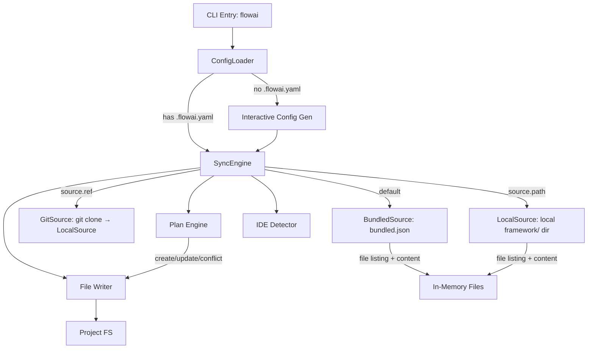

# Software Design Specification (SDS)

## 1. Introduction

- **Document purpose:** Detail the implementation and architecture of flowai.
- **Relation to SRS:** Implements requirements defined in
  `documents/requirements.md`.

## 2. System Architecture

- **Overview diagram:**
  ```mermaid
  graph TD
    Packs[framework/] -->|deno task sync-local| Claude[.claude/]
    Packs -->|flowai sync bundled.json| Users[End Users]
    Claude -->|skills, agents, hooks| IDE[Claude Code]
    IDE -->|Updates| Docs[documents/*.md]
    IDE -->|Executes| Actions[Code/Git/MCP]
    IDE -->|Updates| Claude
  ```
- **Main subsystems and their roles:**
  - **Product Framework (`framework/`):** Source of truth for end-user packs (skills, agents, hooks, scripts). Distributed via flowai.
  - **Dev Resources (`.claude/skills/`, `.claude/agents/`):** Generated by `deno task sync-local` from `framework/`. NOT tracked in git (gitignored). Auto-synced via SessionStart hook.
  - **Skills Subsystem:** Defines procedural workflows and capabilities.
  - **Agents Subsystem:** Defines specialized agent roles and prompts.
  - **Benchmark Runner:** Specialist in executing and analyzing agent acceptance tests.
  - **Documentation Subsystem:** Stores project state and memory.

## 3. Components

### 3.1 Dev Resources (`.claude/skills/`, `.claude/agents/`)

- **Purpose:** Dev-only skills and agents for flowai development. Not distributed to users.
- **Structure:**
  - `.claude/skills/` — Framework skills (from `deno task sync-local`) + dev-only skills (bench-all, opencode-guide)
  - `.claude/agents/` — Framework agents (transformed) + dev-only agents
  - `.claude/scripts/` — Hook scripts (from `deno task sync-local`)
- **Git tracking:** `.claude/skills/`, `.claude/agents/`, `.claude/scripts/` are gitignored. Generated on-demand.
- **Auto-sync:** SessionStart hook bootstraps if missing.
- **Command:** `deno task sync-local` reads from `framework/` directly via `LocalSource` (no bundle step).

### 3.1.1 Product Packs (`framework/`)

- **Purpose:** Modular groups of skills, agents, hooks, and scripts for end users. Each pack is a self-contained directory.
- **Structure:**
  ```
  framework/<pack-name>/
    pack.yaml              # name, version (semver), description, scaffolds, assets (optional)
    skills/<name>/SKILL.md # skills (full installed name, e.g. flowai-commit/)
    agents/<name>.md       # agents (optional)
    hooks/<name>/          # hook.yaml + run.sh (optional)
    scripts/<name>         # utility scripts (optional)
    assets/                # shared templates (optional, e.g. AGENTS.md templates)
  ```
- **Packs:** `core` (base commands), `devtools` (skill/agent authoring), `engineering` (procedural knowledge), `deno` (Deno-specific), `typescript` (TS-specific), `memex` (long-term knowledge bank for AI agents, see §3.15).
- **Resource discovery:** Convention over configuration — resources found by scanning subdirectories, not listed in `pack.yaml`.
- **No inter-pack dependencies:** Each pack is self-contained. Enforced by `check-pack-refs.ts` (core→non-core and non-core-A→non-core-B references are errors; any→core and intra-pack are OK).
- **Naming:** Directory names inside packs are the full installed names (e.g., `flowai-commit/`, `flowai-skill-write-dep/`). flowai copies them as-is — no name transformation at install time.
- **Categories (by installed prefix):**
  - `flowai-*` (not `flowai-skill-*`): User-only commands (e.g., `flowai-commit`, `flowai-review-and-commit`, `flowai-update`).
  - `flowai-skill-*`: Agent-auto-invocable skills (e.g., `flowai-skill-plan`, `flowai-skill-fix-tests`, `flowai-skill-setup-agent-code-style-ts-deno`).
- **Composition**: Skills can delegate to other skills (e.g., `flowai-init` delegates development command configuration to `flowai-skill-configure-*-commands`). Composite skills (`flowai-review-and-commit{,-beta}`) inline source step_by_step blocks verbatim and must follow the rules in `framework/AGENTS.md` §Composite Skill Authoring (no delegation, no source-skill names in description, explicit verdict-gate success path) — sync enforced by `scripts/check-skill-sync.ts`.
- **Beta commit variants:** `flowai-commit-beta` and `flowai-review-and-commit-beta` add a *Post-Reflect Cleanup Commit* step: when the auto-invoked `flowai-skill-reflect` leaves working-tree edits, the workflow stages and commits them as a separate `agent: apply reflect-suggested improvements` commit before exiting — eliminates the "second manual commit" friction of the non-beta variants.
- **Full-cycle composite (FR-DO-WITH-PLAN):** `flowai-do-with-plan` (user-only command at `framework/core/commands/flowai-do-with-plan/`) drives plan → implement → review-and-commit in one invocation. Inlines THREE source skills: `flowai-plan-exp-permanent-tasks` (Plan Phase; step 8 divergent — hands off to Implement instead of TOTAL STOP), `flowai-skill-review` (Review-and-Commit Phase, review steps), `flowai-commit-beta` (Review-and-Commit Phase, commit steps; step 1 divergent — "Verify Unchanged State" reuses diff from review). Three explicit phase gates: variant selection (Plan→Implement), green project check + non-empty diff (Implement→Review-and-Commit), verdict ≠ Approve halts (review→commit). Sync enforced by `scripts/check-skill-sync.ts` `SYNC_CHECKS` entry with three sources.
- **`-beta` lifecycle policy:** Any primitive (skill or command) whose source path ends in `-beta` MUST be either promoted (rename to its stable form, replacing the prior stable variant) or removed within **60 days** of its last functional commit. A `-beta` exists to A/B-test a delta against its stable counterpart via `deno task bench -s, --skill-override`; beyond 60 idle days the A/B comparison is no longer informative and the parallel SKILL.md becomes orphaned doc weight. `flowai-skill-maintenance` flags any `-beta` that crosses the 60-day threshold (Documentation Health category). Coverage parity rule: each behavioral delta listed in the `-beta`'s SKILL.md (or its intro commit) MUST have ≥1 dedicated benchmark scenario — without this the A/B signal is unsubstantiated. Promotion: rename source dirs from `<name>-beta` to `<name>`, delete the prior stable, port any `-beta`-specific scenarios into the new stable benchmark dir, update SDS/SRS references. Retirement: delete the `<name>-beta` source dir, its `benchmarks/`, cache entries under `acceptance-tests/cache/<pack>/<name>-beta-*`, and any SDS/SRS mention.
- **Script independence:** Scripts in pack `scripts/` are installed into user projects without a shared `deno.json`. They MUST be runnable standalone:
  - Use `jsr:` specifiers for Deno std imports (e.g., `jsr:@std/path`), NOT bare specifiers (`@std/path`).
  - Avoid dependencies requiring import maps or `deno.json` resolution.
  - Each script header MUST include a `Run:` section with the exact `deno run` command.

#### 3.1.2 Script Language Policy

All project scripts (`framework/<pack>/skills/*/scripts/`, `framework/<pack>/commands/*/scripts/`, and root `scripts/`) use Deno/TypeScript exclusively. Python appears only in acceptance test fixtures (test project stubs).

#### 3.1.3 Skill Tool Hints (`allowed-tools`)

Skills MAY use the `allowed-tools` frontmatter field (experimental, per agentskills.io spec) to pre-approve tools needed for script execution. Example:

```yaml
---
name: my-skill
description: Does something
allowed-tools: Bash(deno:*)
---
```

Adoption is optional. IDEs that support `allowed-tools` will auto-approve matching tool calls; IDEs that don't will ignore the field.

### 3.2 Product Agents (in packs)

- **Purpose:** Define specialized AI subagent personas and roles for end users.
- **Structure:** `.md` files inside `framework/<pack>/agents/`. One canonical file per agent.
  Frontmatter contains universal superset of all IDE fields; body is the shared system prompt.
- **Canonical Format:** Universal frontmatter — superset of all IDE-specific fields:
  `name`, `description` (required), `tools` (string, Claude), `disallowedTools` (string, Claude),
  `readonly` (bool, Cursor), `mode` (string, OpenCode), `opencode_tools` (map, OpenCode),
  `model` (tier: `max`/`smart`/`fast`/`cheap`/`inherit`), `effort` (string, Claude),
  `maxTurns` (int, Claude; renamed `steps` for OpenCode), `background` (bool, Claude), `isolation` (string, Claude),
  `color` (string, Claude/OpenCode).
  `flowai` extracts IDE-relevant fields and resolves model tiers at install time via `transformAgent()`.
- **Model Tiers:** Abstract quality/cost intent. Resolved to IDE-native values at install time:
  - Default maps: `claude: {max: opus, smart: sonnet, fast: haiku, cheap: haiku}`,
    `cursor: {max: slow, smart: slow, fast: fast, cheap: fast}`, `opencode: {}` (user configures).
  - User overrides via `.flowai.yaml` `models:` section.
  - `inherit` or absent → field omitted (IDE uses parent model).
- **Key Agents (5 canonical files):**
  - `core/agents/flowai-console-expert.md`: Specialist in executing complex console tasks without modifying code.
  - `core/agents/flowai-diff-specialist.md`: Specialist in analyzing git diffs and planning atomic commits.
  - `core/agents/flowai-skill-adapter.md`: Adapts skills to project specifics after upstream updates.
  - `core/agents/flowai-agent-adapter.md`: Adapts agent definitions to project specifics after upstream updates. Mirrors `flowai-skill-adapter` but for agent `.md` files — preserves YAML frontmatter, adapts body (system prompt).
  - `engineering/agents/flowai-deep-research-worker.md`: Research worker for a single direction within a deep research task; spawned by `flowai-skill-deep-research` orchestrator.
- **Distribution:** `flowai` transforms canonical agents into IDE-specific format at install time.
- **IDE frontmatter formats** (transformation rules owned by flowai, see also 3.5 Agent transformation rules):
  - **Universal (canonical):** `model` uses abstract tiers (`max`/`smart`/`fast`/`cheap`/`inherit`). Resolved by flowai at install time.
  - **Claude Code:** `name`, `description` (req), `tools`, `disallowedTools`, `model` (resolved: opus/sonnet/haiku), `effort` (low/medium/high/max), `maxTurns` (int), `background` (bool), `isolation` (worktree/remote), `color`.
  - **Cursor:** `name`, `description` (req), `model` (resolved: slow/fast), `readonly` (bool).
  - **OpenCode:** `description` (req), `mode: subagent`, `model` (resolved from .flowai.yaml or omitted), `tools` (map: write/edit/bash→bool), `color`. Filename = agent name.
  - **OpenAI Codex:** Not a markdown-frontmatter format. Each agent becomes two artifacts: (a) a sidecar `<cwd>/.codex/agents/<name>.toml` with top-level `name`, `description`, `developer_instructions` (the agent body as a TOML multi-line triple-quoted string); (b) a registration block `[agents.<name>] description="..." config_file="./agents/<name>.toml"` merged into `.codex/config.toml`. Agent body markdown is transferred verbatim into `developer_instructions`. Model tier is NOT written — Codex subagents inherit the session model. See 3.5 for the `toml_merge.ts` component.

### 3.3 Project Documentation (`documents/`)

- **Purpose:** Persistent project memory across AI sessions. Single source of truth for requirements, architecture, and current plans.
- **Hierarchy:**
  1. `AGENTS.md` — project vision, constraints, mandatory rules (root-level, read-only reference).
  2. `documents/requirements.md` (SRS) — functional and non-functional requirements. Source of truth for "what" and "why".
  3. `documents/design.md` (SDS) — architecture and implementation details. Depends on SRS.
  4. `documents/tasks/<YYYY-MM-DD>-<slug>.md` — temporary plans and notes in GODS format. One file per task/session. Directory is gitignored.
  5. `documents/ides-difference.md` — cross-IDE capability comparison (primitives, hooks, agents, MCP). Reference for FR-HOOK-DOCS–FR-IDE-SCOPE.
  6. `documents/acceptance-testing.md` — benchmark results and analysis.
- **Rules:**
  - Traceability: code references FR-* IDs via comments (`// FR-<ID>` or `# FR-<ID>`). SRS has `[x]`/`[ ]` status without `Evidence:` paths. Validated by `scripts/check-traceability.ts` (part of `deno task check`).
  - English only (except tasks). Compressed style (no fluff, high-info words).
  - Agent reads docs at session start; outdated docs = wrong assumptions.
- **Deps:** None (plain Markdown files).

### 3.4 Acceptance Test System (`benchmarks/`, `scripts/acceptance-tests/`)

- **Purpose:** Evidence-based evaluation of AI agent skill execution quality.
- **Architecture:**
  - `deno task acceptance-tests`: Evaluates agents via evidence-based scenarios. Supports direct model selection via `-m, --model` flag, and skill override via `-s, --skill-override` for A/B testing (runs existing scenarios against a different skill name).
  - **Parallel Execution Protection**: Uses `acceptance-tests/acceptance-tests.lock` file containing the PID to prevent concurrent runs. Implements signal listeners (`SIGINT`, `SIGTERM`) and `unload` events for reliable cleanup.
  - **Isolation**: Acceptance tests run in isolated sandboxes using `SpawnedAgent` (direct `Deno.Command` based). Sandbox contains only pack-scoped primitives: core pack acceptance test → core only; non-core pack acceptance test → core + that pack.
  - **Skill isolation from user-level installation — FR-ACCEPT-ISOLATION**: Claude Code's Skill tool resolves user-level (`~/.claude/skills/<name>/SKILL.md`) over project-level on name collision, so a developer's installed snapshot of `flowai-*` skills would silently shadow framework-source edits during a bench run. `ClaudeAdapter.prepareWorkspace(<sandbox>)` (called by `runner.ts` after framework copy and before agent spawn) constructs an isolated `$HOME = <workDir>/bench-home/` (sibling of `<workDir>/sandbox/`, deliberately outside the sandbox cwd so `git status` does not see it as untracked) with an empty `.claude/skills/` and two targeted symlinks: `Library/Keychains -> ~/Library/Keychains` (default keychain search-path) and `.local/share/claude -> ~/.local/share/claude` (versioned launcher + PID lock). `.credentials.json` is deliberately omitted — letting Keychain win avoids stale-refresh-token 400s from `platform.claude.com/v1/oauth/token`. The adapter never reads or writes `~/.claude/skills/`. Cursor and Codex have no equivalent resolution-path bug, so their adapters do not implement `prepareWorkspace` and the runner passes them through unchanged. Cache invalidation is automatic: the adapter source lives under `scripts/acceptance-tests/lib/adapters/`, which the cache-key `runner:` prefix already walks recursively.
  - **Container isolation — abandoned, not viable for subscription auth.** A previous Docker scheme (`ce1d4c1` Jan 27 2026, removed `9e30ab7` Jan 31 2026) wrapped `bench` in `docker run -v $(pwd):/app …`. Stripped because (a) `@sigma/pty-ffi` does not work cleanly in the alpine image, AND (b) the deeper, currently-blocking reason: Claude Pro/Max subscription auth lives in macOS Keychain and is bound to the `claude` binary's code-signing identity via an "Always Allow" ACL entry. Inside a Linux container the macOS Security framework is gone, the Linux `claude` binary expects `~/.claude/.credentials.json` (which does not exist on macOS hosts), and extracting the token from Keychain into a file requires a one-time interactive system dialog ("Allow security to access Claude Code"). There is no fully unattended path. The orphan `Dockerfile` at repo root is kept for cursor-agent ad-hoc runs but is not used by the bench. Resource isolation is therefore pushed into userspace guards (see §3.4.3).
  - **Co-located Scenarios**: Scenarios are co-located with primitives — `framework/<pack>/skills/<skill>/acceptance-tests/<scenario>/mod.ts` for skills and `framework/<pack>/commands/<command>/acceptance-tests/<scenario>/mod.ts` for commands. Pack-level scenarios (e.g., AGENTS.md rules) live at `framework/<pack>/acceptance-tests/<scenario>/mod.ts` with shared fixtures.
  - **JSON Configuration**: `acceptance-tests/config.json` stores unified model presets.
  - **Direct Model Support**: If a preset is not found, the system uses the provided name as the model identifier with default settings (temperature: 0).
  - **Side-Effect Validation**: System checks sandbox state (files, git) using LLM-Judge via Claude CLI (`cliChatCompletion` in `llm.ts`). Uses `--output-format json` + `--json-schema` for structured verdicts. No external API key required. Judge retries once on failure before marking items failed.
  - **Evidence Pipeline**: Raw NDJSON agent logs are converted to readable conversation format (`format_logs.ts`). Evidence (user query, agent logs, git diff/status/log, task files, generated files) is written to `<runDir>/judge-evidence.md` and passed to Claude CLI via `--append-system-prompt-file`. This avoids E2BIG/stdin size limits for large traces (~250KB). The user message to judge contains only the checklist and evaluation instruction. Evidence files persist in run directory for debugging.
  - **Execution Stability**: `SpawnedAgent` per-step timeout + global scenario timeout (default 15 min, `totalTimeoutMs`). Kills agent and proceeds to judge with partial evidence on expiry.
  - **Skill Integration**: Both `framework/<pack>/skills/` and `framework/<pack>/commands/` are copied into the sandbox IDE config dir (pack-scoped) by `copyFrameworkToIdeDir` in `scripts/acceptance-tests/lib/utils.ts`. Commands land in the same `.{ide}/skills/` target as skills; each command's `SKILL.md` gets `disable-model-invocation: true` injected via `injectDisableModelInvocation` from `cli/src/sync.ts` (single source of truth, mirrors production sync). The flag marks the primitive as user-only — it remains discoverable but is not auto-triggered by the model.
  - **Project Instructions**: Scenarios MUST declare `agentsTemplateVars` (required field; PROJECT_NAME, TOOLING_STACK, etc.) — runner renders the single AGENTS.md from the pack-level template (`framework/<pack>/assets/AGENTS.template.md`) at runtime (single source of truth). All sections (documentation rules, development commands, planning rules, TDD flow) live in this one template. For Claude adapter, a root CLAUDE.md symlink is created automatically. Legacy `agentsMarkdown` and fixture `AGENTS.md` are not supported.
  - **IDE Session Naming**: Claude adapter passes `--name <skill>/<scenario>` for session identification.
  - **Rich Tracing**: Generates single-file `trace.html` with dashboard, per-scenario detail views, and sidebar navigation. Modular architecture: `trace.ts` (facade) → `trace-collector.ts` (data) + `trace-renderer.ts` (HTML structure) + `trace-styles.ts` (CSS/JS) + `trace-types.ts` (shared types).
  - **Unified Data UI**: All technical data (logs, scripts, prompts) use a consistent `.data-block` component with line numbers, word wrap, and smart expand/collapse.
  - **Interactive Flows**: `UserEmulator` simulates user responses via LLM for multi-turn scenarios (persona-driven).
  - **Multi-Turn Benchmarking**: `SpawnedAgent` + `runner.ts` support automatic session resumption (`--resume`) when `UserEmulator` provides input.

### 3.4.1 Acceptance Test Result Cache — FR-ACCEPT-CACHE (`scripts/acceptance-tests/lib/cache.ts`)

- **Purpose:** Content-addressed cache of per-scenario verdicts, committed under `acceptance-tests/cache/<pack>/<scenario-id>/<ide>.json`. Short-circuits the agent + judge CLIs when inputs have not changed, turning `deno task acceptance-tests` into an incremental operation.
- **Interfaces:**
  - `computeCacheKey(inputs)` — pure async; sha-256 over a canonical-JSON payload. No side effects.
  - `readCache(scenario, ide)` — returns `CacheEntry | null`; treats any failure (missing file, corrupt JSON, schema mismatch) as a miss.
  - `writeCache(scenario, ide, entry)` — creates parent dirs; pretty-printed JSON.
  - `trimResultForCache(r)` — projects `BenchmarkResult` onto the committed shape; drops `logs`/`evidence`; truncates judge `reason` at `MAX_REASON_LEN = 200` with `…`.
  - `resultFromCache(scenario, entry)` — reconstructs a minimal `BenchmarkResult` for summary printing on hit.
- **Deps:** `@std/path`, `@std/fs/walk`, Web Crypto `crypto.subtle.digest("SHA-256", ...)`. No new third-party deps.
- **Data flow:**
  ```
  discoverScenarios → [per scenario]
     computeCacheKey → readCache
        hit  → resultFromCache → results[]         (skip runScenario)
        miss → runScenario → writeCache if all runs success
  ```
- **Cache-key algorithm (v1):** sha-256 of canonical JSON `{ version, scenarioId, ide, ideCliVersion, agentModel, runs, inputs }` where `inputs` is a sorted map of `<prefix>:<relpath> → fileHash(path)`. Prefixes: `scenario:` (scenario dir), `primitive:` (primitive dir, `benchmarks/` skipped), `pack.yaml:`, `agents.template:`, `runner:` (`scripts/acceptance-tests/lib/**` + `scripts/task-bench.ts`), `cli:` (whitelisted cross-package imports — `cli/src/transform.ts`, `cli/src/sync.ts`, `scripts/utils.ts`), `config:full`. Missing files contribute nothing.
- **CLI integration (`scripts/task-bench.ts`):** four flags — `--no-cache` (bypass read+write), `--refresh-cache` (skip read, force write on success), `--cache-check` (read-only, exit 1 on any miss), `--cache-with-runs` (opt-in to caching when `-n > 1`). First three are mutually exclusive. Cache is always bypassed when `scenario.skip` is set or when `-n > 1` without `--cache-with-runs`.
- **Adapter hook:** `AgentAdapter.cliVersion()` → `probeCliVersion(command, 2s timeout)` → trimmed `--version` stdout or `""` on any failure. Stable empty string keeps the key reproducible across probe failures on the same host.
- **Write policy:** write only when all N runs for a scenario return `success === true`. Failed runs never land in cache — protects against freezing broken scenarios at green.
- **Drift guard:** `cache_test.ts` parses every `*.ts` under `scripts/acceptance-tests/lib/` for imports, resolves relative paths, and asserts any import that escapes `scripts/acceptance-tests/` appears in `whitelistedCrossPackageFiles`. Catches silent staleness introduced by new cross-package dependencies.
- **Storage footprint:** One JSON file per (scenario, ide). Typical size ~1–3 KB. `logs` and `evidence` are dropped; full traces remain in the gitignored `acceptance-tests/runs/` directory.

### 3.4.2 Resource Guards For Spawned Agents — FR-ACCEPT-GUARDS (`scripts/acceptance-tests/lib/process_watchdog.ts`, `system_health.ts`)

- **Purpose:** Prevent two host-hang failure modes observed on 2026-05-09: a fork-loop incident at 02:43 (~720 `deno test` descendants in 90 s, 4 forced reboots) and a bloat-OOM incident at 07:50 (`compressor_size = 7.18 GiB`, `compression_ratio = 14`, kernel reported "no eligible processes" to jetsam, host hung until reboot at 08:53). Container-based isolation is unavailable for subscription-auth reasons (see §3.4 "Container isolation — abandoned"); these guards are the userspace replacement.
- **Why not `setrlimit`:** the natural-looking fix — `RLIMIT_AS`/`RLIMIT_DATA` per spawn — does not work against V8-based agents on macOS. Live data: `claude` runs at RSS=95 MB but VSZ=485 GB. V8 over-reserves virtual address space for heap spaces, code cache, and isolates; any `-v` cap small enough to constrain RSS will clip the V8 reservation and crash the binary at startup. `RLIMIT_RSS` is declared in `<sys/resource.h>` but the kernel does not enforce it on macOS or Linux. `RLIMIT_NPROC` is per-user, not per-tree, and is shared with all other user processes — not safe to lower from the bench. The only kernel-enforced macOS path is `launchd` jobs with `MemoryHighWatermark`, which would require a plist per spawn and a launchctl bootstrap/bootout cycle — significantly more complex than userspace polling and was out of scope for the immediate incident response.
- **Components:**
  - **`setpgrp_exec.py`** — Python wrapper invoked between Deno and the agent CLI. Calls `os.setsid()` then `os.execvp(target, args)`. After exec the agent owns a brand-new session and process group whose PGID equals the agent's PID. Every grandchild inherits the PGID, even after re-parenting to PID 1 when an intermediate parent dies. Required because `Deno.Command` cannot itself enter a new process group; macOS does not ship the GNU `setsid` binary; and FFI to `libc setsid()` is more code than a 6-line Python wrapper. Skipped only when the test caller passes `disableWatchdog: true` to `SpawnedAgent` (programmatic; no env-var bypass).
  - **`process_watchdog.ts`** — per-spawned-agent poll loop. `startWatchdog(rootPid, opts)` returns `WatchdogHandle { stop, trip, isStopped }`. Every `intervalMs` (default 500):
    - Resolve PGID lazily on first tick (`getPgid(rootPid)`), falling back to `rootPid` itself when the leader has already exited (orphan-only group). The setsid contract guarantees PGID == leader PID, so the fallback is safe.
    - List process group via `pgrep -g <pgid>` — finds reparented orphans that PPID-walk misses.
    - **Fork-loop check**: `members.length - 1 > maxDescendants` (default 5) for `confirmSamples` (default 2) consecutive samples → trip.
    - **RSS-bloat check**: `readTotalRssBytes(members)` via `ps -o pid=,rss=` → sum bytes. `> maxRssBytes` (default 6 GiB) for `confirmSamples` consecutive samples → trip.
    - On trip: `tripNow()` publishes the `WatchdogTrip { cause, reason, descendants, totalRssBytes, killedPids, trippedAt }` object SYNCHRONOUSLY before awaiting the kill sequence — otherwise consumers reading `watchdog.trip()` after `child.status` resolves on SIGTERM see `null` because the kill grace period outlives the agent's exit-status resolver.
    - Kill sequence: `/bin/kill -TERM -- -<pgid>`, wait `graceMs` (cancellable via `AbortController` so `wd.stop()` lets in-flight grace exit cleanly during tests), `/bin/kill -KILL -- -<pgid>`. The negative-PID syntax targets the entire process group atomically — orphans included.
    - Programmatic-only test escape: `WatchdogOptions.disabled = true` returns a no-op handle; `AgentOptions.disableWatchdog = true` ALSO skips the python wrapper. There is NO environment-variable path to bypass the watchdog — production callers cannot disable it accidentally or under agent control.
  - **History — why not PPID-walk.** The first cut of this watchdog walked descendants via `pgrep -P <root>` recursively. On 2026-05-09 12:12 a real bench scenario (`flowai-skill-configure-deno-commands-trigger-pos-3`, since consolidated into `trigger-pos-1` on 2026-05-10) tripped the count threshold at 35 descendants; the watchdog SIGTERM'd them, but their grandchildren had already re-parented to PID 1 and were no longer descendants of root. The tree-walk reported "tree killed", the bench moved on, and the orphans kept forking in the background until the host hung and required a forced reboot. The fix is the process-group approach above — the kernel's `kill(2)` with negative PID hits all members, regardless of whether their immediate parent is still alive.
  - **`system_health.ts`** — `assertHealthy(thresholds, context)` reads `vm_stat` + `sysctl hw.memsize` + `sysctl vm.swapusage` + `sysctl vm.loadavg` + `sysctl hw.ncpu`, computes `availableBytes = free + inactive + speculative + purgeable` and `effectiveHeadroomBytes = availableBytes + freeSwap × swapDiscountFactor` (default discount 0.3 — swap is several times slower than RAM, so 1 GB of free swap counts as ~300 MB of effective headroom). Throws `SystemUnhealthyError` when headroom drops below `BENCH_MIN_HEADROOM_MB` OR load-per-CPU exceeds `BENCH_MAX_LOAD_PER_CPU`. The single-axis combined headroom replaces the earlier two-axis scheme (`BENCH_MIN_FREE_PCT` + `BENCH_MAX_SWAP_PCT`), which produced false aborts when one axis was tight but the other had ample slack. Linux returns `NEUTRAL_HEALTH` (`platform: "other"`) and never trips. There is NO escape hatch — thresholds may be tuned via env, but the gate cannot be skipped.
  - **`spawned_agent.ts` integration** (`SpawnedAgent.start`): `await assertHealthy(undefined, "agent <name>")` BEFORE `cmd.spawn()`. On `SystemUnhealthyError` → log to scenario evidence, `cleanup(75)` (`EX_TEMPFAIL`), no spawn. On healthy → log snapshot to `fullLog` (lands in `judge-evidence.md`), spawn, attach `startWatchdog(this.process.pid, {...})`. `onTrip` callback labels the message by `trip.cause` (`[fork-loop guard]` vs `[rss-bloat guard]`) and prepends to log + stderr. `cleanup()` reads `watchdog.trip()`; if non-null, returns final exit code 137 instead of the raw `child.status.code`.
- **Tunables (env, all optional, threshold-only — gates cannot be disabled via env):**
  - Health: `BENCH_MIN_HEADROOM_MB` (2048), `BENCH_SWAP_DISCOUNT` (0.3), `BENCH_MAX_LOAD_PER_CPU` (4).
  - Watchdog: `BENCH_MAX_DESCENDANTS` (5), `BENCH_MAX_RSS_GB` (6), `BENCH_WATCHDOG_INTERVAL_MS` (2000), `BENCH_WATCHDOG_CONFIRM` (2).
  - Programmatic-only test bypass: `AgentOptions.disableWatchdog` / `WatchdogOptions.disabled`. No env-var bypass for either guard.
- **Reaction window math:** `intervalMs × confirmSamples = 1 s` between first overshoot and kill (500 ms × 2). A pathological fork bomb on M-series silicon can produce ~200 children/s, so the worst case before kill is ~200 transient processes — well below the ~720 that triggered compressor-shortage in the original incident. Earlier default `intervalMs=2000` was tightened after a 2026-05-09 12:12 test on `flowai-skill-configure-deno-commands-trigger-pos-3` (since consolidated into `trigger-pos-1` on 2026-05-10) where the watchdog tripped at 35 descendants but swap had already grown from 2 GiB to 6 GiB — kill in time, but spike too large.
- **Aggregate gap (open):** guards are per-`SpawnedAgent`. If `task-bench.ts` ever runs N scenarios in parallel, each gets its own 6 GiB cap; total can exceed the host. Sequential execution is the current default, so no aggregate accumulator exists. When concurrency is added, a runner-level `Map<rootPid, currentRssBytes>` should be threaded through and a global cap applied.
- **Deps:** `Deno.Command` (for `pgrep`, `ps`, `vm_stat`, `sysctl`). No third-party deps.

### 3.4.3 Skill Trigger Benchmarks — FR-ACCEPT.TRIGGER

- **Purpose:** Verify the LLM picks the correct skill (or none) for a given user query, independent of whether the skill *executes* correctly when chosen. Detects description-matching regressions: a description rewrite that makes the skill invisible (false negative) or over-broad (false positive). Pairs with execution scenarios, which assume the skill is already loaded.
- **Layout:** Co-located with each skill, parallel to existing execution scenarios:
  ```
  framework/<pack>/skills/<skill-id>/acceptance-tests/
    trigger-pos-1/mod.ts    trigger-adj-1/mod.ts    trigger-false-1/mod.ts
    <execution-scenario>/mod.ts ...
  ```
- **Naming convention:** Scenario `id` is `<skill-id>-trigger-<type>-1` where `<type>` is `pos`, `adj`, or `false`. The trailing `-1` is preserved for backward compatibility with existing trace tooling; only `n=1` is permitted (the previous 3+3+3 layout was reduced to 1+1+1 on 2026-05-10).
- **Type semantics:**
  - `trigger-pos-*` (positive): user query that naturally matches the skill's description. Skill MUST activate.
  - `trigger-adj-*` (adjacent-negative): user query for which a *different, neighboring* skill is the right match (e.g., for `flowai-skill-fix-tests` an adjacent query targets `flowai-skill-jit-review`). The skill under test MUST stand down.
  - `trigger-false-*` (false-use-negative): user query inside the skill's general domain but with the wrong intent — typically asking *about* the skill, asking how it works, requesting documentation on its idiom, or asking for something semantically close but explicitly excluded by the description. The skill under test MUST stand down.
- **Scenario shape:** Plain `AcceptanceTestScenario` instance with `id`, `name`, `skill`, `agentsTemplateVars`, `userQuery`, and `checklist` (1 critical item). No `setup`, no `fixturePath` (default empty sandbox is sufficient — trigger decisions happen before any project state matters).
- **Checklist phrasing (stable, judge-friendly):**
  - Positive (`expectTriggered: true`):
    - `id`: `skill_invoked`
    - `description`: "Did the agent load and act on `<skill-id>` in response to this query? Look in the trace for a `Skill` tool call or a read of the skill's `SKILL.md` for `<skill-id>`."
    - `critical`: true
  - Negative (`expectTriggered: false`):
    - `id`: `skill_not_invoked`
    - `description`: "Did the agent AVOID loading `<skill-id>`? For this query the skill is not appropriate; the agent should either invoke a different skill or respond directly without reading `<skill-id>/SKILL.md` or calling the `Skill` tool with `<skill-id>`."
    - `critical`: true
- **Coverage enforcement:** `scripts/check-trigger-coverage.ts` walks `framework/*/skills/flowai-skill-*` and asserts each contains exactly the 3 expected `acceptance-tests/trigger-{pos,adj,false}-1/mod.ts` files. Wired into `scripts/task-check.ts`. Failure messages list the missing/misnamed paths. Stray `trigger-{pos,adj,false}-{2,3,...}` directories are reported as misnamed.
- **Selection guidance for authors** (also in the authoring skill):
  - `pos` query should sound like a real user — short, natural, no `/skill-name` invocation, no over-specified jargon. With N=1, the single phrasing carries the full description-match weight: pick the phrasing most likely to expose a description regression (typically the most natural / least-jargonized form a user would use).
  - `adj` query picks the *most likely confusion* skill — usually a sibling in the same pack, or a skill with overlapping vocabulary. Examples: `flowai-skill-fix-tests` ↔ `flowai-skill-jit-review`; `flowai-skill-plan` ↔ `flowai-skill-epic`.
  - `false` query probes the skill's hardest no-go case. Recommended patterns: surface-vocabulary match where the actual ask is something else (e.g., a planning skill receiving "plan" in a non-software-task sense; a fix-tests skill receiving a "speed up the test runner" perf request); reverse-intent traps (e.g., write *new* tests vs fix *failing* ones). **Do NOT use meta-questions about the skill itself** ("what does X cover?", "how does X work?", "when should I use X?") as false-use. Under Claude Code, installed skills are exposed as a `.claude/skills/` directory listing; a meta-query is legitimately answered by reading the skill's `SKILL.md`, so the agent will rightly load it and the judge will record activation. Treat meta-questions as positives or omit them.
- **Cost / cache:** Each scenario runs the agent once and the judge once. Trigger benchmarks compose with `FR-ACCEPT-CACHE` (no special handling). Skill-description edits invalidate exactly the affected skill's 3 scenarios.
- **Retry:** Judge-level retry-on-error (`scripts/acceptance-tests/lib/judge.ts:103`) absorbs transient judge failures. Agent-level retry-on-result is intentionally NOT applied — re-running a "skill not invoked" until it passes would mask real description regressions. Suspected agent variance is investigated by manual re-run (`deno task bench -f <scenario-id>`).
- **History:** Original 3+3+3 layout (9 scenarios per skill) was reduced to 1+1+1 (3 per skill) on 2026-05-10; see `documents/tasks/2026/05/trigger-n1-retry.md` for rationale (no empirical justification for N=3 in the originating task; 70% of all framework acceptance tests were trigger scenarios; 24/39 skills had zero cached trigger verdicts at the time of audit, indicating the triple-redundancy was theoretical).

### 3.4a Experiments Subsystem (RELOCATED) — FR-EXP

Relocated to [`flowai-experiments`](https://github.com/korchasa/flowai-experiments) on 2026-04-11 (provenance SHA `f311142`). That repo owns: the experiment runner/judge/noise/report/tokens libs, the `claude-md-length` variants and committed results, the `deno task experiment` CLI, and the `writeMemoryFile`/`getCleanroomEnv` adapter extensions that were experiment-only. The `AgentAdapter` contract in `flow` returns to regression acceptance-test responsibilities (no memory-file injection, no cleanroom env plumbing). `task-bench.ts` discovery was always scoped to `framework/<pack>/.../acceptance-tests/`, so no isolation logic changed.

### 3.5 Global Framework Distribution — FR-DIST (`cli/`)

- **Purpose:** Install/update flowai framework skills/agents into project-local IDE config dirs.
- **Location:** `cli/` monorepo directory. Published to JSR as `@korchasa/flowai`.
- **Pattern:** Single-command CLI. Adapter pattern for FS isolation. Bundled source (default), git clone, or local path.
- **Diagram:**

- **Components:**
  - `cli/src/cli.ts` — CLI entry, `sync` subcommand, `--global`/`-g` flag, IDE context guard (`isInsideIDE`; skipped when `--global` is set), @cliffy/command
  - `cli/src/config.ts` — `.flowai.yaml` parser/writer, validation (include/exclude mutual exclusivity). Config path resolution honours scope (`<cwd>/.flowai.yaml` vs `~/.flowai.yaml`).
  - `cli/src/scope.ts` — `SyncScope = "project" | "global"`. `resolveScope(flags)` reads the explicit scope flags (`--global` / `--local` / `--auto`). `resolveAutoScope(cwd, home, fs)` applies the auto-resolution ladder (project config → global config → `null`) for the `--auto` default. `resolveConfigPath(scope, cwd, home)` returns `<cwd>/.flowai.yaml` or `~/.flowai.yaml`. `resolveIdeBaseDir(ide, scope, cwd, home, purpose?)` returns the target base dir per IDE per scope (purpose `"skills" | "agents"` used only to split Codex global paths: `~/.codex/` for agents, `~/.agents/skills/` for skills). Project mode maps 1:1 to `<cwd>/.{ide.configDir}`. Global mode maps to user-level native dirs: Claude `~/.claude/`, Cursor `~/.cursor/`, OpenCode `~/.config/opencode/`, Codex-agents `~/.codex/`, Codex-skills `~/.agents/skills/`.
  - `cli/src/config_generator.ts` — config creation: interactive (prompts via @cliffy/prompt) and non-interactive (auto-detect IDEs, all packs)
  - `cli/src/source.ts` — `FrameworkSource` interface, `BundledSource` (reads `bundled.json`), `GitSource` (clones repo to tmpdir, delegates to `LocalSource`), `LocalSource` (reads `framework/` dir, follows symlinks, excludes acceptance-tests/_test), `InMemoryFrameworkSource` (tests)
  - `cli/src/sync.ts` — orchestrates: `resolveSource()` (git/local/bundled) → filter skills/agents → compute plan → write files → symlinks
  - `cli/src/plan.ts` — compares upstream vs local (create/ok/conflict classification)
  - `cli/src/writer.ts` — writes plan items to IDE config dirs
  - `cli/src/transform.ts` — transforms universal agent frontmatter into IDE-specific format
  - `cli/src/toml_merge.ts` — merges flowai-managed `[agents.<name>]` blocks into an existing Codex `config.toml` without touching unrelated user sections. Pure (no FS). Uses `jsr:@std/toml`. Ownership is determined by the `flowai-` key prefix (FR-DIST.CLEAN-PREFIX) — any `[agents.flowai-*]` not in the incoming changes is removed; non-prefix tables are preserved verbatim. Throws on malformed input TOML (never silently overwrites). See FR-DIST.CODEX-AGENTS.
  - `cli/src/ide.ts` — IDE detection by config dir presence + `isInsideIDE()` env var check (`CURSOR_AGENT`, `CLAUDECODE`, `OPENCODE`, `CODEX_THREAD_ID`, `CODEX_SANDBOX`)
  - `cli/src/symlinks.ts` — root `CLAUDE.md -> AGENTS.md` symlink (FR-DIST.SYMLINKS)
  - `cli/src/version.ts` — self-update check against JSR registry (fail-open)
  - `cli/src/update.ts` — two entry points: `notifyUpdateAvailable(options?)` used by `flowai` / `flowai sync` pre-flight, prints an `Update available: … Run \`flowai update\` to install.` hint and never spawns an install (silent when up to date, network-failing, or skipped — FR-DIST.UPDATE); `runSelfUpdate(options?)` used exclusively by the `flowai update` subcommand, checks JSR via `checkForUpdate()` and installs via `runUpdate()` (FR-DIST.UPDATE-CMD). Both fail-open on network errors.
  - `cli/src/adapters/fs.ts` — `FsAdapter` abstraction + `DenoFsAdapter` + `InMemoryFsAdapter`
  - `cli/scripts/bundle-framework.ts` — generates `src/bundled.json` from `../framework/`
- **Data entities:**
  - `FlowConfig`: `{ version, ides, packs, skills: {include, exclude}, agents: {include, exclude}, source? }` (`source`: git branch/local path override)
  - `SourceConfig`: `{ git?, ref?, path? }` — `ref` = branch/tag (default URL: `DEFAULT_GIT_URL`); `git` = custom repo URL (requires `ref`); `path` = local dir (mutually exclusive with `ref`)
  - `PackDefinition`: `{ name, version, description, scaffolds?: Record<skill, paths[]>, assets?: Record<template, artifactPath> }` (parsed from `pack.yaml`)
  - `HookDefinition`: `{ event, matcher?, description, timeout? }` (parsed from `hook.yaml`; timeout default: 30 PostToolUse, 600 PreToolUse)
  - `PlanItem`: `{ type: skill|agent|hook|script|asset, name, action: create|update|ok|conflict, sourcePath, targetPath, content }`
- **Agent transformation rules** (per IDE): See 3.2 IDE frontmatter formats.
- **Pack resolution flow:** Load config → expand `packs:` to resource lists (skills, agents, hooks, scripts from `framework/*/`) → apply `skills.include/exclude` filter → compute plan → write. `resolvePackResources()` returns `hookNames` and `scriptNames` alongside skills/agents.
- **Rich sync output:** `flowai sync` produces instruction-oriented output. Layout (top→bottom): truthful header (`flowai sync complete.` on success / `flowai sync FAILED: N error(s).` on errors, red via `cli/src/color.ts` when stdout is TTY and `NO_COLOR` unset) → `>>> ACTIONS REQUIRED` (config migration, updated/created/deleted skills with inline scaffolds, agents, hooks, assets with artifact mappings; counter shown as `N/M` when partial writes failed and failed items are hidden from the success list) → `>>> NO ACTIONS REQUIRED` summary → `>>> ERRORS (N):` block (red) listing failed writes — last so it stays visible in scrollback. Failed status is propagated by `markFailedActions()` (`cli/src/resource_index.ts`) cross-referencing `result.errors` with each section's `ResourceAction[]`. `SyncResult` includes `configMigrated`, `skillActions[]`, `agentActions[]`, `hookActions[]`, `assetActions[]`, `errors[]` (with `name`/`type` for failure attribution), and `dryRun?: boolean`. Post-sync frontmatter validation via `flowai-update/scripts/validate_frontmatter.ts` (scans IDE config dirs for skills + agents).
- **Sync plan preview:** `formatSyncPlan(config, {scope, home})` (`cli/src/cli.ts`, pure string builder for testability) prints Source/IDEs/Skills/Agents block before the confirmation prompt. In global mode it appends a `Target dirs:` list of resolved user-level base dirs per IDE — including the Codex split (`~/.codex` for agents + `~/.agents` for skills) — surfacing the blast radius before any writes.
- **Dry-run (`--dry-run` / `-n`):** Compute and render the full plan without writing. Implemented via `wrapDryRun(fs)` in `cli/src/sync.ts` — a read-through `FsAdapter` that turns `writeFile`/`mkdir`/`symlink`/`remove` into no-ops, leaving every downstream write site unaware. `processPlan` short-circuits before `writeFiles` so `totalWritten` stays 0 and the renderer reports the run truthfully. Dry-run skips the spinner, the `notifyUpdateAvailable` pre-flight step, the new-config generator, and conflict prompts; exits 0 always.
- **Exit code:** `runSync` returns `number`; root command and `sync` subcommand call `Deno.exit(code)` when non-zero. `1` if `result.errors.length > 0` after a real run; `0` for any dry-run.
- **Hook installation:** Reads `hook.yaml`, generates IDE-specific config via `cli/src/hooks.ts`: Claude Code → 3-level nested `settings.json` hooks, Cursor → flat `.cursor/hooks.json`, OpenCode → generated `flowai-hooks.ts` plugin, OpenAI Codex → Claude-compatible nested `.codex/hooks.json` (events: `PreToolUse`, `PostToolUse`, `SessionStart`, `UserPromptSubmit` — same wire names as Claude; feature-gated behind the `codex_hooks` feature flag and behind the `experimental.codexHooks: true` key in `.flowai.yaml`). Event/tool name mapping per IDE (`EVENT_MAP`, `TOOL_MAP`). Manifest `.{ide}/flowai-hooks.json` tracks installed hooks for deinstallation. Merge preserves user hooks not in manifest. 1 framework hook: `flowai-skill-structure-validate` (PostToolUse, SKILL.md validation).
- **Codex subagent sync:** For `ide === "codex"`, agent-writing bypasses the standard markdown path. `syncCodexAgents(...)` in `cli/src/codex_sync.ts`: (1) reads existing `.codex/config.toml` (or starts empty); (2) writes each universal agent body as a sidecar `.codex/agents/<name>.toml` with top-level `name`, `description`, `developer_instructions = """..."""`; (3) runs `computePrefixOrphansPlan` over `.codex/agents/` to delete any `flowai-*.toml` sidecar not in the current change-set; (4) calls `mergeCodexConfig(tomlText, changes)` to upsert `[agents.<name>] description="..." config_file="./agents/<name>.toml"` blocks and strip `[agents.flowai-*]` tables not in changes, preserving all non-prefix TOML sections; (5) removes legacy `.codex/flowai-agents.json` manifest if present (one-shot migration from the old mechanism). Removing or renaming an agent removes both the sidecar and the `[agents.<name>]` block on next sync via the prefix rule. Malformed existing `config.toml` throws with file path + underlying parse error.
- **Prefix-based orphan cleanup (FR-DIST.CLEAN-PREFIX):** Framework sync calls `computePrefixOrphansPlan(targetDir, keepNames, fs, type, { prefix: "flowai-", ext })` once per managed dir per IDE. Invariants: (a) delete only entries whose name starts with `flowai-`; (b) never delete symlinks (`entry.isSymlink`); (c) strip `ext` (`.md` for agents, `.toml` for Codex sidecars, `""` for skill dirs) before comparing against `keepNames`. For the `{ide}/skills/` dir (skills + commands share it) `keepNames = skillNames ∪ commandNames` — a single pass runs after both resources are written. Supersedes the old `computeDeletePlan(allFrameworkNames, includedNames, ...)` which missed renames because the removed-from-bundle name also disappeared from `allFrameworkNames`. User primitives (no `flowai-` prefix) and third-party skills (e.g. `paperclip`, `para-memory-files`) are untouched by construction. `runUserSync` does NOT invoke prefix cleanup — its scan phase already filters `flowai-*` out of the user-owned set.
- **Script installation:** Copies to `.{ide}/scripts/` (simple file copy).
- **Naming:** Pack directory names are the final installed names (e.g., `flowai-commit`, `flowai-skill-write-dep`). No name transformation at install time.
- **Dev-only file exclusion:** Bundle and sync exclude dev-only files from distribution: acceptance test scenarios (`/acceptance-tests/`) and test files (`_test.*`). Filtering at two levels: `bundle-framework.ts` (build time) and `readSkillFiles`/`readPackSkillFiles` in `sync.ts` (runtime).
- **Distribution:** JSR via `deno publish`. `bundled.json` generated at publish time from `framework/*/`. No build step for TS.
- **Scope + global mode (FR-DIST.GLOBAL):** `SyncScope = "project" | "global"` threaded via `cli/src/scope.ts`. CLI exposes three mutually exclusive flags on `flowai` / `flowai sync`: `--global` / `-g` (force global), `--local` / `-l` (force project), `--auto` (default). **Resolution in `--auto`** (via `resolveAutoScope(cwd, home, fs)` in `scope.ts`): (1) `<cwd>/.flowai.yaml` exists → `"project"`; (2) else `~/.flowai.yaml` exists → `"global"` (CLI logs `Using global config at ~/.flowai.yaml`); (3) both missing → `null` (caller prompts interactively, or defaults to global in `-y` mode). **Explicit flags** skip the ladder: `--global` loads/creates `~/.flowai.yaml`, `--local` loads/creates `<cwd>/.flowai.yaml`; conflicting flags (`--global` + `--local`) exit non-zero. **`migrate` subcommand** requires explicit `--global`/`--local`; no auto-resolution. **IDE guard** (`isInsideIDE()`) fires only when resolved scope is `"project"`; global scope bypasses the guard. Project mode: targets `<cwd>/.{ide}/`, scaffolds + artifact sync enabled, hooks merged into `<cwd>/.claude/settings.json`. Global mode: targets per IDE native user dir (see Components bullet for `scope.ts`), scaffolds + artifact sync SKIPPED (templates still install), hooks merged into `~/.claude/settings.json` (same manifest-based logic). `resolvePackResources()` filters by the `scope:` frontmatter field: `project-only` primitives skipped in global mode, `global-only` primitives skipped in project mode, absent = both (FR-PACKS.SCOPE).

### 3.5.1 AGENTS.md Re-Adaptation Skill — `flowai-skill-adapt-instructions`

- **Purpose:** Standalone skill (installable in both scopes) that re-adapts the project's AGENTS.md when the upstream template changes significantly. Reads the installed template (`{ide}/assets/AGENTS.template.md`, path resolved per scope), diffs against `<cwd>/AGENTS.md`, proposes a merge preserving project-specific sections, writes on user approval.
- **Location:** `framework/core/skills/flowai-skill-adapt-instructions/SKILL.md` + `acceptance-tests/basic/mod.ts` (agent-auto-invocable, placed under `skills/` with `flowai-skill-*` prefix per FR-PACKS.STRUCT naming).
- **No template duplication:** The skill does NOT carry its own copy of the AGENTS.md template. It relies on the pack-level asset installed by `flowai sync` into `{ide}/assets/`.
- **Relation to `flowai-update`:** `flowai-update` (scope: `project-only`) delegates the AGENTS.md migration step to `/flowai-skill-adapt-instructions` rather than re-implementing template diffing.
- **Behavioral requirements:** See acceptance test `flowai-skill-adapt-instructions-basic`.

### 3.6 Migrate Command — FR-DIST.MIGRATE (`cli/src/migrate.ts`)

- **Purpose:** One-way migration of all IDE primitives (skills, agents, commands) from one IDE config dir to another. Unlike `user_sync` (bidirectional, mtime-based, user resources only), `migrate` is explicit, one-directional, includes all resources (`flowai-*` + user-created), and requires no `.flowai.yaml`.
- **CLI:** `flowai migrate <from> <to>`. Flags: `--yes` (overwrite without prompt), `--dry-run` (print plan, no writes). Known IDEs: `claude`, `cursor`, `opencode`.
- **Components (`cli/src/migrate.ts`):**
  - `ScannedResource` — `{ name, type: skill|agent|command, files: [{relPath, content}] }`
  - `MigrateOptions` — `{ yes, dryRun, promptConflicts? }`
  - `scanAllResources(cwd, fromIde, fs)` — scans `skills/`, `agents/`, `commands/` subdirs; no filter; uses `safeReadDir` (skips missing dirs).
  - `buildMigratePlan(resources, fromIde, toIde, cwd, fs, modelMap, log)` — async; reads target files; classifies each item as `create/ok/conflict`; transforms agents via `crossTransformAgent()`.
  - `runMigrate(cwd, from, to, fs, options, log)` — validates IDEs, scans, builds plan, applies via `processPlan` (or prints in dry-run mode).
- **Reused from existing modules:** `crossTransformAgent` (`transform.ts`), `processPlan` (`sync.ts`), `DEFAULT_MODEL_MAPS` (`transform.ts`).
- **Excluded from migration:** rules (`.cursor/rules/`, `.claude/rules/`) and hooks — fundamentally different formats across IDEs, no automated transform.

### 3.7 Conventional Commits `agent:` Type — FR-AGENT-COMMIT

- **Purpose:** Dedicated commit type for AI agent/skill config changes.
- **Behavioral requirements:** See acceptance tests `flowai-commit-agent-type`.

### 3.8 flowai-init Multi-File Architecture + Diff-Based Updates — FR-INIT.IDEMPOTENT

- **Purpose:** Preserve user edits during re-initialization. Single root AGENTS.md file generated from the pack-level asset template. Legacy three-file layouts (`documents/AGENTS.md`, `scripts/AGENTS.md`) are detected and collapsed into root. Template updates tracked independently via `pack.yaml` `assets:` field (not flowai-init scaffolds).
- **Script:** `generate_agents.ts` (Deno/TS) — analyze-only. Command: `analyze`.
- **Behavioral requirements:** See acceptance tests `flowai-init-*` (6 scenarios).

### 3.9 AI Devcontainer Setup — FR-DEVCONTAINER

- **Purpose:** Generate `.devcontainer/` config for AI IDE development.
- **Behavioral requirements:** See acceptance tests `flowai-skill-setup-ai-ide-devcontainer-*` (6 scenarios).
- **Deps:** None (pure SKILL.md, agent-driven generation).

### 3.10 Framework Update Skill — `flowai-update`

- **Purpose:** Single entry point for updating framework + migrating asset-mapped and scaffolded artifacts.
- **Asset artifacts:** AGENTS.md template mapped via `pack.yaml` `assets:` field (single template → single project artifact). Tracked independently from skills — changes detected even when no skills are updated.
- **Scaffolded artifacts:** Remaining artifacts mapped via `pack.yaml` `scaffolds:` field (skill → artifact paths).
- **CLI integration:** `flowai` bare command is no-op inside IDE. `flowai sync` required explicitly.
- **Behavioral requirements:** See acceptance tests `flowai-update-*` (4 scenarios).

### 3.11 Loop Command — Non-Interactive Runner — FR-LOOP (`cli/src/loop.ts`)

- **Purpose:** Launch Claude Code non-interactively with a prompt. Base automation primitive.
- **CLI:** `flowai loop [OPTIONS] <prompt>`. Flags: `--agent`, `--model`, `--cwd`, `--yolo`, `--timeout`, `--interval`, `--max-iterations`. Skills invoked via prompt (e.g. `"/flowai-commit msg"`).
- **Components:**
  - `cli/src/loop.ts` — pure functions + runner:
    - `parseInterval(str)` — `"30s"`, `"5m"`, `"1h"` → ms
    - `buildClaudeArgs(options)` — constructs claude CLI args. Always adds `-p --output-format stream-json --verbose`
    - `StreamFormatter` — stateful ANSI formatter with agent nesting depth tracking. Labels: `[init]`, `[call]`, `[text]`, `[result]`, `[ok]`/`[error]`, `[agent:start]`, `[agent:call]`, `[agent:done]`
    - `processNDJSONStream(reader, onEvent)` — buffered NDJSON parser → `StreamResult`
    - `runOnce(options)` — spawn claude, stream-json processing, hang workaround, exit code
    - `runLoop(options)` — cycle: runOnce + sleep(interval) + iteration check
  - `cli/src/loop_test.ts` — 28 unit tests for pure functions, formatter nesting, processNDJSONStream
  - `cli/src/cli.ts` — registers `loop` subcommand
- **Process spawn:** `Deno.Command("claude", { stdin: "null", stdout: "piped", stderr: "inherit", env: { CLAUDECODE: "" } })`. `stdin: "null"` prevents terminal read; `CLAUDECODE: ""` allows nested launch.
- **Output:** Always stream-json. NDJSON real-time parsing + ANSI formatting. Subagent events (`task_started`/`task_progress`/`task_notification`) indented by nesting depth. 30s hang workaround after result event.
- **Exit code:** resultEvent.is_error → process exit code → 1 (fallback).
- **Defaults:** interval=0 (no pause), max-iterations=infinite, timeout=none.

### 3.12 Standalone Primitive Adaptation — `flowai-adapt`

- **Purpose:** On-demand adaptation of all installed framework primitives (skills, agents, AGENTS.md artifact, hooks) to project specifics — independent of `flowai-update`.
- **Command:** `framework/core/commands/flowai-adapt/SKILL.md`. User-only primitive under `commands/` directory; `disable-model-invocation: true` is injected by the CLI writer at sync time.
- **Subagents:**
  - `flowai-skill-adapter` — adapts skill SKILL.md (reused from flowai-update).
  - `flowai-agent-adapter` — adapts agent `.md` body, preserves YAML frontmatter.
- **Workflow:**
  1. Detect IDE config dirs (`.claude/`, `.cursor/`, `.opencode/`).
  2. Parse args: type filter (`--skills`/`--agents`/`--assets`/`--hooks`) + optional name.
  3. Adapt skills: scan `{ide}/skills/`, parallel subagents, diff + confirm.
  4. Adapt agents: scan `{ide}/agents/`, parallel subagents, diff + confirm.
  5. Verify AGENTS.md artifacts: template-vs-artifact comparison.
  6. Adapt hooks: check for stack-specific commands, skip agnostic.
  7. Summary.
- **Git tracking:** Adaptation state tracked through git history. Working tree = current version; `git show HEAD:<path>` = previous adapted version. No extra metadata fields.
- **Relation to flowai-update:** `flowai-update` ties adaptation to the sync cycle. `flowai-adapt` runs standalone — after first install, stack change, or selectively.
- **Behavioral requirements:** See acceptance tests `flowai-adapt-skills-basic`, `flowai-adapt-agents-basic`.

### 3.13 JIT Review Skill — `flowai-skill-jit-review`

- **Purpose:** Diff-centric risk hunter. Generates ephemeral "Catching JiTTests" — tests that pass on parent and fail on diff — to catch regressions the author missed, without polluting the static test suite. Implements FR-JIT-REVIEW.
- **Location:** `framework/engineering/skills/flowai-skill-jit-review/SKILL.md`. Model-invocable (no `disable-model-invocation`).
- **Dependencies:**
  - `git` (worktree, diff, log, show) for diff collection and parent reconstruction.
  - `test` / `check` command declared in the project's AGENTS.md "Development Commands" section — the only stack integration point.
  - `gh pr view` (optional) for PR-body intent hints; falls back to commit message if unavailable.
- **Interface:** Triggered by user queries matching descriptions like "check diff for hidden bugs", "JIT review this commit", "insure against regression". Takes optional diff scope hint (staged / unstaged / `<sha>..<sha>`). Returns a markdown report with catching tests, uncovered risks, and next-step prompt (save / discard).
- **Pipeline (Intent-Aware, adapted from Meta JiTTests):**
  1. **Scope & diff collection** — select staged / unstaged / commit-range; collect parent sources via `git worktree add <session-scoped-name>` (fallback: `git show HEAD:<path>`); gather intent hints from commit message + optional PR body.
  2. **Parent baseline** — run the AGENTS.md `test` command in the worktree; abort if parent is red.
  3. **Intent inference** — ≤5 intents per diff: "what the author tried to do" + "what invariants should hold".
  4. **Risk modeling** — ≤3 hypotheses per intent: targeted failure modes tied to that intent (not generic code smells).
  5. **Mutant synthesis** — one mutant patch per risk modeling a specific failure (swapped comparator, removed guard, inverted return, skipped branch). Empty list allowed for pure-deletion diffs.
  6. **Test synthesis** — one test per mutant, written to an agent-chosen ephemeral directory (outside main test tree, not under git, session-stable).
  7. **Dual-run verification** — (a) parent: must pass; (b) diff: failures = catching tests; (c) mutants: kill-rate probe. Sub-stage (c) is **skipped under time-budget degradation** (single `test`-run > 30 s) while preserving the catching invariant.
  8. **Filter ensemble** — drop flaky (inconsistent across repeats), assertion-duplicates, and zero-kill tests (if 7c ran).
  9. **Report** — top-5 catching tests by severity × uniqueness, uncovered risks, explicit degradation notes. Diff > ~10 files or > ~500 LOC → warn and suggest splitting.
  10. **Ephemeral dispose** — interactive prompt: `save` moves a test into the main test tree (agent proposes a path); `discard` deletes the scratch directory.
- **Test-catalogue criterion:** A test `T` is *catching* for diff `D` iff `T` passes on `parent(D)` and fails on `D`. This is the only objective signal; other metrics (mutant kill-rate, LOC coverage) are auxiliary.
- **Ephemeral-directory rules:** (a) outside main test tree; (b) not in git (under `.gitignore` or system temp); (c) stable path within the session so the skill can relocate tests if the user says `save`; (d) deleted on `discard`. Agent picks the concrete path from context.
- **Budget:** ≤5 intents × ≤3 risks × 1 mutant = ≤15 mutants. After dedup / filter, typically 5–10 tests; user sees the top 5.
- **Fail-fast:** If AGENTS.md declares no `test`- or `check`-command, the skill aborts with an explicit error — no guessing (`npm test`, `pytest`, etc.).
- **Behavioral requirements:** See acceptance tests `flowai-skill-jit-review-catch-regression`, `flowai-skill-jit-review-no-change-no-alarm`.

### 3.14 AI IDE Runner Skill — `flowai-skill-ai-ide-runner`

- **Purpose:** Spawn another AI IDE CLI runtime (`claude`, `opencode`, `cursor-agent`, `codex`) in one-shot non-interactive mode, capture stdout, and relay it verbatim. Enables second-opinion lookups, per-IDE fan-out, and cross-model comparisons from within the current agent session. Implements FR-AI-IDE-RUNNER.
- **Location:** `framework/engineering/skills/flowai-skill-ai-ide-runner/SKILL.md` with catalogue references under `references/models.md` and `references/runtimes.md`. Model-invocable.
- **Dependencies:**
  - Child CLIs on `PATH` (`claude`, `opencode`, `cursor-agent`, `codex`) — skill assumes they are installed and authenticated; missing binaries surface the runtime's own error verbatim.
  - Shell for concurrent execution (`&` + `wait`) and stdout capture.
- **Interface:** Triggered by queries matching the skill's description ("run in <ide>", "compare <ide> vs <ide>", "try on <model>"). Returns the child runtime's quoted output plus thin framing (IDE + resolved model labels, side-by-side layout for comparisons).
- **Workflow:**
  1. **Parse intent** — extract target IDEs, models, comparison axis; default unnamed-IDE runs to the vendor's native CLI (Anthropic→`claude`, OpenAI→`codex`).
  2. **Pick model per IDE** — consult `references/models.md` catalogue; run discovery (`--list-models`, `models`) when the request names an unknown ID; do not invent IDs.
  3. **Build & run** — construct each invocation per `references/runtimes.md` (binary, non-interactive flag, model flag, permission / sandbox mode); launch concurrently for comparisons; apply `CLAUDECODE=""` when calling `claude` from Claude Code.
  4. **Present** — quote captured stdout byte-for-byte in labelled blocks; add only minimal framing (per-IDE headers, comparison paragraph). No translation, paraphrase, or grammar fixes.
- **Output contract (verbatim relay):** The final message's quoted block MUST come from the child runtime's stdout/stderr (or, under sandbox hook blocks, the hook's `reason` payload returned as the Bash tool result). If the tool produced nothing or errored, the skill quotes the empty/error state — it does NOT synthesise a plausible answer from the outer model's weights.
- **Provider routing (OpenCode):** Vendor labels map to native providers first (`anthropic/`, `openai/`); routed providers (`openrouter/`, `opencode/`) require explicit user opt-in. Native failure → report and stop; never silently reroute.
- **Scope boundaries:** Skill does NOT install CLIs, persist session transcripts, or grade outputs. If the user wants a verdict, the skill runs an LLM-as-judge as an additional explicit invocation rather than embedding the opinion.
- **Behavioral requirements:** See acceptance tests `flowai-skill-ai-ide-runner-fanout-parallel-claude-opencode`, `flowai-skill-ai-ide-runner-opencode-provider-format`, `flowai-skill-ai-ide-runner-single-cursor-read-only`, `flowai-skill-ai-ide-runner-default-native-ide-for-model`.

### 3.15 Memex Pack — FR-MEMEX (`framework/memex/`)

- **Purpose:** Long-term knowledge bank for AI agents. The pack provides three agent-invocable skills plus a shared schema asset, a deterministic audit script, and a `SessionStart` hook. The memex itself lives wherever the user keeps it (typical: `<project>/` with `pages/` subdir, or a dedicated `~/memex/` root); this pack ships the operations, not the data.
- **Inspiration:** Vannevar Bush's *Memex* (As We May Think, 1945) reframed for AI agents — a personal knowledge bank that an agent can read from, write into, and audit. Andrej Karpathy's `llmwiki` post (Memex-style persistent wiki maintained by an LLM) is the direct precursor. Two predecessor reference implementations were studied — `ekadetov/llm-wiki` (single-Obsidian-vault skill, ~600 lines) and `nvk/llm-wiki` (15-command multi-IDE plugin, ~4500 lines). This pack stays close to Karpathy's three-operation core while borrowing only the demonstrably useful primitives from each.
- **Location:** `framework/memex/` containing:
  - `pack.yaml` — manifest.
  - `skills/flowai-skill-memex-{save,ask,audit}/SKILL.md` — three agent-invocable skills (`flowai-skill-*` prefix; descriptions are written for model auto-invocation).
  - `scripts/flowai-memex-audit.ts` — standalone deterministic audit (uses `jsr:` imports, no import map). Reports `DEAD_LINK | ORPHAN | MISSING_SECTION | INDEX_MISSING | INDEX_DEAD` one-per-line.
  - `scripts/flowai-memex-audit_test.ts` — 6 unit tests covering each issue kind plus clean-pass and missing-dir.
  - `hooks/flowai-memex-status/{hook.yaml,run.ts,run_test.ts}` — `SessionStart` hook that walks up from `cwd` for `AGENTS.md + pages/`, prints `additionalContext` JSON with page / source counts, last-log entry, last-audit date, and a save-nudge once ≥5 raw sources lack any incoming wikilink.
  - `assets/memex-AGENTS.md` — schema asset dropped into the memex root by the `save` skill on first call (defines directory layout, four entity templates with frontmatter, naming conventions, log format, cross-reference rules).
- **Vocabulary:** Skills are named after their action — **save** (capture a source), **ask** (answer from the memex), **audit** (health check). The data model uses `pages/` for the cross-linked graph (with `pages/answers/` for filed `ask` outputs). The `[[wikilink]]` syntax inside pages is the industry-standard cross-link notation; do not confuse it with directory naming.
- **Memex resolution protocol** (identical across all three skills):
  1. `--memex <path>` flag → use that path.
  2. Walk up from `cwd`. First ancestor with both `AGENTS.md` and a `pages/` subdirectory wins.
  3. Fallback: cwd root. For `save`, scaffold if missing; for `ask` / `audit`, stop with a "no memex found" error.
- **Skill (vs command) classification:** The three primitives are agent-invocable skills (`flowai-skill-*` prefix under `framework/memex/skills/`), not user-only commands. Agents auto-discover them by description match — fitting the "knowledge bank for AI agents" framing where the agent decides when to save, ask, or audit.
- **Atomicity choice:** Unlike both reference implementations (which split source-save from page-creation across `ingest` + `compile`), this pack keeps Karpathy's atomic `save` — one skill stores to `raw/`, extracts entities, creates / updates pages, runs the backlink audit, updates `pages/index.md`, and appends `log.md`. Reduces ceremony at the cost of longer single invocations; aligns with "one source typically touches 5–15 pages."
- **Schema-as-AGENTS.md:** Schema lives in the memex root as `AGENTS.md` (cross-IDE convention) rather than `CLAUDE.md` (Claude-specific). Both Claude Code and Codex auto-load it when working inside the memex dir.
- **Optional dual-link:** When `.obsidian/` exists in the memex root, skills switch to `[[slug|Display]] ([Display](slug.md))` so both Obsidian's graph view and naive markdown link-followers can navigate. Otherwise plain `[[slug]]`.
- **Honest gaps:** `ask` is forbidden from falling back on training-data knowledge. If the memex does not cover the question, the answer says so explicitly, suggests sources to save, and files a `status: gap` answer record. No silent `WebFetch` / `WebSearch` while answering.
- **Scope boundaries (intentionally minimal vs nvk/llm-wiki):** No multi-memex hub, no `research` / `thesis` / `librarian` / `projects` / `output` / `assess` / `plan` skills, no volatility / freshness scoring, no `qmd` dependency, no derived-index protocol (the on-disk frontmatter is the only source of truth; index drift surfaces as an audit issue rather than auto-rebuilding silently).
- **Behavioral requirements:** See acceptance tests `flowai-skill-memex-save-new`, `flowai-skill-memex-save-update`, `flowai-skill-memex-ask-citations`, `flowai-skill-memex-ask-honest-gap`, `flowai-skill-memex-audit-clean`, `flowai-skill-memex-audit-defects`.

### 3.16 Documentation System — FR-DOC-* (`framework/core/`)

- **Purpose:** A coherent doc system across SRS, SDS, tasks, index, code references — one cross-reference mechanism, agent-maintainable, drift-detectable.
- **Core principle (FR-DOC-LINKS):** Interconnectedness Principle in [AGENTS.template.md](../framework/core/assets/AGENTS.template.md) — every cross-reference (doc-to-doc AND code-to-doc) uses standard GFM markdown links `[descriptive text](relative/path.md#auto-slug)`. No custom anchor schemes, no ID-only shortcuts, no wikilinks. Applies in code: `// [FR-XYZ](relative/requirements.md#fr-xyz-…)` instead of bare `// FR-XYZ` comments.
- **Code-to-doc migration (FR-DOC-IDS):** All 104 legacy `// FR-<ID>` comments rewritten to GFM-link form. [scripts/check-traceability.ts](../scripts/check-traceability.ts) validates link resolution (file exists + heading slug matches), detects legacy shortcuts, validates task `implements:` references against SRS. Path-based skip patterns for acceptance test / cache directories.
- **First-class committed tasks (FR-DOC-TASKS):** Tasks live at `documents/tasks/<YYYY>/<MM>/<slug>.md`, are committed (NOT gitignored), use GODS body shape, and carry frontmatter `date` / `status: to do | in progress | done` / optional `implements: [FR-...]` / optional `tags` / optional `related_tasks` / optional `migrated_from`. Validated by [scripts/check-task-format.ts](../scripts/check-task-format.ts) — wired into `deno task check` (path regex, status enum, status↔DoD consistency). Architectural decisions are recorded as regular tasks with weighed alternatives surfaced in the body — there is no separate ADR primitive. The user-invoked variant of `flowai-skill-plan` that writes this layout is `/flowai-plan-exp-permanent-tasks` (under `framework/core/commands/` so it is not auto-discovered).
- **Task lifecycle (FR-DOC-TASK-LIFECYCLE):** `flowai-commit` and `flowai-review-and-commit` derive `status` from `## Definition of Done` checkbox count on every commit that stages a new-shape task (frontmatter contains `date:`). Algorithm: count top-level `- [ ]`/`- [x]` items K of N; map `K=0 → "to do"`, `0<K<N → "in progress"`, `K=N → "done"`; rewrite frontmatter and `git add` if it differs. Idempotent. Never downgrades `done`. Warn-only on parse errors. Legacy flat-path tasks (no `date:`) are skipped — coexistence with the unmodified `flowai-skill-plan` output. Composite review-and-commit inlines the same step (no Skill-tool delegation per composite rules).
- **Related-task context (FR-DOC-TASK-CONTEXT):** `flowai-plan-exp-permanent-tasks` Step 2 globs `documents/tasks/**/*.md`, parses each frontmatter `implements:`, and reads up to 10 most-recent tasks whose set intersects the new task's `implements:`. Loaded content informs variant analysis and DoD synthesis so prior decisions are not contradicted.
- **SRS back-pointer (FR-DOC-TASK-LINK):** `flowai-plan-exp-permanent-tasks` and `flowai-skill-epic` insert/extend a single `- **Tasks:** [<slug>](tasks/<YYYY>/<MM>/<slug>.md)[, ...]` line directly after the `**Description:**` line of each FR section listed in `implements:`. Surgical edit; idempotent. Replaces the now-removed `## ADR` section in `documents/index.md` as the FR → task navigation surface.
- **Index maintenance (FR-DOC-INDEX):** `flowai-skill-plan` writes/updates `documents/index.md` rows under `## FR` (`- [<FR-ID>](requirements.md#anchor) — <summary> — <status>`). Anchor falls back to `<fr-id>-tbd` when the SRS section does not yet exist; develop/commit fixes the anchor on FR introduction. The legacy `## ADR` section is removed; FR-inline `**Tasks:**` carries the navigation load.
- **Decision rescue (FR-DOC-RESCUE):** `flowai-skill-reflect` Step 2b "Surface Decisions for Task Capture" scans the source for decision passages (≥2 weighed alternatives + explicit reasoning) and recommends `/flowai-plan-exp-permanent-tasks` on its `**Recommended action:**` line. Reflect remains read-only — never writes a task file, never edits SRS/SDS, never creates an ADR. The legacy `documents/adr/` directory is phased out.
- **Health audit (FR-DOC-LINT):** `flowai-skill-maintenance` adds Category 9 "Documentation Health" — broken GFM cross-links, stale `[x]` FRs (acceptance reference missing), orphan FRs (`[x]` in SRS, no source-code link), SRS↔SDS contradictions, `documents/index.md` drift. DISTINCT from Category 5 Consistency (doc-vs-code drift) and Category 6 Documentation Coverage (jsdoc per symbol) — this group covers doc-vs-doc integrity.
- **Ownership flow:** `flowai-skill-plan` writes gitignored GODS tasks + `## FR` index rows (legacy path); `flowai-plan-exp-permanent-tasks` writes committed new-shape tasks + SRS-inline `**Tasks:**` back-pointers; commit/review-and-commit derive task `status` from DoD; reflect detects decisions (read-only); maintenance audits drift.
- **Acceptance evidence:** Benchmarks `flowai-plan-exp-permanent-tasks-writes-task-new-frontmatter`, `flowai-plan-exp-permanent-tasks-loads-related-tasks`, `flowai-plan-exp-permanent-tasks-updates-srs-task-back-pointer`, `flowai-commit-flips-task-status`, `flowai-commit-derives-in-progress-status`, `flowai-review-and-commit-flips-task-status`, `flowai-skill-plan-updates-index-on-new-fr`, `flowai-skill-reflect-rescues-decision-as-task`, `flowai-skill-maintenance-detects-doc-health-issues`, plus 104 GFM-link comments resolved by check-traceability.

## 4. Data and Storage

- File-based storage only. No database. Entities: Skill (Name, Content, Path), Agent (Name, Prompt, Capabilities).
- Manual updates via git.

## 5. Future Extensions

- Hook format transformation — tracked as FR-HOOK-DOCS (cross-IDE hook/plugin format transformation) and FR-HOOK-RESOURCES (hook resources in packs).
