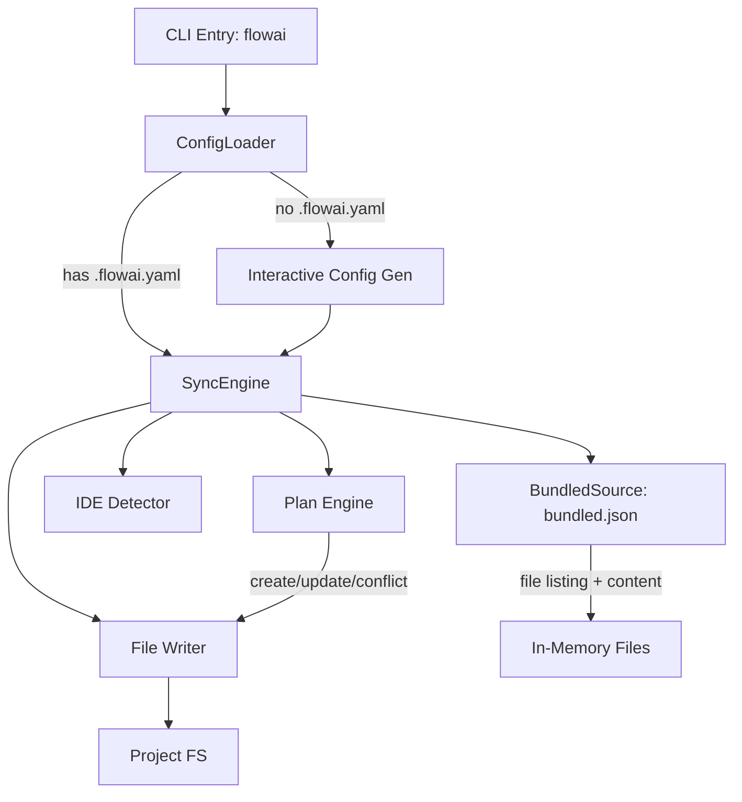

# Software Design Specification (SDS)

## 1. Introduction

- **Document purpose:** Detail the implementation and architecture of the
  AI-First IDE Rules and Skills project.
- **Relation to SRS:** Implements requirements defined in
  `documents/requirements.md`.

## 2. System Architecture

- **Overview diagram:**
  ```mermaid
  graph TD
    Packs[framework/] -->|flowai cli/| Claude[.claude/]
    DevSkills[.claude/skills/ dev] -->|tracked in git| Claude
    Claude -->|skills, agents, hooks| IDE[Claude Code]
    IDE -->|Updates| Docs[documents/*.md]
    IDE -->|Executes| Actions[Code/Git/MCP]
    Packs -->|flowai| Users[End Users]
  ```
- **Main subsystems and their roles:**
  - **Product Framework (`framework/`):** Source of truth for end-user packs (skills, agents, hooks, scripts). Distributed via flowai.
  - **Dev Resources (`.claude/skills/`, `.claude/agents/`):** Dev-only skills/agents tracked in git. Framework resources installed by flowai from remote.
  - **Skills Subsystem:** Defines procedural workflows and capabilities.
  - **Agents Subsystem:** Defines specialized agent roles and prompts.
  - **Benchmark Runner:** Specialist in executing and analyzing agent benchmarks.
  - **Documentation Subsystem:** Stores project state and memory.

## 3. Components

### 3.1 Dev Resources (`.claude/skills/`, `.claude/agents/`)

- **Purpose:** Dev-only skills and agents for flowai development. Not distributed to users.
- **Structure:**
  - `.claude/skills/` — Dev skills (SKILL.md directories, tracked in git) + framework skills (installed by flowai)
  - `.claude/agents/` — Dev agents (tracked in git) + framework agents (installed by flowai)
- **Distribution:** flowai (`cli/`) installs framework resources from bundled source into `.claude/`.

### 3.1.1 Product Packs (`framework/`)

- **Purpose:** Modular groups of skills, agents, hooks, and scripts for end users. Each pack is a self-contained directory.
- **Structure:**
  ```
  framework/<pack-name>/
    pack.yaml              # name, version (semver), description, scaffolds (optional)
    skills/<name>/SKILL.md # skills (full installed name, e.g. flowai-commit/)
    agents/<name>.md       # agents (optional)
    hooks/<name>/          # hook.yaml + run.sh (optional)
    scripts/<name>         # utility scripts (optional)
  ```
- **Packs:** `core` (base commands), `devtools` (skill/agent authoring), `engineering` (procedural knowledge), `deno` (Deno-specific), `typescript` (TS-specific).
- **Resource discovery:** Convention over configuration — resources found by scanning subdirectories, not listed in `pack.yaml`.
- **No inter-pack dependencies:** Each pack is self-contained. Enforced by `check-pack-refs.ts` (core→non-core and non-core-A→non-core-B references are errors; any→core and intra-pack are OK).
- **Naming:** Directory names inside packs are the full installed names (e.g., `flowai-commit/`, `flowai-skill-write-dep/`). flowai copies them as-is — no name transformation at install time.
- **Categories (by installed prefix):**
  - `flowai-*`: Command-like skills (e.g., `flowai-commit`, `flowai-plan`).
  - `flowai-skill-*`: Practical guides (e.g., `flowai-skill-fix-tests`).
  - `flowai-setup-*`: One-time setup skills (e.g., `flowai-setup-code-style-ts-deno`).
- **Composition**: Skills can delegate to other skills (e.g., `flowai-init` delegates development command configuration to `flowai-skill-configure-*-commands`).
- **Script independence:** Scripts in pack `scripts/` are installed into user projects without a shared `deno.json`. They MUST be runnable standalone:
  - Use `jsr:` specifiers for Deno std imports (e.g., `jsr:@std/path`), NOT bare specifiers (`@std/path`).
  - Avoid dependencies requiring import maps or `deno.json` resolution.
  - Each script header MUST include a `Run:` section with the exact `deno run` command.

#### 3.1.2 Script Language Policy

All project scripts (both `framework/<pack>/skills/*/scripts/` and root `scripts/`) use Deno/TypeScript exclusively. Python appears only in benchmark fixtures (test project stubs).

#### 3.1.3 Skill Tool Hints (`allowed-tools`)

Skills MAY use the `allowed-tools` frontmatter field (experimental, per agentskills.io spec) to pre-approve tools needed for script execution. Example:

```yaml
---
name: my-skill
description: Does something
allowed-tools: Bash(deno:*)
---
```

Adoption is optional. IDEs that support `allowed-tools` will auto-approve matching tool calls; IDEs that don't will ignore the field.

#### 3.1.4 Skill Name Collision Resolution

When a dev skill in `.claude/skills/` has the same name as a framework skill in a pack, flowai will overwrite the dev version during sync. Dev skills should use unique names to avoid collisions.

### 3.2 Product Agents (in packs)

- **Purpose:** Define specialized AI subagent personas and roles for end users.
- **Structure:** `.md` files inside `framework/<pack>/agents/`. One canonical file per agent.
  Frontmatter contains universal superset of all IDE fields; body is the shared system prompt.
- **Canonical Format:** Universal frontmatter — superset of all IDE-specific fields:
  `name`, `description` (required), `tools` (string, Claude), `disallowedTools` (string, Claude),
  `readonly` (bool, Cursor), `mode` (string, OpenCode), `opencode_tools` (map, OpenCode).
  `flowai` extracts IDE-relevant fields at install time via `transformAgent()`.
- **Key Agents (4 canonical files):**
  - `engineering/agents/flowai-deep-research-worker.md`: Research worker for a single direction within a deep research task; spawned by `flowai-skill-deep-research` orchestrator.
  - `core/agents/console-expert.md`: Specialist in executing complex console tasks without modifying code.
  - `core/agents/diff-specialist.md`: Specialist in analyzing git diffs and planning atomic commits.
  - `core/agents/skill-executor.md`: Specialist in executing any prompt or task or specific skills.
- **Distribution:** `flowai` transforms canonical agents into IDE-specific format at install time.
- **Reference: IDE frontmatter formats** (transformation rules owned by flowai):
  - **Claude Code:** `name`, `description` (req), `tools` (list: Read, Grep, etc.), `disallowedTools`, `model` (sonnet/opus/haiku/inherit).
  - **Cursor:** `name`, `description` (req), `model` (inherit/fast/slow), `readonly` (bool).
  - **OpenCode:** `description` (req), `mode: subagent`, `model` (provider/model-id), `tools` (map: write/edit/bash→bool). Filename = agent name.

### 3.3 Project Documentation (`documents/`)

- **Purpose:** Persistent project memory across AI sessions. Single source of truth for requirements, architecture, and current plans.
- **Hierarchy:**
  1. `AGENTS.md` — project vision, constraints, mandatory rules (root-level, read-only reference).
  2. `documents/requirements.md` (SRS) — functional and non-functional requirements. Source of truth for "what" and "why".
  3. `documents/design.md` (SDS) — architecture and implementation details. Depends on SRS.
  4. `documents/whiteboards/<YYYY-MM-DD>-<slug>.md` — temporary plans and notes in GODS format. One file per task/session. Directory is gitignored.
  5. `documents/ides-difference.md` — cross-IDE capability comparison (primitives, hooks, agents, MCP). Reference for FR-14–FR-17.
  6. `documents/benchmarking.md` — benchmark results and analysis.
- **Rules:**
  - Every `[x]` acceptance criterion in SRS must include file-path evidence.
  - English only (except whiteboards). Compressed style (no fluff, high-info words).
  - Agent reads docs at session start; outdated docs = wrong assumptions.
- **Deps:** None (plain Markdown files).

### 3.4 Benchmark System (`benchmarks/`, `scripts/benchmarks/`)

- **Purpose:** Evidence-based evaluation of AI agent skill execution quality.
- **Architecture:**
  - `deno task bench`: Evaluates agents via evidence-based scenarios. Supports direct model selection via `-m, --model` flag.
  - **Parallel Execution Protection**: Uses `benchmarks/benchmarks.lock` file containing the PID to prevent concurrent runs. Implements signal listeners (`SIGINT`, `SIGTERM`) and `unload` events for reliable cleanup.
  - **Isolation**: Benchmarks run in isolated sandboxes using `SpawnedAgent` (direct `Deno.Command` based). Sandbox contains only pack-scoped primitives: core pack benchmark → core only; non-core pack benchmark → core + that pack.
  - **Docker**: Optional Docker isolation (`Dockerfile` based on `denoland/deno:alpine`) with `git`, `bash`, `curl`, and `cursor-agent` installed.
  - **Co-located Scenarios**: Scenarios are co-located with skills as `framework/<pack>/skills/<skill>/benchmarks/<scenario>/mod.ts`.
  - **JSON Configuration**: `benchmarks/config.json` stores unified model presets.
  - **Direct Model Support**: If a preset is not found, the system uses the provided name as the model identifier with default settings (temperature: 0).
  - **Side-Effect Validation**: System checks sandbox state (files, git) using LLM-Judge via Claude CLI (`cliChatCompletion` in `llm.ts`). Uses `--output-format json` + `--json-schema` for structured verdicts. No external API key required. Judge retries once on failure before marking items failed.
  - **Evidence Pipeline**: Raw NDJSON agent logs are converted to readable conversation format (`format_logs.ts`). Evidence (user query, agent logs, git diff/status/log, whiteboards, generated files) is written to `<runDir>/judge-evidence.md` and passed to Claude CLI via `--append-system-prompt-file`. This avoids E2BIG/stdin size limits for large traces (~250KB). The user message to judge contains only the checklist and evaluation instruction. Evidence files persist in run directory for debugging.
  - **Execution Stability**: `SpawnedAgent` per-step timeout + global scenario timeout (default 15 min, `totalTimeoutMs`). Kills agent and proceeds to judge with partial evidence on expiry.
  - **Skill Integration**: Framework skills are copied into sandbox IDE config dir (pack-scoped). Skills with `disable-model-invocation: true` are included but not auto-triggered.
  - **Project Instructions**: Scenarios MUST declare `agentsTemplateVars` (required field; PROJECT_NAME, TOOLING_STACK, etc.) — runner renders AGENTS.md from `flowai-init` templates at runtime (single source of truth). Optional `generateDocuments`/`scripts` flags generate `documents/AGENTS.md` and `scripts/AGENTS.md`. For Claude adapter, CLAUDE.md symlinks are created automatically. Legacy `agentsMarkdown` and fixture `AGENTS.md` are not supported.
  - **IDE Session Naming**: Claude adapter passes `--name <skill>/<scenario>` for session identification.
  - **Rich Tracing**: Generates single-file `trace.html` with dashboard, per-scenario detail views, and sidebar navigation. Modular architecture: `trace.ts` (facade) → `trace-collector.ts` (data) + `trace-renderer.ts` (HTML structure) + `trace-styles.ts` (CSS/JS) + `trace-types.ts` (shared types).
  - **Unified Data UI**: All technical data (logs, scripts, prompts) use a consistent `.data-block` component with line numbers, word wrap, and smart expand/collapse.
  - **Interactive Flows**: `UserEmulator` simulates user responses via LLM for multi-turn scenarios (persona-driven).
  - **Multi-Turn Benchmarking**: `SpawnedAgent` + `runner.ts` support automatic session resumption (`--resume`) when `UserEmulator` provides input.

### 3.5 Global Framework Distribution — FR-10 (`cli/`)

- **Purpose:** Install/update flowai framework skills/agents into project-local IDE config dirs.
- **Location:** `cli/` monorepo directory. Published to JSR as `@korchasa/flowai`.
- **Pattern:** Single-command CLI. Adapter pattern for FS isolation. Bundled source (no network at runtime).
- **Diagram:**

- **Components:**
  - `cli/src/cli.ts` — CLI entry, `sync` subcommand, IDE context guard (`isInsideIDE`), @cliffy/command
  - `cli/src/config.ts` — `.flowai.yaml` parser/writer, validation (include/exclude mutual exclusivity)
  - `cli/src/config_generator.ts` — config creation: interactive (prompts via @cliffy/prompt) and non-interactive (auto-detect IDEs, all packs)
  - `cli/src/source.ts` — `FrameworkSource` interface, `BundledSource` (reads `bundled.json`), `InMemoryFrameworkSource` (tests)
  - `cli/src/sync.ts` — orchestrates: load bundle → filter skills/agents → compute plan → write files → symlinks
  - `cli/src/plan.ts` — compares upstream vs local (create/ok/conflict classification)
  - `cli/src/writer.ts` — writes plan items to IDE config dirs
  - `cli/src/transform.ts` — transforms universal agent frontmatter into IDE-specific format
  - `cli/src/ide.ts` — IDE detection by config dir presence + `isInsideIDE()` env var check (`CURSOR_AGENT`, `CLAUDECODE`, `OPENCODE`)
  - `cli/src/symlinks.ts` — `CLAUDE.md -> AGENTS.md` symlinks (FR-10.4)
  - `cli/src/version.ts` — self-update check against JSR registry (fail-open)
  - `cli/src/adapters/fs.ts` — `FsAdapter` abstraction + `DenoFsAdapter` + `InMemoryFsAdapter`
  - `cli/scripts/bundle-framework.ts` — generates `src/bundled.json` from `../framework/`
- **Data entities:**
  - `FlowConfig`: `{ version, ides, packs, skills: {include, exclude}, agents: {include, exclude} }` (v1.1: `packs` field added)
  - `PackDefinition`: `{ name, version, description, scaffolds?: Record<skill, paths[]> }` (parsed from `pack.yaml`)
  - `HookDefinition`: `{ event, matcher?, description, timeout? }` (parsed from `hook.yaml`; timeout default: 30 PostToolUse, 600 PreToolUse)
  - `PlanItem`: `{ type: skill|agent|hook|script, name, action: create|update|ok|conflict, sourcePath, targetPath, content }`
- **Agent transformation rules** (per IDE):
  - Claude: `name`, `description`, `tools`, `disallowedTools`
  - Cursor: `name`, `description`, `readonly`
  - OpenCode: `description`, `mode`; `opencode_tools` → `tools`
- **Pack resolution flow:** Load config → expand `packs:` to resource lists (skills, agents, hooks, scripts from `framework/*/`) → apply `skills.include/exclude` filter → compute plan → write. `resolvePackResources()` returns `hookNames` and `scriptNames` alongside skills/agents.
- **Automigration:** v1 config detected → rewrite as v1.1 with `packs:` listing all available packs (backward-compatible).
- **Rich sync output:** `flowai sync` produces instruction-oriented output: `>>> ACTIONS REQUIRED` (config migration, updated/created/deleted skills with inline scaffolds, agent updates, hook installs) or `>>> NO ACTIONS REQUIRED`. `SyncResult` includes `configMigrated`, `skillActions[]`, `agentActions[]`, `hookActions[]` with per-resource action and scaffolds.
- **Hook installation:** Reads `hook.yaml`, generates IDE-specific config via `cli/src/hooks.ts`: Claude Code → 3-level nested `settings.json` hooks, Cursor → flat `.cursor/hooks.json`, OpenCode → generated `flowai-hooks.ts` plugin. Event/tool name mapping per IDE (`EVENT_MAP`, `TOOL_MAP`). Manifest `.{ide}/flowai-hooks.json` tracks installed hooks for deinstallation. Merge preserves user hooks not in manifest. 4 framework hooks: `flowai-lint-on-write` (PostToolUse, ts/js/py linting), `flowai-test-before-commit` (PreToolUse, blocks commit w/o tests), `flowai-skill-structure-validate` (PostToolUse, SKILL.md validation), `flowai-mermaid-validate` (PostToolUse, Mermaid diagram validation).
- **Script installation:** Copies to `.{ide}/scripts/` (simple file copy).
- **Naming:** Pack directory names are the final installed names (e.g., `flowai-commit`, `flowai-skill-write-dep`). No name transformation at install time.
- **Dev-only file exclusion:** Bundle and sync exclude dev-only files from distribution: benchmark scenarios (`/benchmarks/`) and test files (`_test.*`). Filtering at two levels: `bundle-framework.ts` (build time) and `readSkillFiles`/`readPackSkillFiles` in `sync.ts` (runtime).
- **Distribution:** JSR via `deno publish`. `bundled.json` generated at publish time from `framework/*/`. No build step for TS.

### 3.6 Conventional Commits `agent:` Type — FR-11

- **Purpose:** Dedicated commit type for AI agent/skill configuration changes.
- **Integration point:** `flowai-commit` SKILL.md — added to recognized types list.
- **Auto-detection logic:** If all staged files match patterns
  (`framework/**`, `.claude/agents/**`, `.claude/skills/**`,
  `AGENTS.md`) -> suggest `agent:` type.
- **Affected components:** `flowai-commit` SKILL.md, `flowai-diff-specialist` agent.

### 3.7 flowai-init Multi-File Architecture + Diff-Based Updates — FR-12

- **Purpose:** Preserve user edits during re-initialization. Eliminate monolithic
  AGENTS.md. Enable agent-driven file generation.
- **Architecture:** 3 AGENTS.md files:
  - `./AGENTS.md` — core agent rules, project metadata, planning rules, TDD flow.
  - `./documents/AGENTS.md` — documentation system rules (SRS/SDS/GODS formats).
  - `./scripts/AGENTS.md` — development commands (standard interface, detected commands).
- **Generation approach:** Agent reads template files from `assets/` as reference
  and writes files directly. No manifest or script-driven rendering.
- **Brownfield extraction:** Agent semantically identifies documentation and
  script sections in existing `./AGENTS.md`, extracts them to subdirectory files,
  and removes duplicates from root. Templates are fallbacks for greenfield only.
- **Preservation:** User's custom project rules preserved. Extracted content takes
  priority over template content.
- **Diff-based update:** Agent shows diff per file, asks user for confirmation.
- **Documents guard:** Skip existing files exceeding line thresholds (50 for SRS/SDS). Whiteboards directory created on first use by planning/answer skills.
- **Script:** `generate_agents.ts` (Deno/TS) — analyze-only. Command: `analyze`.
  Template rendering removed; agent handles generation natively.
- **IDE compat:** Cursor, Claude Code support subdir AGENTS.md natively.
  OpenCode needs `opencode.json` glob workaround (agent checks and warns).
- **Deps:** Deno std via `jsr:` specifiers (`jsr:@std/path`). No bare specifiers.

### 3.8 Python-to-Deno Migration — FR-13

- **Purpose:** Eliminate Python runtime dependency by rewriting all 12 `.py` scripts
  to TypeScript (Deno).
- **Approach:** 1:1 behavioral parity. Same stdin/stdout/exit-code contracts.
- **Script categories:**
  - **Analyzers** (`analyze_project`, `count_tokens`): File system inspection, JSON output.
  - **Generators** (`generate_agents`, `init_*`): Template expansion, file scaffolding.
  - **Validators** (`validate_*.py`): YAML/Markdown parsing, error reporting.
  - **Packagers** (`package_*.py`): Bundling skill/command directories.
- **Test strategy:** Each `.ts` script gets a `_test.ts` file verifying identical
  output against known fixtures.
- **SKILL.md updates:** All `python3 scripts/*.py` invocations replaced with
  `deno run -A scripts/*.ts`.

### 3.9 AI Devcontainer Setup — FR-20

- **Purpose:** Generate `.devcontainer/` config optimized for AI IDE development.
- **Architecture:** 7-step skill workflow (detect stack → discover features → detect
  existing → determine capabilities → generate → write → verify). 4 reference docs
  (`devcontainer-template`, `features-catalog`, `dockerfile-patterns`, `firewall-template`).
- **Stack detection:** Scans project root for indicator files (`deno.json`,
  `package.json`, `pyproject.toml`, `go.mod`, `Cargo.toml`). Maps to MCR base images.
  Multi-stack → user picks primary, secondary added as features.
- **Feature discovery:** Indicator→need mapping in `references/features-catalog.md`.
  Categories: secondary runtimes (auto), build tools (auto), infra/cloud (suggest),
  databases (suggest), testing (suggest). Always includes `common-utils` + `github-cli`.
- **AI CLI support:** 4 CLIs via registry features (Claude Code, OpenCode, Cursor CLI,
  Gemini CLI). Config persistence via Docker volumes. Global skills via read-only bind
  mount to `*-host` path + `postStartCommand` sync with `cp -rL` (dereferences symlinks).
- **Security hardening:** Optional `init-firewall.sh` with default-deny iptables +
  stack-aware domain allowlist. Requires `NET_ADMIN`/`NET_RAW` capabilities + custom
  Dockerfile.
- **Idempotency:** Detects existing `.devcontainer/`, shows diff, asks per-file
  confirmation.
- **Integration:** Invoked standalone or delegated from `flowai-init` step 11.
- **Deps:** None (pure SKILL.md, agent-driven generation).

### 3.10 Framework Update Skill — `flowai-update`

- **Purpose:** Single entry point for updating framework + migrating scaffolded project artifacts.
- **Location:** `framework/core/skills/flowai-update/SKILL.md`.
- **Workflow:** 7 steps: update CLI → sync → parse sync output → migrate scaffolded artifacts → propose → confirm → commit.
- **Scaffolded artifacts:** Files created once by setup skills, then owned by the project. Mapping declared in `pack.yaml` `scaffolds:` field (skill-name → artifact paths). `flowai sync` includes scaffolds info in its `>>> ACTIONS REQUIRED` output.
- **Rich sync output:** `flowai sync` produces instruction-oriented output with `>>> ACTIONS REQUIRED` / `>>> NO ACTIONS REQUIRED` sections. Lists updated/created/deleted skills with inline scaffolded artifact paths. flowai-update parses this output instead of manual `git status` discovery.
- **CLI integration:** `flowai` bare command is no-op inside IDE (env var check: `CURSOR_AGENT`, `CLAUDECODE`, `OPENCODE`). `flowai sync` required explicitly. See `cli/src/ide.ts:isInsideIDE()`.
- **Deps:** None (pure SKILL.md, agent-driven migration).

## 4. Data and Storage

- **Entities and attributes:**
  - **Skill:** Name, Content, Path.
  - **Agent:** Name, Prompt, Capabilities.
- **ER diagram:** N/A (File-based storage).
- **Migration policies:** Manual updates via git.

## 5. Algorithms and Logic

- **Key algorithms:**
  - **Skill Matching:** IDE/Agent matches user intent to available skills.
  - **Agent Selection:** IDE/Agent selects appropriate agents based on task.
- **Business rules:**
  - Documentation must be kept up-to-date with code changes.
  - Code changes must follow defined style rules.

## 6. Non-functional Aspects

- **Scalability:** Modular file structure allows easy addition of new skills and
  agents.
- **Fault tolerance:** Text-based instructions are robust.
- **Security:** Skills are local to the project.
- **Monitoring and logging:** Git history tracks changes.

## 7. Constraints and Trade-offs

- **Simplified:** No centralized database; relies on file system.
- **Deferred:** Automated regression testing of skills.

## 8. Known Issues

### 8.1 flowai-plan Benchmark Failures (pre-existing)

3 of 8 flowai-plan benchmarks fail consistently. Root cause: agent behavioral issues unrelated to skill text.

- **flowai-plan-interactive**: Agent skips variant presentation step, jumps to G-O-D draft. SimulatedUser responds before variants are shown. Likely cause: sonnet model doesn't reliably follow multi-step interactive protocol with single-turn timeout.
- **flowai-plan-variants-obvious**: Agent presents 2 variants for trivial task ("create hello.txt") instead of 1. "Variant Analysis" rule says "1 variant OK if path is clear" but agent over-interprets.
- **flowai-plan-variants-complex**: Agent exits with code 130 (timeout at 120s). Complex auth system task exceeds `stepTimeoutMs`. Agent spends time thinking internally but doesn't emit variants to chat before timeout.

## 9. Future Extensions

- Hook format transformation — tracked as FR-14 (cross-IDE hook/plugin format transformation) and FR-24 (hook resources in packs).
